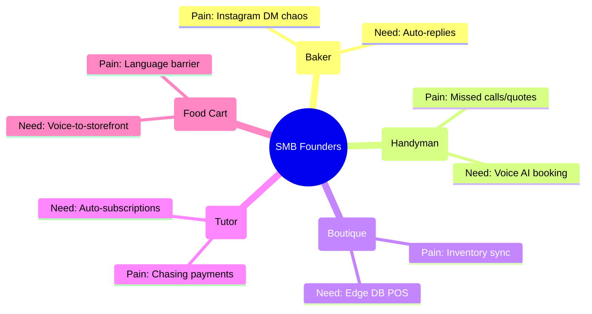

# [research] In-Depth Founder Profiles for OHC Platform

## Introduction
To build a platform that truly serves non-technical small business founders, we must deeply understand their daily routines, technical limitations, fears, and primary goals. This document expands on our core personas, detailing their complete business lifecycle and identifying the exact moments where traditional platforms (like Shopify or Wix) fail them.

## Persona 1: Maya, The Social Seller
### Demographics & Background
- **Age**: 28
- **Business Type**: Artisanal Bakery (Custom Cakes & Pastries)
- **Primary Sales Channel**: Instagram Direct Messages (DMs)
- **Technical Literacy**: High on social media apps (TikTok, Instagram), very low on web development, DNS configuration, and database management.
- **Time Commitment**: Full-time, working 60+ hours a week. Most of this time is spent baking, not managing software.

### The Daily Struggle (A Day in the Life)
- **6:00 AM**: Maya wakes up and immediately checks her Instagram DMs. There are 15 new messages.
- **6:15 AM - 7:30 AM**: She spends over an hour manually replying to questions like "Do you deliver to Brooklyn?" and "How much for a 2-tier wedding cake?" She manually copies order details into a Google Sheet.
- **8:00 AM - 4:00 PM**: Baking, decorating, and fulfilling orders. She misses 5 new DMs during this time because her hands are covered in flour.
- **5:00 PM - 6:00 PM**: Trying to figure out Shopify. She attempts to set up a product page for "Assorted Cupcakes" but gets stuck on the "Shipping Profiles" and "Tax Settings" pages. She abandons the setup.
- **7:00 PM - 8:00 PM**: Posting daily content. She struggles to write a caption that feels authentic but also sells.

### The Breaking Point
Maya is exhausted by the administration of her business. She tried Shopify but found the interface overwhelming. "I just want a place where people can click a link in my bio, see my cakes, pay me, and I get a notification."

### OHC Opportunity
- **Immediate Win**: Unified Inbox with AI Auto-Replies. OHC intercepts the "Do you deliver?" question and answers it based on her pre-configured settings.
- **Long-term Value**: Vision-to-Product. Maya takes a photo of a cake; OHC creates the storefront listing instantly.

## Persona 2: Carlos, The Local Service Provider
### Demographics & Background
- **Age**: 42
- **Business Type**: Handyman & Home Repair Services
- **Primary Sales Channel**: Word of Mouth, Local Facebook Groups
- **Technical Literacy**: Very low. Uses a smartphone for calls, texts, and Facebook. Has never used a spreadsheet.
- **Time Commitment**: Full-time. Always on the road or at a job site.

### The Daily Struggle (A Day in the Life)
- **8:00 AM**: Carlos is at his first job fixing a leak. His phone rings twice. He ignores it to focus on the work.
- **11:00 AM**: Checks his voicemail. One missed call didn't leave a message (lost lead). The other is asking for a quote to paint a room.
- **1:00 PM**: Carlos tries to text the potential client back to arrange a time to look at the room. The client has already found someone else who answered immediately.
- **Evening**: Carlos manually writes down tomorrow's schedule on a notepad. He has no automated reminders, so clients occasionally forget he is coming.

### The Breaking Point
Carlos knows he is losing thousands of dollars a month in missed calls and disorganized scheduling, but a website feels like a vanity project. He doesn't need "branding"; he needs a receptionist.

### OHC Opportunity
- **Immediate Win**: AI Phone Answering & SMS Quoting. An AI agent answers missed calls, asks what the issue is, and books a consultation on Carlos's calendar.
- **Long-term Value**: Automated SMS reminders to clients the day before a job, reducing no-shows and wasted trips.

## Persona 3: Priya, The Hybrid Retailer
### Demographics & Background
- **Age**: 35
- **Business Type**: Independent Clothing Boutique
- **Primary Sales Channel**: Physical Storefront in a busy downtown area.
- **Technical Literacy**: Moderate. Comfortable with point-of-sale (POS) systems like Square but overwhelmed by setting up an e-commerce sync.
- **Time Commitment**: Full-time store manager.

### The Daily Struggle (A Day in the Life)
- **10:00 AM**: Opens the physical store.
- **12:00 PM**: A customer buys the last medium-sized floral dress in-store.
- **2:00 PM**: An online customer buys the *same* dress on her Shopify store because Priya forgot to manually update the inventory on the website.
- **4:00 PM**: Priya has to email the online customer, apologize, and issue a refund, damaging her brand's reputation.

### The Breaking Point
Priya wants to grow her online presence but is terrified of overselling because her POS and e-commerce platform don't talk to each other in real-time without expensive, brittle Zapier integrations.

### OHC Opportunity
- **Immediate Win**: Edge-synced Real-time Inventory. OHC acts as the single source of truth. When the item is scanned at the POS, the online store updates within milliseconds.
- **Long-term Value**: AI Customer Segmentation. OHC notices a customer always buys dresses in spring and auto-generates a personalized email campaign for them next season.

## Persona 4: Leo, The Passionate Tutor
### Demographics & Background
- **Age**: 22
- **Business Type**: Private Music Lessons (Guitar/Piano)
- **Primary Sales Channel**: Craigslist, Flyers, Reddit
- **Technical Literacy**: High. Comfortable with software, but lacks the capital to pay for multiple SaaS tools (Calendly + Mailchimp + Stripe + Zoom).
- **Time Commitment**: Part-time (Side Hustle).

### The Daily Struggle (A Day in the Life)
- **3:00 PM**: Finishes his college classes.
- **4:00 PM**: Checks his email. Three students want to book lessons. He engages in a 10-email thread with each trying to find a time that works.
- **5:00 PM**: A student no-shows for a Zoom lesson because Leo forgot to send the link.
- **End of Month**: Leo has to awkwardly text students asking them to Venmo him for the past month's lessons.

### The Breaking Point
Leo feels like a debt collector and an administrator rather than a music teacher. Piecing together free tiers of Calendly, Zoom, and Venmo feels unprofessional and is prone to errors.

### OHC Opportunity
- **Immediate Win**: Native AI Scheduling with integrated video links.
- **Long-term Value**: Automated Subscription Billing. Parents put their credit card on file once, and OHC automatically charges them on the 1st of every month.

## Persona 5: Fatima, The First-Generation Entrepreneur
### Demographics & Background
- **Age**: 50
- **Business Type**: Weekend Food Cart (Empanadas)
- **Primary Sales Channel**: Foot traffic, repeat local customers.
- **Technical Literacy**: Very low. Primarily uses WhatsApp. English is her second language.
- **Time Commitment**: Weekends only, heavily reliant on pre-orders to know how much to cook.

### The Daily Struggle (A Day in the Life)
- **Thursday**: Fatima tries to collect pre-orders via WhatsApp. Messages are disorganized. She manually writes them in a notebook.
- **Friday**: She mistranslates an order request and makes 20 beef empanadas instead of chicken. Food is wasted.
- **Saturday**: Working the cart. The line is long. A customer asks if she has a menu online; she says no.

### The Breaking Point
Software interfaces in English with complex terminology ("SKU", "Variant", "Fulfillment") are impenetrable. She needs a tool that speaks her language and operates as simply as sending a text.

### OHC Opportunity
- **Immediate Win**: Multi-lingual voice and text AI interface. She can speak to OHC in Spanish: "I am selling 50 chicken empanadas this weekend for $3 each." OHC builds the page in English for her customers.
- **Long-term Value**: WhatsApp Order Integration. Customers order via WhatsApp, OHC structures the data, translates it to Spanish, and prints a clear order ticket for Fatima.

