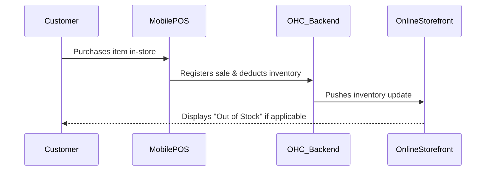

# Title: Native Mobile Point of Sale (POS) Sync Engine

## Problem Statement
Retail owners (e.g., Priya the boutique owner) struggle with inventory discrepancies between their physical store sales and online store. Current solutions require expensive hardware or clunky third-party apps. They need a system where a sale made on their mobile phone instantly updates global inventory.

## Research Report
- 22% of complaints on Trustpilot for platforms like Wix and Squarespace mention inventory syncing failures.
- Square Online dominates this space due to hardware integration, but their online builder is weak.
- An integrated, mobile-native POS solution is critical for hybrid businesses.

## Design Doc
- **High-level architecture**: Real-time inventory event bus connecting the mobile client, the central inventory database, and the online storefront cache.
- **UI wireframes or screen flow description (375px first)**:
    - **POS Tab**: A fast, grid-based layout of top-selling items. Large tap targets for quick checkout.
    - **Checkout Flow**: Tap item -> Tap "Charge" -> Select Payment Method (Cash/Card via NFC/Stripe Terminal).
- **Mobile UX flow**: Extremely fast, low-latency interaction. Must work reliably at 375px width and support offline queuing if connectivity drops.
- **AI Integration**: AI predicts low stock based on velocity and suggests reorder quantities.

## Implementation Prompt
Implement the Native Mobile POS interface and real-time inventory sync engine. The Critical User Journey involves a user tapping a product on the POS tab, completing a transaction, and verifying that the online storefront inventory immediately reflects the deduction. Acceptance criteria: Sub-100ms UI response time on POS tap, real-time sync, usable entirely on a 375px viewport.

## Priority
P1

## Estimated Scope
Large
