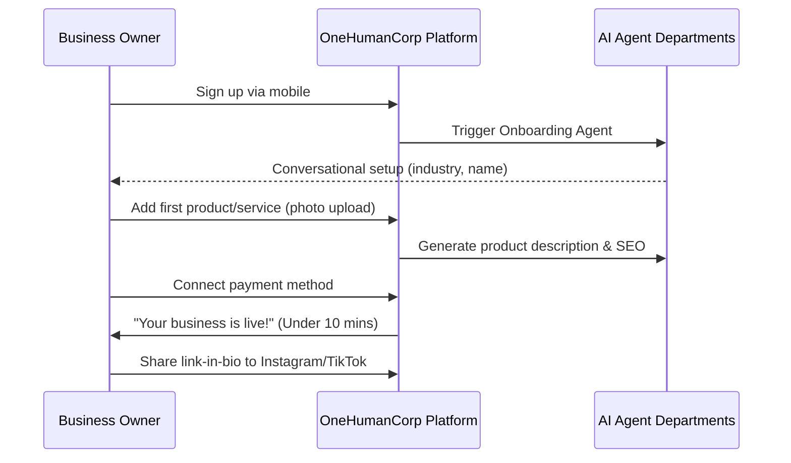

# [product] Business Journey Architecture Improvement

## Problem Statement
Small business owners (bakers, handymen, boutique owners, tutors, food cart operators) currently face friction when onboarding, managing their digital storefronts, and handling customer interactions. The current flow may be too technical or lack the necessary automation to allow a non-technical user to go from zero to a live business in under 10 minutes.

## Research Report
Research indicates that users like Maya (baker), Carlos (handyman), Priya (boutique owner), Leo (music tutor), and Fatima (food cart) require intuitive, mobile-first tools.
- **Shopify/Wix/Squarespace** often require desktop use for complex setup and have steep learning curves.
- **GoDaddy** is simpler but lacks integrated, invisible AI automation for daily tasks like DM replies and quote generation.
- Users need immediate value (e.g., first product added, first payment received) to remain engaged.

## Design Doc

### Architecture Diagram

### UI Wireframes & Mobile UX Flow (375px)
1. **Welcome Screen**: Large, clear CTA "Start your business in 5 minutes".
2. **Conversational Setup**: Chat-like interface asking for business name and type.
3. **Product Addition**: Camera integration. Take a photo -> AI auto-fills title and suggests price based on industry.
4. **Go Live**: Confetti animation. Big button to "Share to Instagram".

### Key Design Decisions
- **Mobile-First**: The entire onboarding and management flow must be 100% functional and optimized for a 375px viewport. Desktop is additive.
- **AI-Assisted Onboarding**: Replace static forms with conversational, AI-driven data collection to reduce cognitive load.
- **Immediate Value Delivery**: Focus on getting one product/service live and a payment method connected before asking for complex configurations.

## Implementation Prompt
Implement the new mobile-first onboarding flow. The user should be greeted by a conversational interface that collects their business name and industry. Then, prompt them to add their first product by taking a photo, using AI to auto-generate the description. Finally, guide them to connect a payment method and provide a shareable link. The flow must pass the 'grandmother test' (completable in < 30 seconds by a non-technical user). Ensure all screens follow the Glassmorphism design tokens and Outfit/Inter typography.

## Priority
P0

## Estimated Scope
Large
