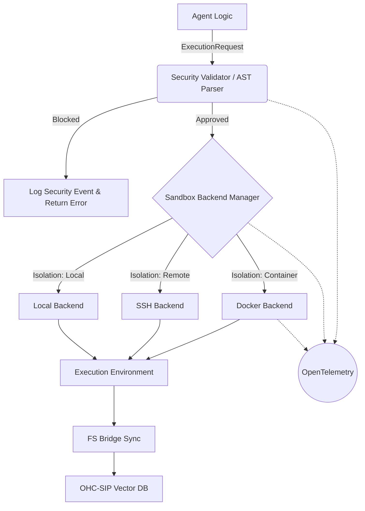

# 🔬 Research Report: Agent Harness Architecture & Sandboxing

## Title
Implement Pluggable Agent Harness & Sandboxing Ecosystem

## Problem Statement
The AI agent ecosystem is rapidly evolving, with significant divergence in how agent execution environments (Agent Harnesses) are designed. Currently, OHC lacks a unified, secure, and observable execution harness. To safely orchestrate a vast swarm of agents across Cloud-Native and Standalone environments, OHC requires a robust sandbox and isolation layer capable of dynamically scaling and preventing malicious or destructive actions.

## Research Report
A deep technical audit of top-tier AI agent projects reveals several critical patterns for secure agent execution:

1. **Claude Code (Anthropic):**
   - **Architecture:** Employs a tightly integrated `BashTool` that executes commands via `utils/Shell.js`.
   - **Security:** Relies on robust AST-based pre-execution validation (`bashPermissions.js`, `bashSecurity.js`) to parse and block dangerous commands before they reach the shell.
   - **Isolation:** Conditionally applies sandboxing via a `SandboxManager` wrapped around the `sandbox-runtime`.

2. **Hermes Agent (Nous Research):**
   - **Architecture:** Utilizes an abstract base environment (`HermesAgentBaseEnv`) driven by an orchestration loop (`HermesAgentLoop`).
   - **Execution:** Features a global `ThreadPoolExecutor` for asynchronous tool invocation.
   - **Isolation:** Provides a highly flexible `terminal_tool.py` that delegates execution to disparate backends (local, Docker, Modal cloud sandboxes, SSH) dynamically based on environment variables, enabling sophisticated multi-turn evaluations.

3. **OpenClaw:**
   - **Architecture:** Implements a strict factory/manager pattern (`SandboxBackendManager`, `SandboxBackendFactory`) to provision execution environments dynamically.
   - **Isolation:** Supports pluggable backends (Docker, Browser, SSH) ensuring agents run in fully isolated contexts.
   - **I/O:** Features advanced File System (FS) bridges (`SandboxFsBridge`, `RemoteShellSandboxFsBridge`) for seamless bidirectional state synchronization.

**OHC Gap Analysis:**
OHC's architecture (Cloud-Native, Standalone) excels at state synchronization via OHC-SIP but lacks a unified, secure execution harness. We must adopt the factory/manager pattern for dynamic backend provisioning, implement AST-based command validation, and ensure full observability via OpenTelemetry.

### Competitive Table (OHC vs Market)

| Feature / Architecture | Claude Code | Hermes Agent | OpenClaw | OHC (Current) | OHC (Proposed) |
| :--- | :--- | :--- | :--- | :--- | :--- |
| **Execution Tooling** | `BashTool` (exec) | `terminal_tool.py` | CLI/Agents | Raw `exec` | Pluggable Backends |
| **Isolation/Sandbox** | Conditional (`SandboxManager`) | Backend-based (Docker/Modal) | Pluggable Backends | None | Dynamic Managers |
| **Command Validation** | Advanced (AST parser) | Minimal | Basic | None | Advanced (AST-based) |
| **Execution Engine** | Local Node.js | `ThreadPoolExecutor` | Node.js | Go routines | Go Manager/Workers |
| **File Sync** | None | Limited | Advanced (FS Bridges) | OHC-SIP | OHC-SIP + FS Bridges |
| **Observability** | None | Minimal logs | Basic | Minimal | Full OpenTelemetry |

## Design Doc

### 1. Harness Architecture Layer
A new intermediate layer sitting between the Agent Logic and the Execution Environment.
- **ExecutionRequests:** Agents submit execution requests defining the command, requested isolation level (`container`, `vm`, `local`), and resource limits.

### 2. Security Validation Component
- **SecurityValidator:** Before routing, the command is parsed via a custom AST parser. It checks against a deny-list of destructive actions or forbidden patterns. If blocked, an error is immediately returned.

### 3. Sandbox Backend Manager
- **Pluggable Backends:** A Go/C++ based manager that dynamically provisions the correct environment based on the request.
  - *DockerBackend:* Spins up ephemeral containers.
  - *SSHBackend:* Connects to remote execution environments.
  - *LocalBackend:* Native execution (for safe, standalone tasks).

### 4. Telemetry & Observability
- All executions, sandbox provisioning events, and security blocks will emit high-fidelity spans and metrics to OpenTelemetry/Prometheus, feeding into OHC's Grafana dashboards.

### Premium Mermaid Chart

## Implementation Prompt
**Task:** Implement the Pluggable Agent Sandbox Backend Manager and Security Validator in Go.

**Requirements:**
1. Create `srcs/harness/manager.go` defining the `SandboxBackendManager` interface and a factory pattern for registering backends.
2. Implement `srcs/harness/backends/docker_backend.go` and `srcs/harness/backends/local_backend.go` that satisfy the interface.
3. Create `srcs/harness/security/validator.go` that implements a basic AST or regex-based command parser to block commands like `rm -rf /` or unauthorized network access.
4. Integrate OpenTelemetry spans in the manager for execution latency and security block events.
5. Provide 100% unit test coverage for the manager and validator in `srcs/harness/..._test.go`. Ensure tests pass under `bazelisk test //srcs/harness/...`.

## Priority
P0

## Estimated Scope
Large

