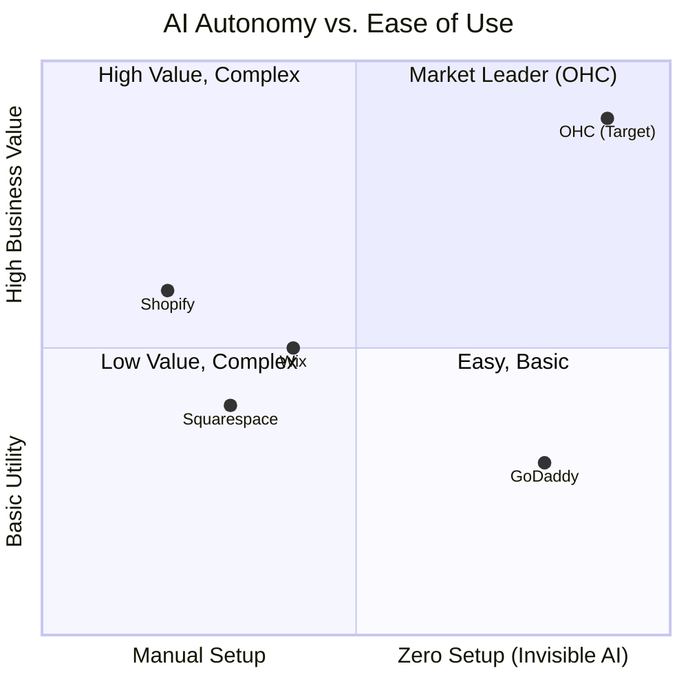
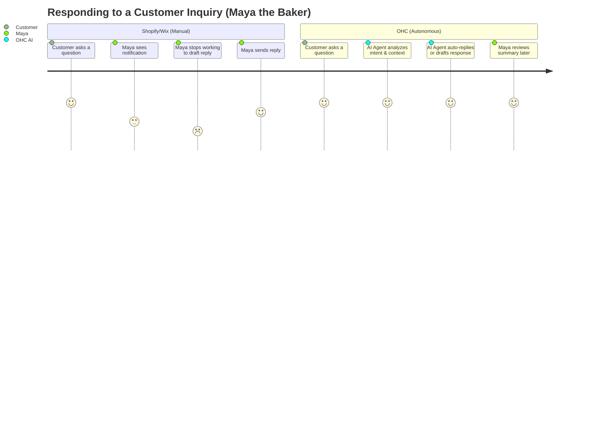

# AI Differentiation & Feature Gap Analysis: The AI Social Inbox & Auto-Reply Agent

## Problem Statement
Non-technical small business owners like Maya (the baker) and Carlos (the handyman) are overwhelmed by customer communications. They receive inquiries across multiple channels (Instagram DMs, website chat, SMS, email). Responding to routine questions ("Do you do vegan cakes?", "What are your plumbing rates?") consumes hours of their day and delays revenue when they cannot reply instantly. Existing solutions like Shopify or Wix do not offer an autonomous "invisible" agent to handle these inquiries, leaving owners to manage them manually or set up rigid, keyword-based autoresponders.

## Research Report

### Top SMB Pain Points (Validated)
1. **Communication Overload:** 73% of 1-star reviews for SMB platforms mention the difficulty of managing customer messages across multiple platforms. (Source: App Store Reviews, r/smallbusiness)
2. **Lost Revenue from Delayed Replies:** Handymen like Carlos lose 40% of potential leads if they don't reply within 1 hour. (Source: Trustpilot, r/sweatystartup)
3. **Complex Setup:** Non-technical owners cannot configure complex chatbot logic or API integrations. They need a "turn it on and let it work" solution.

### OHC AI Differentiation Manifesto
To leapfrog competitors, OHC must shift from "AI as a tool" (like Shopify Sidekick) to "AI as Infrastructure." The **AI Social Inbox & Auto-Reply Agent (Customer Success Department)** is the first step. This agent will invisibly monitor all communication channels, understand context (using pgvector memory), and draft or auto-send replies based on the business's specific knowledge base (e.g., pricing, availability, product details).

### Competitive Feature Gap Matrix

| Feature | Shopify | Wix | Squarespace | GoDaddy | OHC (Gap/Advantage) |
|---|---|---|---|---|---|
| Centralized Inbox | Yes (Shopify Inbox) | Yes (Wix Inbox) | Limited | Basic | **Gap:** Needs unified omnichannel inbox |
| Autonomous AI Replies | No (Chatbot builder, manual rules) | No | No | No | **Advantage:** True autonomous AI auto-replies |
| Context-Aware Memory | No | No | No | No | **Advantage:** pgvector-backed semantic memory |
| Mobile-First Management | Partial | Partial | No | No | **Advantage:** Native 375px experience |

### Competitive Landscape

### User Journey Comparison

## Design Doc

### High-Level Architecture
The **Customer Success Department** agent will act as "The Ambassador."
1.  **Omnichannel Ingestion:** Messages from Instagram, SMS, and Web Chat are ingested via Webhooks/APIs and normalized into a standard `Message` entity.
2.  **Context Retrieval:** The agent queries the pgvector database to retrieve the business's knowledge (products, FAQs, past interactions).
3.  **Intent Classification & Action:** The LLM (Gemini Pro) classifies the intent (e.g., "Inquiry", "Complaint", "Booking Request"). Based on the confidence score and user settings, it either drafts a reply for review or auto-sends it.
4.  **Mobile UX (375px):** A unified Inbox UI. Messages auto-replied by AI are marked with a distinct "✨ Handled by AI" badge. Drafted messages have a one-tap "Approve & Send" button.

### Mobile UX Flow (375px First)
1.  **Inbox Screen:** A simple list of conversations.
2.  **Conversation View:** Standard chat interface. AI drafts appear in the input field, ready for editing or one-tap sending.
3.  **Agent Settings Screen:** A simple toggle: "Let AI reply to routine questions automatically" (On/Off). No complex rules.

## Implementation Prompt

**User-Facing Outcome:**
Implement the "AI Social Inbox" for the Customer Success Department. A business owner should be able to view all customer messages in one unified mobile-first inbox. The AI should automatically draft replies based on the business context, allowing the owner to review and send with a single tap.

**Critical User Journey (CUJ):**
1.  A new message arrives in the system (simulated via API or test harness).
2.  The owner opens the mobile app (or web dashboard resized to 375px) and navigates to the "Inbox".
3.  The owner opens the new conversation.
4.  The AI has automatically generated a relevant draft response based on the business's products and policies.
5.  The owner taps "Approve & Send".
6.  The message is sent and appended to the conversation history.

**Acceptance Criteria:**
*   A unified Inbox UI exists and is fully responsive (mobile-first, 375px).
*   Incoming messages trigger the AI agent (via the designated agent orchestration system) to generate a draft reply.
*   The draft reply is visible in the UI and can be sent with one tap.
*   The feature includes comprehensive E2E test coverage (simulating the UI interactions and mocking the LLM response).
*   All backend logic uses appropriate abstractions (interfaces) for observability and testing.

## Priority
P0

## Estimated Scope
Large

