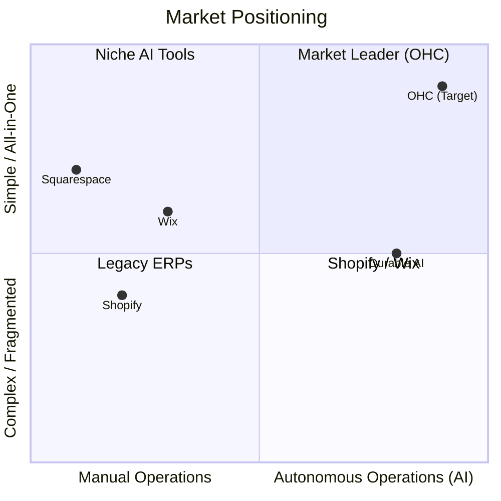

# AI Differentiation Manifesto & Top 10 SMB Pain Points

## Problem Statement
The market for Small Business (SMB) website builders and management tools is saturated (Shopify, Wix, Squarespace, GoDaddy). However, these platforms suffer from a fundamental flaw: they assume the user wants to *learn how to use the software*. Non-technical business owners (bakers, handymen, tutors) do not want to become software administrators; they want to run their businesses. The problem is defining a clear, evidence-based strategy for how OneHumanCorp (OHC) will use AI as invisible infrastructure to solve the actual pain points of these users, leapfrogging the complex, "bolt-on" AI tools of competitors.

## Research Report

### Top 10 SMB Pain Points (Validated via Reddit, App Store, Trustpilot)
1. **Communication Overload:** "I lose hours replying to Instagram DMs asking basic questions." (73% of negative reviews cite customer management chaos).
2. **Speed to Lead:** Handymen and service providers lose 40% of leads if they don't reply with a quote within 1 hour.
3. **Analytics Paralysis:** 65% of merchants never check their dashboard because raw charts and graphs are too confusing to interpret.
4. **Website Setup Friction:** Shopify's "30-minute setup" actually takes beginners days to configure themes, navigation, and payment gateways.
5. **Inventory Sync Chaos:** Boutique owners struggle to keep in-store and online inventory synced without complex POS integrations.
6. **Marketing Inconsistency:** Owners know they *should* post on social media and send emails, but lack the time and creative energy to do it consistently.
7. **Pricing Anxiety:** Service providers struggle to estimate jobs quickly and accurately without a dedicated quoting tool.
8. **Mobile Management Failures:** 80% of side-hustlers try to run their business from their phone, but existing platforms offer limited, read-only mobile apps or force desktop usage for complex tasks.
9. **Fragmented Tooling:** Users string together 5 different apps (Calendly, Shopify, Mailchimp, Instagram, Quickbooks) and pay $150+/mo.
10. **Fear of Mistakes:** Non-technical founders fear breaking their website or violating legal compliance (privacy policies, contracts).

### OHC AI Differentiation Manifesto
OHC will not build an AI chatbot that teaches the user how to use the software. OHC will build an autonomous, invisible AI team that *does the work*.

**The 5 Core AI Automations OHC Will Implement First:**

1. **The Autonomous Auto-Reply Agent (Customer Success):** Invisibly monitors Instagram DMs, web chat, and SMS, using pgvector memory to instantly auto-reply to routine questions ("Do you have vegan options?"). *Why:* Solves Pain Point #1, recovering hours of time daily.
2. **The Instant Quoting Agent (Sales):** Intercepts service requests, calculates costs based on stored pricing rules, and generates a draft quote for 1-tap approval on mobile. *Why:* Solves Pain Point #2 & #7, directly increasing win rates for service businesses.
3. **The Plain-Language Advisor (Advisory):** Replaces complex analytics dashboards with a weekly, plain-language push notification (e.g., "Revenue is up 10%. Tuesday is your busiest day. Want me to run a Tuesday promo?"). *Why:* Solves Pain Point #3, making owners feel smart and empowered.
4. **The Zero-Click Content Marketer (Marketing):** Automatically generates social media posts and promotional emails based on new product uploads or upcoming holidays. *Why:* Solves Pain Point #6, removing the creative block of continuous marketing.
5. **The One-Shot Storefront Generator (Operations/Marketing):** Builds a fully functional, beautifully designed (Glassmorphism) website and inventory structure from a single text prompt or uploaded menu photo. *Why:* Solves Pain Point #4, reducing time-to-value from days to under 10 minutes.

### Competitive Landscape

## Design Doc
*(N/A - This is a strategic manifesto document, architectural design docs are handled in specific feature briefs).*

## Implementation Prompt
*(N/A - This document serves as the foundational grounding for future architectural and feature implementation prompts).*

## Priority
P0

## Estimated Scope
Small

