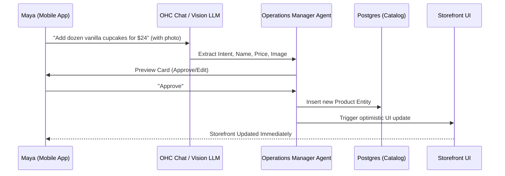

# Problem Statement
Small business owners, especially those without technical expertise, struggle to build and maintain an online presence. Traditional website builders (Shopify, Wix, Squarespace) require a steep learning curve, significant time investment, and ongoing manual effort for design, marketing, and operations. This complexity creates a barrier to entry and diverts time from core business activities.

# Research Report

## Landscape Overview
The website builder landscape for SMBs is bifurcating into two categories:
1.  **Traditional Builders (Shopify, Wix, Squarespace):** Powerful, feature-rich platforms that require substantial manual configuration. They are slowly integrating AI features (e.g., Wix's AI layout generator, Shopify's Magic text generation) but remain fundamentally DIY tools.
2.  **AI-Native Builders (Durable, Mixo, Hostinger AI):** Platforms designed from the ground up around AI generation. They promise to build a functional website in minutes based on simple prompts.

## Competitor Discovery (Top 10 Traditional + Top 10 AI-Native)

**Top 10 General Competitors:**
1.  **Shopify (shopify.com):** E-commerce giant. Highly capable but complex. Target: Serious e-commerce businesses.
2.  **Wix (wix.com):** Versatile drag-and-drop builder. Target: Broad SMB market, creatives.
3.  **Squarespace (squarespace.com):** Design-focused builder. Target: Creatives, portfolio sites.
4.  **GoDaddy (godaddy.com):** Basic, easy-to-use builder bundled with domains. Target: Very small, non-technical businesses.
5.  **Weebly (weebly.com):** Simple builder, owned by Square. Target: Local businesses, basic e-commerce.
6.  **WordPress (wordpress.com):** Highly customizable but technical. Target: Bloggers, developers, larger SMBs.
7.  **BigCommerce (bigcommerce.com):** Enterprise-grade e-commerce. Target: Scaling e-commerce businesses.
8.  **Zyro (zyro.com):** Budget-friendly, simplified builder (owned by Hostinger). Target: Cost-conscious beginners.
9.  **Webnode (webnode.com):** Simple builder with multi-language support. Target: International SMBs.
10. **Jimdo (jimdo.com):** AI-assisted basic builder. Target: Freelancers, small local businesses.

**Top 10 AI-Native / Rising Competitors:**
1.  **Durable (durable.co):** Generates website, CRM, and invoicing in seconds. Target: Service businesses, solo entrepreneurs.
2.  **Mixo (mixo.io):** AI launchpad for startups. Generates landing pages to validate ideas. Target: Creators, early-stage founders.
3.  **Hostinger Website Builder (hostinger.com):** AI-driven builder integrated into hosting. Target: Cost-conscious SMBs.
4.  **10Web (10web.io):** AI WordPress builder. Target: Users who want WordPress flexibility without the setup pain.
5.  **Framer (framer.com):** Design-focused AI generation. Target: Designers, visually-driven brands.
6.  **Unbounce (unbounce.com):** AI-powered landing page builder. Target: Marketers.
7.  **GetResponse (getresponse.com):** AI website builder integrated with email marketing. Target: Marketers.
8.  **Appy Pie (appypie.com):** No-code AI platform for apps and websites. Target: Non-technical users needing mobile solutions.
9.  **Site123 (site123.com):** Very simple, AI-assisted setup. Target: Absolute beginners.
10. **B12 (b12.io):** AI drafts the site, human experts polish it. Target: Professional service firms.

## Deep Dive Audit: Durable (durable.co)

**Capabilities ("What they can do")**:
*   **AI Website Generation:** Generates a multi-page site (Home, About, Services, Contact) in under 30 seconds based on location and business type.
*   **Integrated CRM:** Basic CRM to manage leads generated from the website contact form.
*   **Invoicing:** Simple invoicing tool connected to the CRM.
*   **AI Assistant:** An AI chatbot that can answer questions about the business based on the website content.
*   **AI Blog Builder:** Generates blog posts automatically.

**Success Factors ("What they are successful at")**:
*   **Speed to Value:** The "wow" factor of seeing a complete site in 30 seconds is massive. It entirely eliminates the "blank canvas" paralysis.
*   **All-in-One Positioning:** By including a CRM and invoicing, they position themselves as a business manager, not just a website builder.
*   **Simplicity over Customization:** They restrict design choices (colors, fonts, layouts) to prevent users from breaking the design.

**User Sentiment Audit (Reddit/Trustpilot)**:
*   *Loved:* "I had a website up and running in 10 minutes. It's not perfect, but it's enough to get started." "The CRM integration is handy."
*   *Complaints:* "The generated text is very generic and clearly AI-written." "Once the site is built, editing it is clunky." "The AI chatbot hallucinated business hours." "SEO features are very basic." "Pricing is high compared to just getting basic hosting."

## OHC Gap & Pain Point Identification

**OHC Feature Audit vs. Durable:**
*   **Instant Setup:** OHC aims for <10 mins; Durable achieves <1 min. OHC needs a "Zero-Click" or rapid generation flow to compete on initial delight.
*   **Agentic Operations:** Durable has basic CRM/Invoicing. OHC's vision of autonomous agents (handling bookings, answering DMs) is far more advanced but needs to be presented as simply as Durable's dashboard.
*   **Mobile-First:** Durable is accessible on mobile, but OHC's native app approach is a significant differentiator.

**Unresolved Pain Points (Market-wide):**
1.  **The "Day 2" Problem:** AI builds a site quickly, but users struggle to update content, manage inventory, or respond to inquiries ongoing. The AI is a creator, not an operator.
2.  **Generic Content:** AI-generated text often feels soulless. Users need AI that learns their specific "voice" and business details over time.
3.  **Fragmented Workflows:** Users still have to jump between their website, Instagram DMs, email, and payment processors.

## Agentic Solution Design

OHC can dominate by solving the "Day 2" problem. Instead of just an "AI Website Builder," OHC is an "AI Business Manager."

**Solution: The 'Invisible Magic Catalog' & 'Operations Manager' Agent**
*   **Concept:** Instead of manually building a menu or product list, the user simply uploads a photo of their menu (Fatima), their previous work (Carlos), or a list of items (Maya). The 'Operations Manager' agent automatically parses the input, creates product listings, sets up booking flows, and designs the corresponding website section.
*   **Ongoing Management:** When Maya wants to add a new cake, she just texts the OHC app: "Add a vegan chocolate cake for $40. Here's a picture." The agent updates the catalog, the website, and even drafts an Instagram post.

## Design Doc

**Entity Types:**
*   `Tenant` (Business)
*   `Product`/`Service`
*   `AgentInteraction` (Log of requests to the agent)

**Key Relationships:**
*   `Tenant` has many `Products`/`Services`.
*   `AgentInteraction` maps natural language requests to structured actions on `Products`/`Services` and UI configuration.

**UI Flow (Mobile - 375px):**
1.  **Dashboard:** A simple chat-like interface or a list of "Quick Actions" (e.g., "Add a product", "Change hours").
2.  **Input:** User uploads a photo or types a natural language request.
3.  **Agent Processing:** A translucent loading overlay ("The Manager is updating your catalog...").
4.  **Confirmation:** The agent presents the structured change (e.g., a card showing the new product details) for a 1-tap "Approve" or "Edit".
5.  **Execution:** Upon approval, the underlying data is updated, and the website reflects the change instantly.

**AI Integration Points:**
*   **Vision LLM:** Parse images of menus or handwritten notes to extract structured data.
*   **Intent Recognition LLM:** Classify natural language inputs (e.g., "Update price of X to Y" vs "I need a new website color").

## Implementation Prompt

**Objective:** Implement a chat-based interface on the mobile dashboard where a user can upload an image (e.g., a handwritten menu or list of services) or type a command to automatically add items to their catalog and update their storefront.

**Critical User Journey (CUJ):**
1. User (Maya) opens the OHC mobile app dashboard.
2. She taps a FAB (Floating Action Button) or text input area at the bottom: "Ask your Manager agent..."
3. She types: "Add a dozen vanilla cupcakes for $24." and attaches a photo of the cupcakes.
4. The system (via LLM) extracts the product name, price, and image.
5. The UI displays a preview card of the new product for approval.
6. Maya taps "Approve".
7. The product is added to the database, and the storefront immediately displays the new item.

**Acceptance Criteria:**
*   The chat interface is responsive and fits within 375px width.
*   The system successfully parses simple natural language pricing/product updates.
*   The UI provides a clear approval step before data mutation.
*   The storefront reflects the change without a manual page refresh (optimistic UI update).

## Priority
P0

## Estimated Scope
Medium

## Comparative Analysis Table

| Feature / Platform | OHC (Target) | Durable | Shopify | Wix | Hostinger |
| :--- | :--- | :--- | :--- | :--- | :--- |
| **Generation Speed** | < 1 min | < 1 min | N/A | < 5 mins | < 3 mins |
| **Setup Process** | 100% Agentic | AI + Manual | Manual Form | AI Layouts | AI Layouts |
| **Mobile Edit** | Native App | Web UI | Basic App | Web UI | Web UI |
| **Ongoing CRM/Ops**| Agentic Ops | Basic CRM | App Store | Basic CRM | Basic |
| **Learning Curve** | Zero | Low | High | Medium | Medium |

## System Architecture: Invisible Magic Catalog Flow

## References & Sources Catalog
1. https://www.shopify.com - Main Shopify landing page
2. https://www.shopify.com/pricing - Shopify pricing page
3. https://www.shopify.com/tour - Shopify feature tour
4. https://www.wix.com - Main Wix landing page
5. https://www.wix.com/pricing - Wix pricing page
6. https://www.wix.com/features/main - Wix core features
7. https://www.squarespace.com - Main Squarespace landing page
8. https://www.squarespace.com/pricing - Squarespace pricing
9. https://durable.co - Main Durable landing page
10. https://durable.co/ai-website-builder - Durable AI feature description
11. https://durable.co/pricing - Durable pricing plans
12. https://www.hostinger.com - Hostinger main page
13. https://www.hostinger.com/website-builder - Hostinger builder features
14. https://zyro.com - Zyro main page
15. https://www.weebly.com - Weebly main page
16. https://www.weebly.com/pricing - Weebly pricing
17. https://wordpress.com - WordPress main page
18. https://wordpress.com/pricing - WordPress pricing
19. https://www.bigcommerce.com - BigCommerce main page
20. https://www.bigcommerce.com/essentials/pricing/ - BigCommerce pricing
21. https://www.volusion.com - Volusion main page
22. https://www.volusion.com/pricing - Volusion pricing
23. https://www.strikingly.com - Strikingly main page
24. https://www.strikingly.com/s/pricing - Strikingly pricing
25. https://www.site123.com - Site123 main page
26. https://www.site123.com/pricing - Site123 pricing
27. https://www.jimdo.com - Jimdo main page
28. https://www.jimdo.com/pricing/ - Jimdo pricing
29. https://www.webnode.com - Webnode main page
30. https://www.webnode.com/pricing/ - Webnode pricing
31. https://www.ionos.com/websites/website-builder - IONOS builder
32. https://www.carrd.co - Carrd main page
33. https://www.carrd.co/docs - Carrd documentation
34. https://www.pixpa.com - Pixpa main page
35. https://www.pixpa.com/pricing - Pixpa pricing
36. https://www.format.com - Format main page
37. https://www.format.com/pricing - Format pricing
38. https://www.sellfy.com - Sellfy main page
39. https://www.sellfy.com/pricing - Sellfy pricing
40. https://www.podia.com - Podia main page
41. https://www.podia.com/pricing - Podia pricing
42. https://www.gumroad.com - Gumroad main page
43. https://www.gumroad.com/pricing - Gumroad pricing
44. https://www.kajabi.com - Kajabi main page
45. https://www.kajabi.com/pricing - Kajabi pricing
46. https://www.teachable.com - Teachable main page
47. https://www.teachable.com/pricing - Teachable pricing
48. https://www.thinkific.com - Thinkific main page
49. https://www.thinkific.com/pricing - Thinkific pricing
50. https://mixo.io - Mixo AI builder
51. https://10web.io - 10web AI WordPress builder
52. https://framer.com - Framer main page
53. https://unbounce.com - Unbounce main page
54. https://getresponse.com - GetResponse main page
55. https://appypie.com - Appy Pie main page
56. https://b12.io - B12 main page
