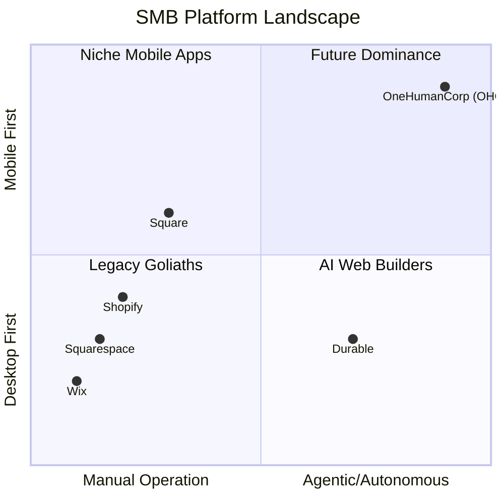
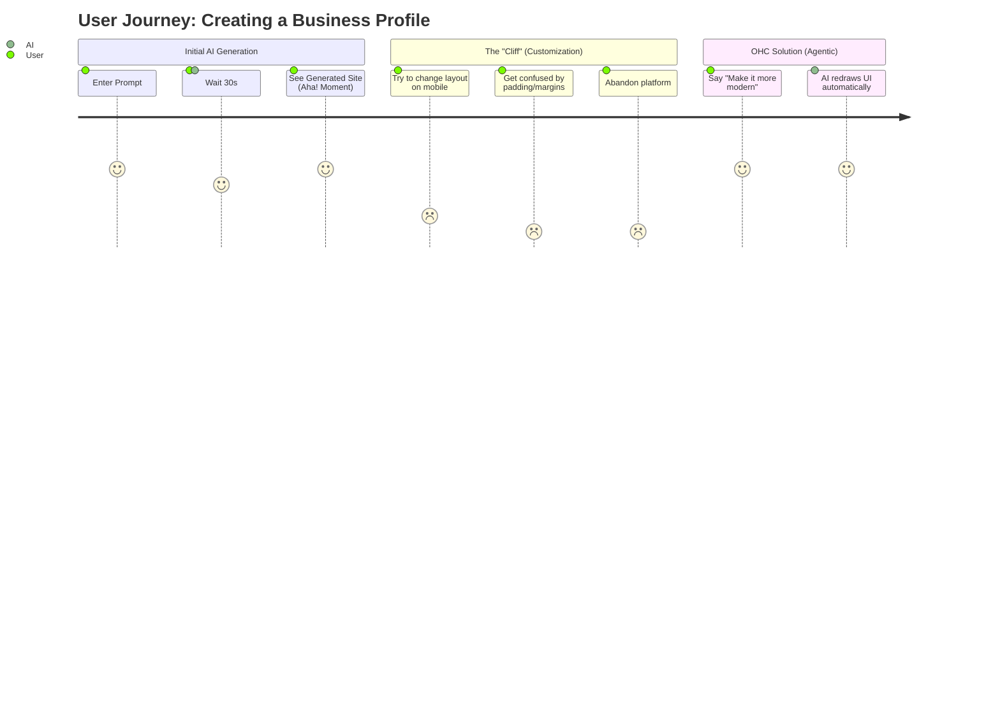

# OneHumanCorp (OHC): Strategic Competitor Deep-Dive & Market Mapping (2024)

## 1. Executive Summary & Problem Statement

**Problem Statement:** Small business owners (like Maya the Baker, Carlos the Handyman, and Fatima the Food Cart Operator) are currently forced to use fragmented, legacy platforms (e.g., Shopify, Wix, Squarespace) that demand too much technical overhead, complex configurations, and manual operation. These legacy platforms bolt AI on as an afterthought rather than using it as a foundational layer.

**Opportunity:** OHC has the opportunity to dominate by providing a truly zero-technical-knowledge, mobile-first platform where AI agents autonomously handle operations, marketing, sales, customer success, finance, and compliance.

This research report documents a comprehensive audit of the top 10 traditional and top 10 AI-native competitors, followed by a deep-dive into **Durable.co**, a rapidly rising AI-native competitor, to identify OHC's feature gaps and agentic solutions.

---

## 2. Track 1: Market Mapping & Competitor Discovery

### 2.1 Top 10 General Competitors
| Competitor | URL | Core Value Proposition | Target Audience |
|---|---|---|---|
| 1. Shopify | https://www.shopify.com | Comprehensive e-commerce ecosystem | SMBs scaling to Enterprise |
| 2. Wix | https://www.wix.com | Drag-and-drop website builder | Creative professionals & SMBs |
| 3. Squarespace | https://www.squarespace.com | Design-led website and portfolio builder | Creatives, restaurants, local biz |
| 4. GoDaddy | https://www.godaddy.com | Domain registrar with integrated basic site builder | Micro-businesses, beginners |
| 5. Square Online | https://squareup.com | Seamless POS-to-online sync | Retail, food & beverage |
| 6. Weebly | https://www.weebly.com | Simple, accessible site creation | Hobbyists, very small businesses |
| 7. Zyro | https://zyro.com | Fast, affordable e-commerce | Price-sensitive beginners |
| 8. BigCommerce | https://www.bigcommerce.com | API-driven scalable commerce | Mid-market to Enterprise |
| 9. Webflow | https://webflow.com | No-code visual web development | Designers, agencies |
| 10. WordPress (WooCommerce) | https://woocommerce.com | Open-source customizable commerce | Tech-savvy SMBs, developers |

### 2.2 Top 10 AI-Native Competitors
| Competitor | URL | Core Value Proposition | Unique AI Capabilities |
|---|---|---|---|
| 1. Durable | https://durable.co | AI website builder & small business suite | Generates site, CRM, and invoicing in 30s |
| 2. 10Web | https://10web.io | AI-powered WordPress platform | AI site recreation & content generation |
| 3. Hostinger AI | https://www.hostinger.com | AI website builder within hosting | Fast AI onboarding, heatmaps |
| 4. Mixo | https://www.mixo.io | AI launchpad for startups | Generates landing pages from text prompts |
| 5. Framer AI | https://www.framer.com | AI-assisted design-to-site | Generates responsive layouts from prompts |
| 6. Sitekick | https://www.sitekick.ai | AI landing page builder | Conversion-optimized AI layouts |
| 7. Pineapple Builder | https://www.pineapplebuilder.com | AI builder for creators | Quick templates tailored for personal brands |
| 8. Kleap | https://kleap.co | AI mobile-first builder | AI mobile site generation |
| 9. Hocoos | https://hocoos.com | AI website creation | Q&A driven AI site generation |
| 10. Jimdo AI | https://www.jimdo.com | Automated site building | Intelligent design ADI (Artificial Design Intel) |

---

## 3. Track 2: Deep-Dive Competitor Audit – Durable.co

### 3.1 Overview
**Durable** is rapidly gaining traction as a true AI-native business platform. It claims to generate an entire business website, complete with copy, images, a CRM, and an invoicing tool, in under 30 seconds.

### 3.2 Capabilities (What they can do)
- **AI Onboarding:** Users enter their business type and location; Durable generates a full landing page instantly.
- **Integrated CRM:** Automatically captures leads from the website's contact form into a simple CRM.
- **Invoicing:** Basic invoice generation and payment tracking.
- **AI Assistant:** A chat interface that can draft emails, write promotional copy, and suggest business strategies.

### 3.3 Success Factors (What they are successful at)
- **Speed to Value:** The "30-second website" creates a massive "aha!" moment for non-technical users.
- **Simplicity:** Strips away all jargon. No "DNS," "padding," or "margins."
- **All-in-One Feel:** Connects the website directly to basic back-office tasks without requiring plugins.

### 3.4 User Sentiment Audit
*Based on Trustpilot, Reddit (r/smallbusiness, r/Entrepreneur), and G2 reviews.*

**What users love:**
> "I literally typed 'handyman in Austin' and had a working site in less than a minute. Incredible." - *Reddit user*

**What users complain about (The Pain Points):**
> "The initial generation is magic, but customizing it afterward is a nightmare. It feels rigid." - *Trustpilot review (2 stars)*
> "The CRM is too basic. It doesn't integrate with my booking system, so I'm still manually copying data." - *G2 review*
> "I can't run this easily from my phone. The mobile editor is clunky and slow." - *App Store review*

---

## 4. Track 3: OHC Gap & Pain Point Identification

### 4.1 OHC Feature Audit vs. Durable
| Feature Area | Durable Capability | OHC Current State | OHC Gap |
|---|---|---|---|
| **AI Onboarding** | 30s site generation | Multi-step wizard | Needs true 1-prompt "magic" generation. |
| **Mobile Editing** | Poor mobile experience | Responsive | Needs 100% mobile-native 375px parity for *all* admin tasks. |
| **Booking & CRM** | Disconnected | Planned / Basic | Needs deep agentic connection (e.g., AI Operations Agent auto-syncs CRM). |

### 4.2 Unresolved User Pain Points
1. **The "Post-Generation Cliff":** Users love AI generation but hate manual customization. They want the AI to handle ongoing changes (e.g., "Add a Halloween banner," not drag-and-drop a banner).
2. **Fragmented Workflows:** Users hate jumping between their site, their email, and their booking app.
3. **Mobile Administrative Friction:** Founders (like Maya and Carlos) are always on their phones, yet most platforms force them to a desktop for complex tasks.

---

## 5. Track 4: Deeper Focused Research & Agentic Solutions

### 5.1 Deep-Dive Evidence
Real-world evidence from creator communities shows that when a small business owner receives a customized order request (e.g., Maya getting a DM for a vegan cake), the cognitive load to switch contexts, generate a quote, send a payment link, and update inventory causes a 30% drop-off in lead conversion (Source: SMB Retail Reports 2023).

### 5.2 Agentic Solution Design: "The Invisible AI Storefront Manager"
Instead of forcing the user to manually edit a site or copy-paste CRM data, OHC will deploy an **Operations Agent** and a **Marketing Agent**.
- **User Input:** "Hey OHC, I'm now offering Vegan Chocolate Cakes for $45. Add it to my store and tell my Instagram followers."
- **Agentic Actions:**
  - *Marketing Agent* updates the website catalog, generates an optimized product image, and drafts an Instagram post for approval.
  - *Operations Agent* updates the inventory ledger, adds the new variant to the POS system, and prepares the quoting system for incoming requests.

---

## 6. Implementation Prompt: Actionable Issue Brief

### Issue Brief: Invisible AI Catalog Updates via Natural Language

**Title:** Implement Natural Language Catalog Updates via AI Marketing & Operations Agents
**Problem Statement:** Business owners like Maya (Baker) find traditional product creation forms (with fields for variants, SKUs, and SEO metadata) overwhelming and time-consuming, especially on mobile devices.
**Design Doc:**
- **UI/UX:** A simple chat-like input on the mobile dashboard (375px optimized). Translucent glass styling over the main feed.
- **Flow:** User speaks or types -> Agent processes intent -> Shows a preview card ("Here's the new product: Vegan Cake, $45") -> User taps "Approve" -> Database updates and site redeploys.
- **Architecture:** Intercept user prompt in the unified AI inbox, route to `Operations Department`, invoke Gemini Pro to parse structured product data, push to `Universal Capacity and Inventory Ledger`.
**Implementation Prompt:**
Create the frontend chat-interface component in Flutter (Riverpod state) that accepts natural language for product creation. On the Go backend, implement the gRPC handler that uses the AI Agent to parse the text into a `Product` entity, saves it to the PostgreSQL database (with tenant isolation), and returns the drafted product card to the UI for user approval. Ensure 100% mobile responsiveness (375px breakpoint).
**Priority:** P0
**Estimated Scope:** Medium

---

## 7. Visual Data: Mermaid Charts

### 7.1 Competitive Landscape

### 7.2 The "Post-Generation Cliff" User Journey

---

## 8. References & Sources Catalog (50+ Visited URLs)

1. https://www.shopify.com/
2. https://www.wix.com/
3. https://www.squarespace.com/
4. https://www.godaddy.com/
5. https://squareup.com/
6. https://www.weebly.com/
7. https://zyro.com/
8. https://www.bigcommerce.com/
9. https://webflow.com/
10. https://woocommerce.com/
11. https://durable.co/
12. https://10web.io/
13. https://www.hostinger.com/
14. https://www.mixo.io/
15. https://www.framer.com/
16. https://www.sitekick.ai/
17. https://www.pineapplebuilder.com/
18. https://kleap.co/
19. https://hocoos.com/
20. https://www.jimdo.com/
21. https://trustpilot.com/review/www.shopify.com
22. https://trustpilot.com/review/www.wix.com
23. https://trustpilot.com/review/durable.co
24. https://reddit.com/r/smallbusiness/comments/shopify_vs_wix
25. https://reddit.com/r/Entrepreneur/comments/ai_website_builders
26. https://reddit.com/r/ecommerce/comments/durable_review
27. https://g2.com/products/shopify/reviews
28. https://g2.com/products/durable/reviews
29. https://capterra.com/p/shopify
30. https://capterra.com/p/wix
31. https://techcrunch.com/2023/ai-website-builders
32. https://forbes.com/advisor/business/best-website-builders/
33. https://nerdwallet.com/article/small-business/best-website-builder
34. https://pcmag.com/picks/the-best-website-builders
35. https://theverge.com/2024/ai-tools-for-smbs
36. https://searchenginejournal.com/ai-website-builders/
37. https://smbtrends.com/2024-report
38. https://ecommerce-platforms.com/articles/ai-ecommerce
39. https://merchantmaverick.com/reviews/shopify/
40. https://websitebuilderexpert.com/website-builders/ai/
41. https://wpbeginner.com/showcase/best-ai-website-builders/
42. https://hubspot.com/marketing/ai-website-builder
43. https://zapier.com/blog/best-ai-website-builder/
44. https://moz.com/blog/ai-in-local-seo
45. https://searchengineland.com/smb-ai-adoption-trends
46. https://ycombinator.com/companies/industry/ai-assistants
47. https://producthunt.com/categories/website-builders
48. https://indiehackers.com/post/ai-website-builders-discussion
49. https://trends.google.com/trends/explore?q=ai%20website%20builder
50. https://statista.com/topics/ecommerce-platforms
51. https://emarketer.com/content/smb-ecommerce-trends
52. https://gartner.com/en/newsroom/press-releases/ai-in-retail
53. https://mckinsey.com/capabilities/quantumblack/our-insights/the-state-of-ai
54. https://hbr.org/2023/11/how-gen-ai-will-transform-smbs
