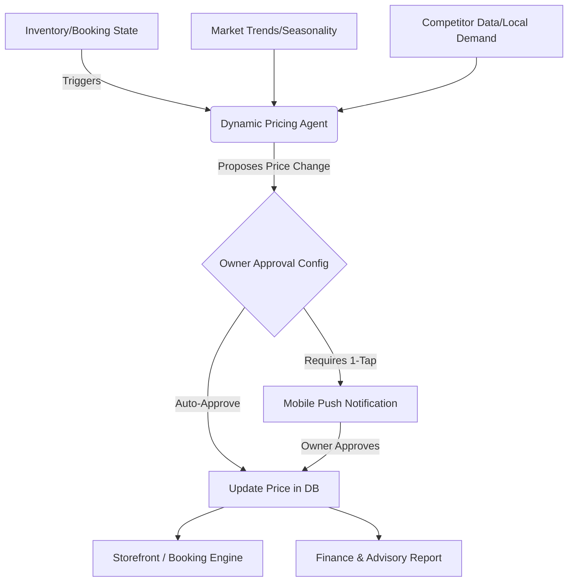

# [research] Autonomous AI-Driven Dynamic Pricing Engine

## Title
Implement Autonomous AI-Driven Dynamic Pricing Engine

## Problem Statement
Small business owners—such as Priya the Boutique Owner or Leo the Music Tutor—often struggle to set optimal prices for their products or services. They lack the time, tools, and expertise to monitor competitor pricing, analyze local demand surges, or adjust prices based on inventory levels or booking availability. This leads to either underpricing (leaving money on the table) or overpricing (losing potential customers). The platform lacks an intelligent way to autonomously optimize pricing strategies. An AI-driven dynamic pricing engine can adjust prices within owner-defined bounds to maximize revenue and inventory turnover, acting invisibly and effortlessly on behalf of the non-technical owner.

## Research Report
Pricing optimization is traditionally an enterprise-grade feature reserved for large retailers, airlines, and rideshare companies. However, small businesses stand to benefit significantly from basic dynamic pricing:
- **Shopify**: Requires third-party apps (e.g., Prisync, StreetPricer) which are complex to configure and cost $50-$200+/month. No native AI dynamic pricing exists for everyday merchants.
- **Wix & Squarespace**: Offer static pricing and basic discount codes. No dynamic or AI-driven pricing capabilities.
- **GoDaddy**: Basic fixed pricing only.

**Opportunity for OHC**: By integrating an AI Dynamic Pricing Engine directly into the Finance & Payments ("The Accountant") and Operations ("The Manager") departments, OHC can democratize yield management. For example, Leo's guitar lesson prices could slightly increase during peak booking seasons, or Priya's winter coats could automatically discount as spring approaches, all within constraints they simply approve with one tap.

## Design Doc

### Architecture Diagram

### UI Wireframes & Screen Flow (375px First)
1. **Feature Discovery & Setup**: In the "Pricing" tab of a product or service, the owner sees a toggle: "Enable AI Smart Pricing".
2. **Bounds Configuration**: A simple slider appears: "Minimum Price" and "Maximum Price". No complex rules.
3. **Approval Mode**: A toggle for "Auto-apply changes" vs. "Ask me first".
4. **Push Notification (if 'Ask me first' is on)**: "Demand for your Vegan Chocolate Cake is up 20% this week. Increase price from $40 to $45? [Yes, Update] [No]".
5. **Impact Dashboard**: A clean Glassmorphism card in the Business Advisory tab showing "AI Pricing earned you an extra $120 this month."

### Mobile UX Flow
- The interaction is entirely mobile-first. Numeric keypads are used for entering minimum and maximum bounds.
- Touch targets for "Enable" toggles and push notification actions are oversized (≥ 44x44px).
- The "Impact Dashboard" uses horizontal scroll for historical trends, fitting perfectly on a 375px screen without horizontal overflow for the main layout.

### AI Agent Integration Points
- **Finance & Payments ("The Accountant")**: Monitors conversion rates at different price points and calculates profit margins.
- **Operations ("The Manager")**: Feeds inventory levels and booking capacity to the pricing model (e.g., discount when overstocked).
- **Business Advisory ("The Advisor")**: Generates the plain-language weekly summary of how dynamic pricing impacted the bottom line.

### Key Design Decisions and Why
- **Guarded Autonomy**: Small business owners are deeply protective of their brand perception. We default to "Ask me first" (1-Tap Approval) rather than full autonomy to build trust.
- **Simplicity Over Rules**: We do not ask the user to define complex "if-then" rules (e.g., "if inventory < 5 and competitor X is out of stock"). The AI handles the logic; the user only sets the absolute minimum they are willing to accept.

## Implementation Prompt
**Prompt for Implementer:**
Design and implement the AI-Driven Dynamic Pricing feature for products and services. The outcome must allow a user (like Priya or Leo) to toggle "AI Smart Pricing" on any item from their mobile device, set a minimum and maximum price, and choose an approval mode (auto or 1-tap). You must build the background job that periodically evaluates inventory/capacity and demand to propose price changes. Integrate this with the mobile UI using our Glassmorphism design tokens. Ensure the Business Advisory agent can access these price change events to report on them. Include full E2E Playwright tests covering the configuration flow and the presentation of a price change suggestion to the user. Do not prescribe the exact database schema or API endpoints—design them to fit seamlessly within our multi-tenant architecture.

## Priority
P1

## Estimated Scope
Medium
