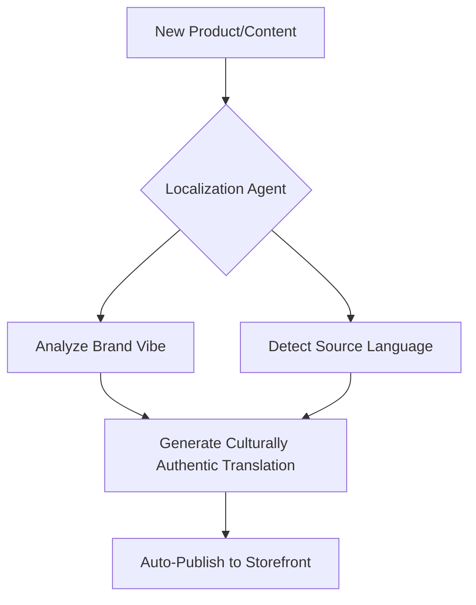

# Issue Brief: Autonomous Global Localization (Vibe-Preserving Translation)

## Problem Statement
Fatima (food cart operator) and other non-English-first founders struggle to reach wider audiences because translation tools are either too expensive (hiring pros) or too "robotic" (Google Translate), which destroys the business's brand "vibe."

## Research Report
- **Competitive Gap:** Shopify and Wix offer basic translation plugins, but they require manual setup and often break layout or tone.
- **Market Opportunity:** 99% of SMEs globally operate in non-English primary markets or serve multi-lingual communities.
- **Technical Insight:** LLMs (Gemini/GPT-4o) are now capable of "vibe-preserving" translation that maintains the cultural nuance and emotional tone of the original content.

### Comparative Table: Localization
| Feature | OHC | Shopify | Wix |
| :--- | :--- | :--- | :--- |
| **Translation Type** | Vibe-Preserving AI | Robotic Plugin | Manual Editor |
| **Cultural Nuance** | High (Context-Aware) | Low | None |
| **Automation** | Fully Autonomous | Manual Setup | Manual Entry |

## Design Doc
### High-Level Architecture
- **Localization Agent (The Promoter):** Monitors content updates on the storefront.
- **Cultural Context Map:** Stores business-specific "vibe" descriptors (e.g., "friendly", "authentic", "street-food style").
- **Auto-Sync:** Generates localized versions of product descriptions, menus, and notification emails automatically.

## Implementation Prompt
Implement a "Vibe-Preserving Localization" feature for "The Promoter". The agent should automatically detect the user's primary language and offer to generate a "culturally authentic" translation for a second target language. The translation must pass a "vibe check" against the business's core identity markers.

## Priority
P1

## Estimated Scope
Medium
