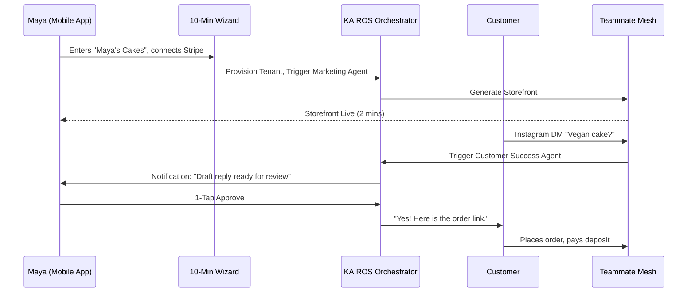
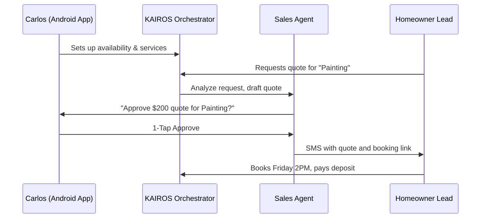
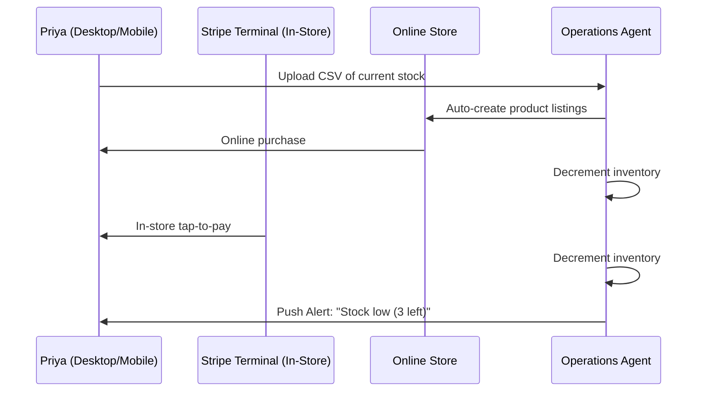
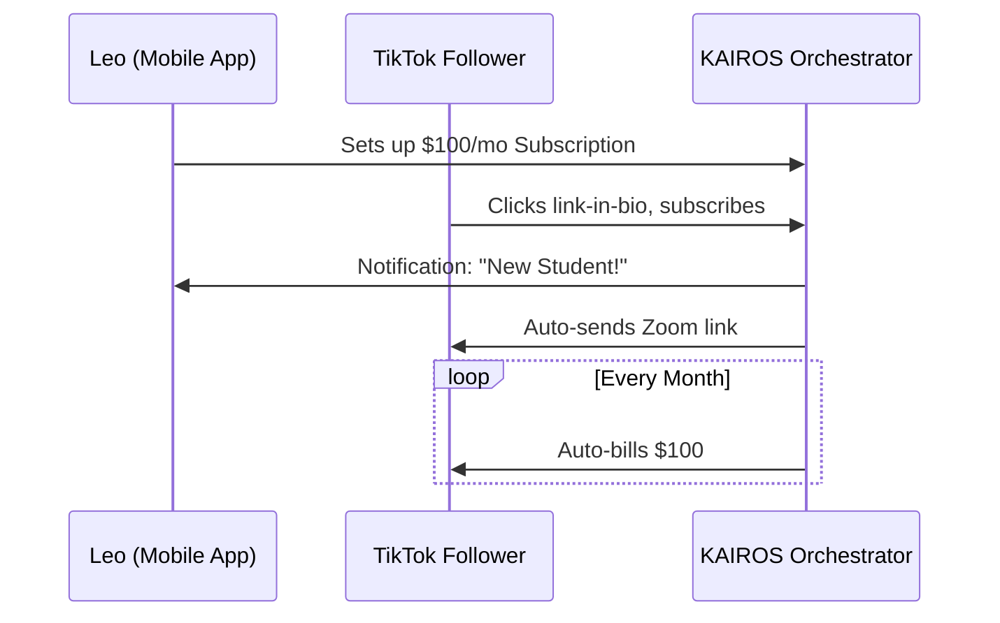
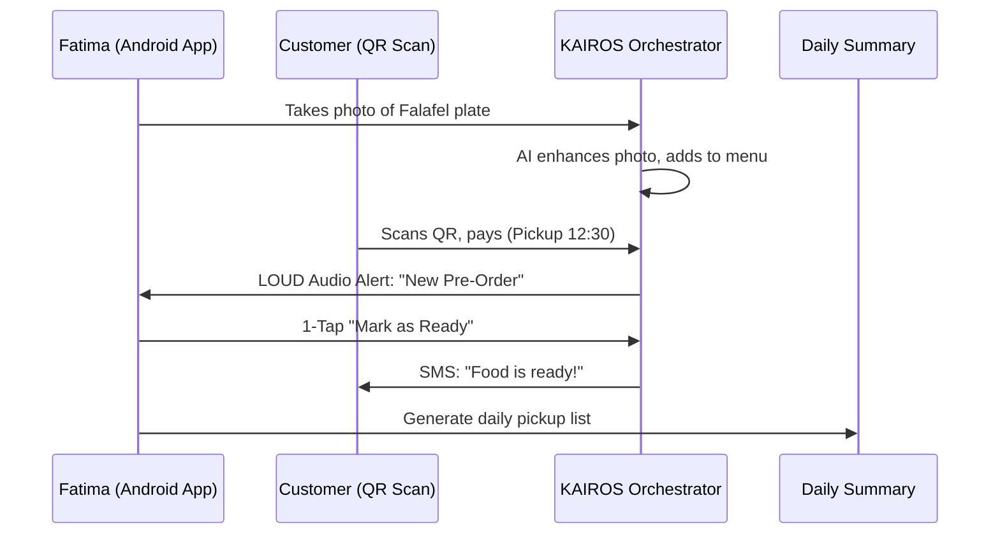

# Issue Brief: Business Journey Architecture

## Title
Business Journey Architecture: End-to-End User Journey Maps

## Problem Statement
The OHC platform aims to onboard non-technical small business owners and launch their live business in under 10 minutes. Without clearly mapped user journeys covering acquisition, onboarding, activation, retention, revenue, and referral for our core personas, the product experience may become disjointed or introduce technical friction that causes drop-off. We need a comprehensive architecture detailing these flows and identifying critical friction points.

## Research Report
- **Goal**: Design the complete end-to-end user journey for each of the primary personas (Maya, Carlos, Priya, Leo, and Fatima).
- **Findings**:
  - **Mobile-First Dependency**: Most of the target demographic (e.g., Maya, Carlos, Fatima) runs their business entirely from a smartphone (iOS or Android). Desktop parity is secondary.
  - **Friction Points**: Setup paralysis (empty canvas), payment gateway setup, and technical jargon (e.g., DNS configuration) are the primary drop-off triggers.
  - **AI Abstraction**: By leveraging the 10-Minute Wizard and background AI agents, we can eliminate the traditional "blank canvas" problem seen in platforms like Shopify.

## Design Doc

### Persona Sequence Diagrams & Flows

#### 1. Maya — The Home Baker (28, Non-Technical, Mobile Only)
* **Acquisition**: Discovers OHC via Instagram ad.
* **Onboarding**: Uses the 10-Minute Wizard. AI agents auto-generate a glassmorphic catalog.
* **Activation**: Receives first custom cake order with a 50% deposit.
* **Retention**: Customer Success agent handles Instagram DMs automatically.
* **Revenue**: Upgrades to Starter Tier ($9/mo) after reaching her 100th AI action to maintain the automated DM replies.
* **Referral**: Other bakers see her streamlined "Link in Bio" and ask what platform she uses.

#### 2. Carlos — The Freelance Handyman (42, Non-Technical, Android Only)
* **Acquisition**: Word-of-mouth referral.
* **Onboarding**: Minimal inputs; selects a service listing template.
* **Activation**: A homeowner books a slot and pays a deposit online.
* **Retention**: The Sales Agent follows up with unconfirmed leads.
* **Revenue**: Upgrades to Pro ($29/mo) to unlock unlimited AI actions to handle the volume of automated SMS quotes.
* **Referral**: Mentions how easy the platform is to his electrician friend at the hardware store.

#### 3. Priya — The Boutique Owner (35, Semi-Technical, Mac + iPhone)
* **Acquisition**: Organic search for inventory sync solutions.
* **Onboarding**: Uploads inventory CSV; AI Operations maps variants. Connects Stripe Terminal.
* **Activation**: Makes synchronous online and in-store sales.
* **Retention**: Daily plain-language analytics generated by Business Advisory Agent.
* **Revenue**: Upgrades to Pro ($29/mo) for unlimited products and advanced multi-channel analytics.
* **Referral**: Recommends the platform to a fellow business owner at a local Chamber of Commerce meeting.

#### 4. Leo — The Music Tutor (22, Non-Technical, TikTok First)
* **Acquisition**: TikTok link-in-bio comparison video.
* **Onboarding**: Sets up a monthly recurring lesson package.
* **Activation**: First student subscribes; auto-generates Zoom links.
* **Retention**: AI Marketing agent drafts social posts. Auto-follows up for inactive students.
* **Revenue**: Starts on Starter ($9/mo) immediately to use his custom domain (`leoguitar.com`).
* **Referral**: Does a TikTok breakdown of how much money he makes, casually dropping the OHC platform name.

#### 5. Fatima — The Food Cart Operator (50, Non-Technical, Limited English)
* **Acquisition**: Local community rep.
* **Onboarding**: Arabic language UI. Snaps photos, AI enhances them.
* **Activation**: Customer scans QR code and pre-orders. Fatima gets an audio alert.
* **Retention**: Prints consolidated daily pickup list. Uses the "Sold Out" toggle.
* **Revenue**: Remains on Free ($0/mo) tier, paying slightly higher transaction fees due to the immense value.
* **Referral**: Another food cart owner next to her asks how she avoids long lines, and she shows them the app.

### Friction Point Mitigation
- **Empty State Paralysis**: Prevented by the 10-Minute generative AI Wizard.
- **Payment Setup**: Use embedded Stripe Connect; ask "Where should we send your money?"
- **Notification Overload**: Batch low-priority actions; implement the "Draft-for-Review" queue.
- **Technical Jargon**: Default to OHC subdomains; hide DNS complexities entirely.
- **AI Hallucination Trust**: External communication actions mandate 1-tap human approval on mobile.

## Implementation Prompt
"Implement the foundational UX flows and onboarding wizards based on the Business Journey Architecture. Focus on the mobile-first (375px) 10-Minute Wizard that gathers essential business details and orchestrates the initial site generation via the Marketing Agent. Introduce the 'Draft-for-Review' UI queue for high-risk AI actions."

## Priority
P0

## Estimated Scope
Medium
