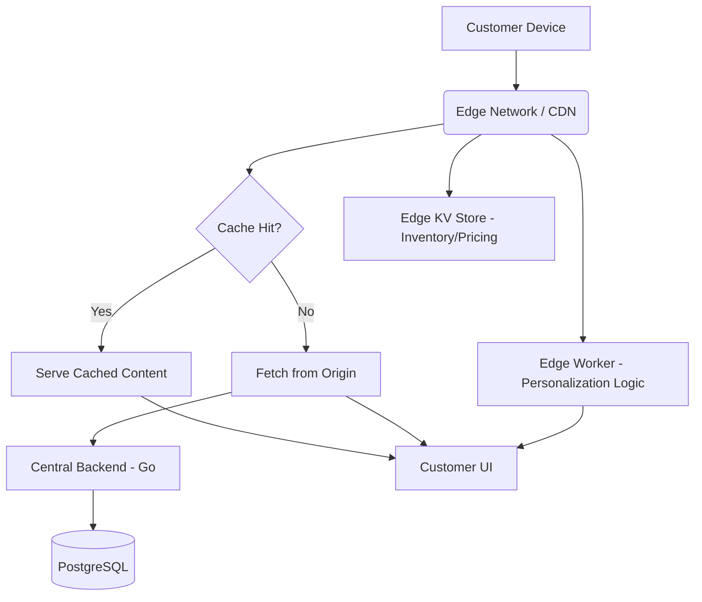

# Research Report: Edge-Cached Dynamic Storefronts with Edge AI Personalization

## Problem Statement
Small business owners like Maya (baker) and Priya (boutique owner) need their storefronts to load instantly for customers, regardless of global location. However, dynamic features like inventory availability, personalized recommendations, and real-time localized pricing currently rely on centralized backend calls, leading to increased latency, especially on mobile networks, and potential downtime during traffic spikes (e.g., product drops). This centralized architecture degrades the customer experience and increases cart abandonment rates.

## Research Report
### Competitive Analysis
*   **Shopify:** Uses a globally distributed CDN and Edge computing for fast storefront delivery, but deeper personalization often requires app integrations that add latency.
*   **Wix & Squarespace:** Rely heavily on CDN caching for static assets but can struggle with the performance of highly dynamic, data-driven storefronts.
*   **OHC Opportunity:** By pushing not just static assets, but dynamic rendering and lightweight AI personalization (e.g., sorting products based on local trends or browsing history) to the edge (e.g., Cloudflare Workers or similar edge compute), OHC can achieve sub-100ms time-to-interactive for all storefronts globally.

### Findings
1.  **Latency is Revenue:** Every 100ms delay in page load time correlates with a measurable drop in conversion rates.
2.  **Dynamic Content Bottleneck:** Fetching live inventory or running recommendation models on a central server for every page load is inefficient and slow.
3.  **Edge Compute Maturation:** Edge platforms now support lightweight KV stores (for inventory caching) and WASM/Edge Functions (for logic and basic AI inference).

## Design Doc
### Architecture
1.  **Edge Routing & Caching:** All storefront requests hit an Edge Network first.
2.  **Stale-While-Revalidate Strategy:** The Edge serves the cached HTML/JSON immediately while asynchronously fetching updates from the central origin server.
3.  **Edge KV Store:** Inventory counts and localized pricing rules are synced to an Edge KV store.
4.  **Edge AI Personalization:** A lightweight, pre-trained model (or rules engine) runs on the Edge to reorder products based on the user's location, time of day, and anonymized session context.

### Mobile UX Flow (375px)
*   **Instant Load:** The skeleton UI and critical content (hero image, top products) load instantly from the edge cache.
*   **Progressive Enhancement:** Inventory status and personalized recommendations hydrate seamlessly within milliseconds without layout shifts.
*   **Offline Resilience:** If the customer loses connection, the Service Worker (PWA) serves the last cached version of the storefront.

### AI Agent Integration
*   **The Promoter (Marketing & Advertising):** Analyzes global traffic patterns and adjusts Edge caching rules (e.g., increasing cache TTL for viral products).
*   **The Operations Manager:** Manages the synchronization of inventory data between the central database and the Edge KV store.

## Implementation Prompt
**Goal:** Implement a distributed edge architecture for OHC storefronts to achieve sub-100ms loading times globally, including dynamic inventory and personalized product sorting.

**Acceptance Criteria:**
1.  All storefront requests route through an Edge Network proxy.
2.  Implement a stale-while-revalidate caching strategy for storefront HTML and API responses.
3.  Deploy an Edge KV store to cache real-time inventory counts, reducing central database load.
4.  Implement a lightweight edge function to dynamically sort products based on the user's region and time of day.
5.  Ensure 100% mobile parity and seamless hydration on 375px viewports.
6.  Add OpenTelemetry tracing to measure Edge latency vs. Origin latency.
7.  Provide Playwright E2E tests verifying instant load times and dynamic hydration on simulated slow 3G networks.
