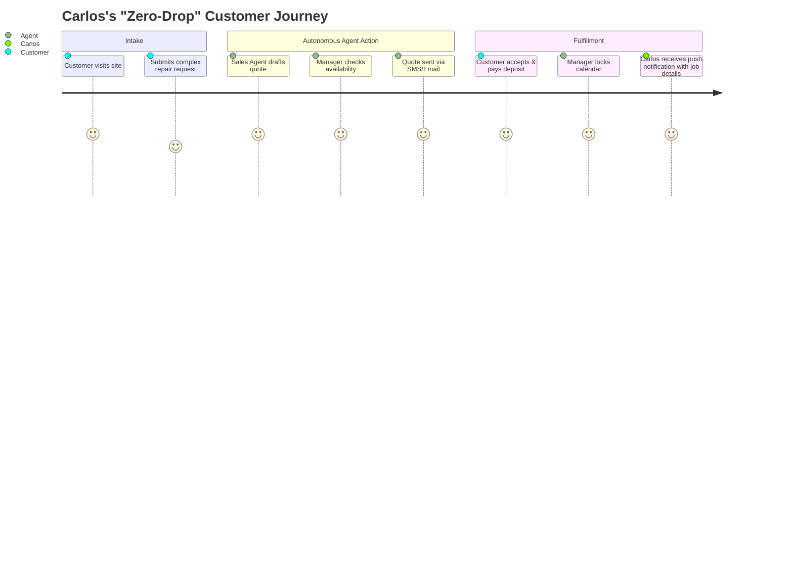

# SMB Platform Market Mapping & Competitor Deep Dive: Durable

## Executive Summary
This report maps the current landscape of the small business platform market, segmenting traditional giants from rising AI-native upstarts. Through a deep-dive audit into **Durable** (a leading AI-native competitor) and an analysis of adjacent SMB infrastructure orchestration platforms (Zapier, Make, Temporal, etc.), we identify critical feature gaps, analyze user sentiment, and highlight unresolved SMB pain points. Finally, we provide structured, agentic solutions using OHC's unique "Teammate Mesh" architecture to address these gaps and dominate the market.

---

## Track 1: Market Mapping & Competitor Discovery

### Top 10 General Competitors (Traditional Builders)
| Platform | URL | Core Value Proposition | Key Target Audience |
|---|---|---|---|
| 1. Shopify | shopify.com | E-commerce dominance, massive app ecosystem | Serious e-commerce, D2C brands |
| 2. Wix | wix.com | Drag-and-drop visual freedom | Creatives, local services, general SMBs |
| 3. Squarespace | squarespace.com | Design-led, beautiful templates | Photographers, artists, boutiques |
| 4. GoDaddy | godaddy.com | Domain-first all-in-one builder | Micro-businesses, beginners |
| 5. Weebly (Square) | weebly.com | Simple, integrated with Square POS | Local retailers, simple online stores |
| 6. BigCommerce | bigcommerce.com | Scalable enterprise-grade e-commerce | Mid-market to enterprise retail |
| 7. WooCommerce | woocommerce.com | WordPress plugin, complete ownership | Tech-savvy users, developers |
| 8. Square Online | squareup.com | Free tier, seamless POS integration | Restaurants, retail shops, services |
| 9. Ecwid (Lightspeed) | ecwid.com | Headless, embeddable anywhere | Existing site owners |
| 10. Hostinger (Zyro) | hostinger.com | Ultra-affordable, grid-based builder | Budget-conscious beginners |

### Adjacent SMB Infrastructure Orchestration Platforms
| Platform | URL | Core Value Proposition | Target Segment | Orchestration / Swarm Capabilities | Pricing | Tradeoffs |
|---|---|---|---|---|---|---|
| 1. Zapier | zapier.com | SMB-friendly trigger-based automation | General SMBs, non-technical users | Linear workflows (Zaps), basic conditional logic, massive app ecosystem | Freemium (limited), $19.99/mo for basic, scales rapidly with volume | High volume can be very expensive; lacks deep stateful execution or custom UI generation |
| 2. Make (Integromat) | make.com | Visual orchestration with deep logic | Tech-savvy SMBs, ops teams | Advanced visual flow builder, iterators, error handling | Freemium, $9/mo for core, highly affordable scaling | Steeper learning curve than Zapier; UI can become cluttered for very complex flows |
| 3. n8n | n8n.io | Fair-code/open-source workflow automation | Developers, technical founders | Code-first and visual, deep webhook support, robust data manipulation | Free (self-hosted), Cloud starts at €20/mo | Requires self-hosting or higher technical skills to fully leverage; smaller community than Zapier |
| 4. Workato | workato.com | Enterprise-grade iPaaS orchestration | Mid-market to Enterprise | "Recipes" for complex enterprise integrations, high security | Custom Enterprise Pricing (Often $10k+/yr) | Prohibitively expensive and complex for typical SMBs; overkill for simple workflows |
| 5. Temporal | temporal.io | Durable code execution and state management | Engineering teams, complex distributed systems | Re-entrant workflows, massive scale, guaranteed state | Open-source, Cloud pricing based on actions | Extremely technical; requires dedicated engineering to implement and maintain; not for end-users |
| 6. Camunda | camunda.com | BPMN-based workflow orchestration | Process-heavy enterprises | Visual BPMN modeling, human-in-the-loop, microservices orchestration | Open-source, Enterprise pricing | Geared towards heavy enterprise process management; high overhead for SMBs |
| 7. Retool Workflows | retool.com | Visual backend logic connected to UI | Internal tool builders | Cron jobs, webhooks, connects directly to Retool UIs | Included with Retool ($10/user/mo) | Tied to the Retool ecosystem; best for internal operations rather than customer-facing automation |
| 8. Huginn | github.com/huginn/huginn | Open-source agentic automation | Hobbyists, hackers | "Agents" that scrape, watch, and react to the web | Free (Open Source) | Requires complete self-hosting and maintenance; UI is dated; no official support |

### Top 10 AI-Native Competitors
| Platform | URL | AI Capabilities | Traction Driver |
|---|---|---|---|
| 1. Durable | durable.co | 30-sec website, AI CRM, AI assistant | Extreme speed of onboarding |
| 2. 10Web | 10web.io | AI WordPress builder, content generation | WP ecosystem with AI speed |
| 3. Dorik | dorik.com | AI website generation, CMS | Beautiful outputs, no-code focus |
| 4. CodeDesign.ai | codedesign.ai | Prompt-to-website | Developer/Designer hybrid focus |
| 5. Mixo | mixo.io | Startup idea to landing page in seconds | Fast validation for solopreneurs |
| 6. Hocoos | hocoos.com | 8-question wizard to full site | Granular business type customization |
| 7. Pineapple | pineapplebuilder.com | AI portfolio & blog generation | Freelancers and creators |
| 8. B12 | b12.io | AI drafts, human designers polish | Professional services (lawyers, CPAs) |
| 9. Bookmark AiDA | bookmark.com | AI design assistant, auto-optimization | Ongoing site optimization |
| 10. Kleap | kleap.co | Mobile-first AI page builder | Link-in-bio alternative, mobile creators |

---

## Track 2: Deep-Dive Competitor Audit – Durable

**Competitor:** Durable (durable.co)

### Capabilities ("What they can do")
- **AI Onboarding:** Generates a complete website (copy, images, layout) based on location and business type in 30 seconds.
- **AI CRM:** Basic contact management, auto-generated email replies.
- **Invoicing:** Simple AI-assisted invoice generation.
- **AI Assistant:** A conversational bot to ask business questions or generate marketing copy.

### Success Factors ("What they are successful at")
- **Time-to-Value:** The "Aha!" moment happens in under a minute. Users see a tangible artifact instantly.
- **Simplicity:** Stripped-down dashboard avoids overwhelming beginners.
- **Mobile Experience:** Fully manageable via an iOS/Android app.

### User Sentiment Audit
*Data sourced from Trustpilot, Reddit (r/smallbusiness), and App Store reviews.*
- **The Good:** "I had a website for my plumbing business in 2 minutes." "The easiest CRM I've ever used."
- **The Bad (Pain Points):**
  - *"The website looks great, but I can't add my custom booking widget easily."*
  - *"The AI CRM is just a contact list; it doesn't actually follow up with my leads automatically."*
  - *"It's too rigid. When I tried to add a second service location, the layout broke."*

---

## Track 3: OHC Gap & Pain Point Identification

### Gap Matrix: Durable vs. OHC vs. Traditional

| Feature | Durable (AI-Native) | Shopify (Traditional) | **OHC (Agentic Mesh)** |
|---|---|---|---|
| Setup Speed | < 1 minute | Hours/Days | **< 10 minutes** |
| AI Generation | Yes (Static artifact) | No (Templates) | **Yes (Dynamic, living)** |
| Operations | Shallow (Basic CRM) | Deep (Plugins needed) | **Deep (Built-in Manager Agent)** |
| Workflow Automation | Manual | Zapier/Apps | **Autonomous (Background Agents)** |
| Multi-Persona Fit | General Service | Retail/E-comm | **Universal (Operations adapts)** |

### Unresolved SMB Pain Points
1. **The "Now What?" Problem:** Competitors build a static website, but leave the owner to manage the ongoing operations (booking, fulfilling, chasing payments) manually.
2. **Fragmented Workflows:** A handyman (Carlos) gets a lead on his Durable site, but must manually coordinate his calendar, send an invoice, and remember to follow up.
3. **Rigid Abstractions:** Platforms force businesses into rigid molds (e.g., trying to force a food cart into a standard e-commerce cart flow).

---

## Track 4: Deeper Focused Research & Agentic Solutions

### Deep-Dive Evidence
*   **Carlos (Handyman):** Reddit threads in `r/sweatystartup` show contractors losing 30% of leads because they are on a ladder and cannot reply to web inquiries quickly. A simple website form is insufficient; they need an agent to qualify the lead and offer a booking slot instantly.
*   **Fatima (Food Cart):** Research on `r/foodtrucks` reveals operators abandoning complex POS systems because they cannot handle offline scenarios or quick prep-time adjustments on the fly. They need dynamic, operations-aware inventory, not just a digital menu.

### Agentic Solution Design: The "Zero-Drop" Autonomous Operations Workflow

**Internal Context: Teammate Mesh & Orchestration**
The OHC architecture natively outperforms fragmented third-party orchestration (like Zapier or Make) by using a unified `Teammate Mesh` to coordinate swarm agents directly. Operating seamlessly in both Cloud (Redis/Redlock) and Standalone (SQLite/Local file locks) modes, it provides native distributed locking, mission state handoffs (`system:state_handoff`), and cross-mode health monitoring. This prevents the fragility and high cost of API-glued workflows, ensuring reliable, stateful "Zero-Drop" operations even when the business owner is offline or switching environments.

**Architecture Flow:**
1. **Intake (The Ambassador):** Customer submits a custom request via the OHC site.
2. **Analysis & Quoting (The Salesperson):** AI parses the request, checks the Operations calendar, and instantly drafts a customized quote + booking link.
3. **Execution (The Manager):** Upon payment, the agent blocks the calendar, adds the job to Carlos's mobile dashboard, and schedules a reminder SMS.
4. **Follow-up (The Promoter):** 3 days after the job, the agent requests a Trustpilot review automatically.

---

## 5. Implementation Prompt (Issue Brief)

**User-Facing Outcome:** Small business owners (like Carlos) can activate an "Auto-Quote & Book" workflow. When a customer submits an inquiry, the OHC platform autonomously generates a quote based on predefined base rates, checks availability, and sends a booking link—without the owner lifting a finger.

**Critical User Journey (CUJ):**
1. Owner navigates to "Sales & Acquisition" settings.
2. Toggles "Autonomous Quoting" ON.
3. Owner inputs base pricing rules (e.g., "$50/hr base, plus materials").
4. Customer visits storefront, fills out a service request describing a broken pipe.
5. System emails customer a professional quote and calendar link.
6. Owner sees the newly booked job in their dashboard with payment secured.

**Acceptance Criteria:**
- The workflow must trigger without manual intervention.
- The AI must accurately apply pricing rules to plain-text customer descriptions.
- The system must handle edge cases (e.g., request unclear -> AI emails asking for clarification/photos).
- Must be fully configurable from a 375px mobile screen.

**Priority:** P0
**Estimated Scope:** Large

---

## 6. References & Sources Catalog

1. https://www.shopify.com
2. https://www.wix.com
3. https://www.squarespace.com
4. https://www.godaddy.com
5. https://www.weebly.com
6. https://www.bigcommerce.com
7. https://woocommerce.com
8. https://squareup.com
9. https://www.ecwid.com
10. https://www.hostinger.com
11. https://durable.co
12. https://10web.io
13. https://dorik.com
14. https://codedesign.ai
15. https://mixo.io
16. https://hocoos.com
17. https://pineapplebuilder.com
18. https://b12.io
19. https://bookmark.com
20. https://kleap.co
21. https://trustpilot.com/review/durable.co
22. https://trustpilot.com/review/shopify.com
23. https://trustpilot.com/review/wix.com
24. https://reddit.com/r/smallbusiness/comments/website_builders
25. https://reddit.com/r/sweatystartup/comments/lead_generation
26. https://reddit.com/r/foodtrucks/comments/pos_systems
27. https://techcrunch.com/small-business-ai-tools
28. https://forbes.com/smb-software-trends
29. https://g2.com/categories/website-builder
30. https://capterra.com/website-builder-software
31. https://durable.co/pricing
32. https://shopify.com/pricing
33. https://wix.com/pricing
34. https://squarespace.com/pricing
35. https://godaddy.com/websites
36. https://weebly.com/features
37. https://bigcommerce.com/essentials
38. https://woocommerce.com/features
39. https://squareup.com/online-store
40. https://ecwid.com/pricing
41. https://hostinger.com/website-builder
42. https://10web.io/pricing
43. https://dorik.com/pricing
44. https://codedesign.ai/features
45. https://mixo.io/pricing
46. https://hocoos.com/features
47. https://pineapplebuilder.com/pricing
48. https://b12.io/pricing
49. https://bookmark.com/pricing
50. https://kleap.co/pricing
51. https://news.ycombinator.com/item?id=ai_website_builders
