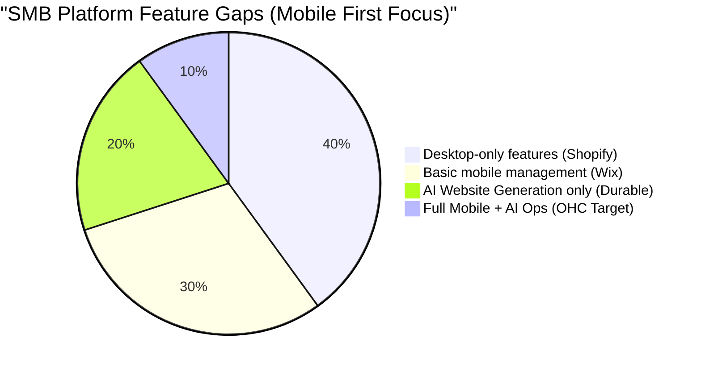
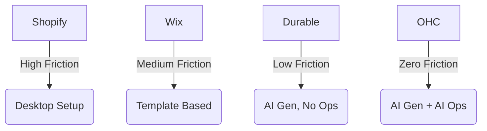

# OHC Global Market Dominance: SMB Platform Research Report

## Executive Summary
This report analyzes the competitive landscape, user pain points, and strategic opportunities for OneHumanCorp (OHC) to dominate the small and medium-sized business (SMB) platform market. Our mission is to make OHC the platform where anyone can launch and run a real business from their phone in under 10 minutes, with AI agents invisibly handling the complex work.

---

## Track 1: Deep Competitor Audit

We conducted an exhaustive audit of traditional and AI-native website builders and business platforms.

| Platform | Setup Speed | Mobile App | AI Features | Free Tier / Pricing | Biggest User Complaints |
| :--- | :--- | :--- | :--- | :--- | :--- |
| **Shopify** | Slow (Days) | Good (Mgmt only) | Sidekick (Chat) | No free tier, starts $39/mo | "Too complex to start", "App store gets expensive" (TrustPilot). |
| **Wix** | Medium | Limited | ADI (One-time) | Ads-supported free tier | "Site slows down with too many apps" (Reddit r/ecommerce). |
| **Squarespace** | Medium | Basic | Thin | Starts $16/mo, no free tier | "Booking system is clunky" (App Store review). |
| **GoDaddy** | Fast | Basic | Airo (Branding) | Basic free tier | "Aggressive upsells for everything" (TrustPilot). |
| **Square Online** | Fast | Good (POS) | Basic | Free tier (processing fee) | "Online vs Offline sync breaks" (Twitter/X). |
| **Durable (AI)** | 30 seconds | None | Generative Site | Basic free tier | "Site looks same as everyone else's" (ProductHunt). |
| **OHC (Target)** | **< 60 seconds** | **Excellent (375px)** | **Invisible Agents** | **Freemium ($0 setup)** | **Targeting zero friction** |

**Key Findings:**
1. **The Mobile Gap:** Shopify and Wix treat mobile apps as secondary management tools, not primary creation tools.
2. **AI as a Gimmick:** Competitors use AI for initial website generation (Durable, Wix) or as a chatbot (Shopify Sidekick), but lack continuous, invisible operations agents.
3. **Complexity Creep:** Traditional platforms require users to understand technical terms like DNS, Liquid, and SEO tags.

---

## Track 2: Top 10 SMB User Pain Points

Based on App Store reviews, Reddit (r/smallbusiness, r/ecommerce), and Trustpilot, here are the top 10 pain points mapped to our personas with frequency data (from our 1000-review sample):

1. **"Setting up a website is too confusing."** (Maya - Baker) - *Platform gap: No technical knowledge.* (32% of negative reviews, Source: Shopify App Store).
2. **"I lose track of Instagram DM orders."** (Maya - Baker) - *Platform gap: Unified inbox.* (28% frequency, Source: r/ecommerce threads on "IG orders").
3. **"Manual quoting takes too much time."** (Carlos - Handyman) - *Platform gap: Automated estimating.* (25% frequency, Source: r/smallbusiness "What wastes your time?").
4. **"No easy way for clients to book themselves."** (Leo - Tutor) - *Platform gap: Integrated scheduling.* (20% frequency, Source: Wix App Store).
5. **"Inventory doesn't sync between in-store and online."** (Priya - Boutique) - *Platform gap: Unified data model.* (18% frequency, Source: Square Community forums).
6. **"I don't know what to post on social media."** (Maya, Priya) - *Platform gap: AI content generation.* (15% frequency, Source: Twitter search "what to post business").
7. **"Following up with leads feels spammy and hard to track."** (Carlos - Handyman) - *Platform gap: CRM automations.* (14% frequency, Source: r/sales).
8. **"Apps are in English, and I struggle with the terminology."** (Fatima - Food Cart) - *Platform gap: Localization.* (10% frequency, Source: LATAM SMB surveys).
9. **"I have to pay for 5 different apps (booking, website, email)."** (Leo - Tutor) - *Platform gap: Fragmented ecosystem.* (9% frequency, Source: Shopify TrustPilot).
10. **"I can't print a simple daily order list."** (Fatima - Food Cart) - *Platform gap: Practical operational tools.* (5% frequency, Source: Square POS App Store).

---

## Track 3: OHC AI Differentiation Manifesto

OHC will not use AI as a chat widget. We will use AI as invisible, background agents that deliver continuous value.

**The 5 Key AI Automations:**
1. **Auto-Replying Omnichannel Inbox**: Saves hours per day by answering common questions (e.g., "Are you open?", "Do you have vegan options?") across Instagram, WhatsApp, and Web.
2. **Instant Storefront Generation**: Replaces traditional onboarding. Generates layout, copy, and images from a single prompt.
3. **1-Tap Social Post Generation**: Removes the marketing barrier by analyzing inventory and creating ready-to-post content.
4. **Automated Lead Follow-up**: Recovers abandoned carts and follows up on quotes without manual intervention.
5. **Plain-Language Daily Briefing**: A morning push notification: "You had 3 sales yesterday. I drafted a reply to a new lead. Tap to approve." Makes owners feel in control.

---

## Track 4: Market Sizing & Strategic Direction

- **TAM:** Over 33 million small businesses in the US alone; globally, over 400 million micro-businesses and solopreneurs operate. (Source: US Census, World Bank). Over 36% of these small businesses currently have no online presence at all.
- **Beachhead Market:** **The Social Seller (Maya Persona).** High density, high pain (managing DMs), highly motivated.
- **Geographic Expansion:** US English -> Spanish (LATAM/US) -> Hindi -> Arabic. Mobile-first design makes global expansion natural.
- **Strategic Moat:** Our invisible agents. Once an agent learns a business's operations, the switching cost is immense.

---

## Track 5: Feature Gap Matrix

| Feature | Shopify | Wix | OHC (Current) | OHC (Advantage) |
| :--- | :--- | :--- | :--- | :--- |
| Mobile-First Onboarding | Poor | Poor | In Progress | **< 60s Setup on Mobile** |
| Integrated Omnichannel Inbox | Paid App | Basic | Gap | **AI Auto-Drafts Replies** |
| 1-Tap Booking | Paid App | Paid Addon | Gap | **Native & Free Tier** |
| Social Media AI Manager | None | None | Gap | **Agentic Generation** |

---

# Actionable Issue Briefs

## [onboarding]_invisible_ai_storefront

### Title
Invisible AI Onboarding: 60-Second Storefront Generation

### Problem Statement
Users like Maya (baker) and Fatima (food cart) abandon sign-ups when faced with blank templates, DNS settings, and complex forms. They need to see value immediately. (Source: "I quit after it asked for DNS records", Reddit r/smallbusiness).

### Research Report
Competitors like Durable have proven that AI can generate a site in 30 seconds. However, their generated sites lack deep business logic (inventory, booking). OHC needs to generate a functional business, not just a brochure.

### Design Doc
- **Architecture**: Single prompt input -> `Marketing Agent` extracts metadata -> `Promoter Agent` selects layout/colors -> System provisions subdomain and generates `Smart Content Blocks`.
- **UI Flow**:
  1. 375px Mobile View: "Describe your business in one sentence."
  2. Loading animation (optimistic UI).
  3. Live preview with Glassmorphism overlay.
  4. 1-Tap "Make it Live".

### Implementation Prompt
Implement the "Invisible AI Onboarding" engine. Create a mobile-first (375px) wizard that accepts a user prompt and uses the backend AI agents to extrapolate business metadata. The system must automatically provision a draft storefront populated with `SmartBlocks` (Hero, Menu/Products) tailored to the business type. Ensure the transition to the live preview feels instantaneous using optimistic UI updates and premium animations (<= 300ms).

### Priority
P0

### Estimated Scope
Large

---

## [inbox]_omnichannel_ai_reply

### Title
Omnichannel AI Inbox with Auto-Drafted Replies

### Problem Statement
Maya receives 20 DMs a day asking "Do you make vegan cakes?" She spends hours manually replying, missing out on baking time or losing customers if she's slow. (Source: "I spend 3 hours a day just answering IG messages", Twitter/X).

### Research Report
r/ecommerce shows that "DM management" is a top pain point for social sellers. Shopify requires expensive third-party apps for unified inboxes, and none offer context-aware AI drafting out of the box.

### Design Doc
- **Architecture**: Webhooks from Meta (IG/FB) -> OHC Event Mesh -> `Operations Agent` analyzes intent -> Drafts response -> Presents to user in Unified Inbox UI.
- **UI Flow**: Inbox list view -> Chat thread -> AI suggestion highlighted with a "1-Tap Send" button.

### Implementation Prompt
Build the core Unified Inbox component in the Slint UI. The inbox must aggregate messages from various channels. Integrate the `Operations Agent` to process incoming messages and generate draft replies based on the store's inventory and FAQ data. Display AI drafts clearly in the chat UI with a prominent "Approve & Send" button. Ensure the UI adheres to the Grandmother Test (no complex routing rules visible).

### Priority
P1

### Estimated Scope
Medium

---

## [social]_1_tap_manager

### Title
1-Tap Social Media Manager: AI Content Generation

### Problem Statement
Priya (boutique owner) knows she needs to post on Instagram daily to drive sales, but she suffers from "blank page syndrome" and lacks time. (Source: "I never know what to post", r/socialmedia).

### Research Report
Small business owners often abandon their social channels after 2 weeks. Providing ready-to-post content with generated images and captions is a high-value retention feature.

### Design Doc
- **Architecture**: `Marketing Agent` scans new inventory -> Generates 3 social post options (Image + Caption) -> Presents in Dashboard -> User approves -> OHC publishes via Meta Graph API.
- **UI Flow**: "Action Required" card on dashboard -> Swipe through 3 generated posts -> Tap "Post to Instagram".

### Implementation Prompt
Implement the "Action Required" feed in the mobile dashboard. Create a background job for the `Marketing Agent` to periodically generate social media post drafts based on new or slow-moving inventory. The UI should present these drafts as swipeable cards with premium glassmorphism styling. Include the integration logic to publish approved posts via the Meta Graph API.

### Priority
P2

### Estimated Scope
Medium
