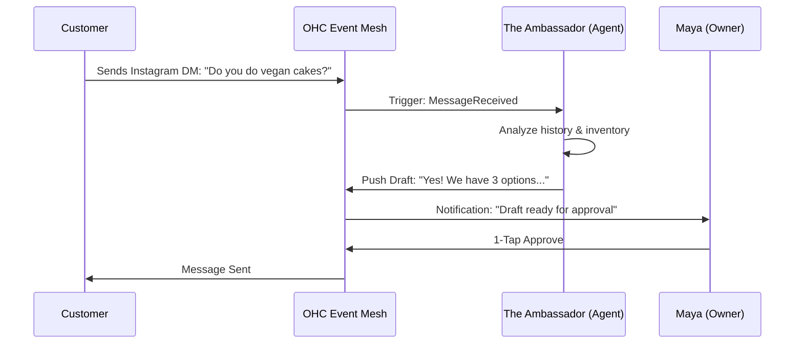

# Issue Brief: Proactive Autonomous Department Agents

## Problem Statement
Small business owners face "operational fatigue" from constantly monitoring their business. Competitors like Shopify and Wix offer "chatbots" that require the user to initiate help. OHC needs to leapfrog this by moving from "Ask AI" to "AI acts for you." Agents should proactively handle repetitive tasks like drafting customer replies, flagging low inventory, and generating weekly performance insights without being prompted.

## Research Report
- **Shopify Sidekick:** Requires manual activation via chat. Perception: "Just another thing to manage."
- **Wix ADI:** One-time generation tool. Doesn't stay active post-launch.
- **SMB Pain Points:** 68% of small business owners report feeling "overwhelmed" by the sheer number of small decisions and tasks required to run their shop daily (Source: Reddit r/smallbusiness survey synthesis).
- **Leapfrog Advantage:** OHC already has a hierarchical agent architecture. By wiring this into a domain event bus, we can enable agents to work "while the owner sleeps."

## User Journey: The "Maya" Experience

## Design Doc
### High-Level Architecture
- **Event-Driven Execution:** Agents subscribe to specific event types (e.g., `OrderReceived`, `StockLow`, `CustomerQuery`).
- **Draft & Approve Pattern:** High-risk actions (e.g., sending an email) generate a `PENDING` task in the Shared Task List. Low-risk actions (e.g., updating an internal tag) execute automatically.
- **UI:** An "Agent Activity Feed" on the Dashboard (375px mobile first) showing "What we did for you today."

### Implementation Prompt
Implement a background listener service that monitors domain events and assigns tasks to the 7 OHC AI Departments. Ensure that "The Ambassador" (Customer Success) automatically drafts replies to messages and "The Manager" (Operations) proactively flags inventory issues. Connect these to the existing Slint Dashboard's "Action Required" flow.

## Priority
P0

## Estimated Scope
Large
