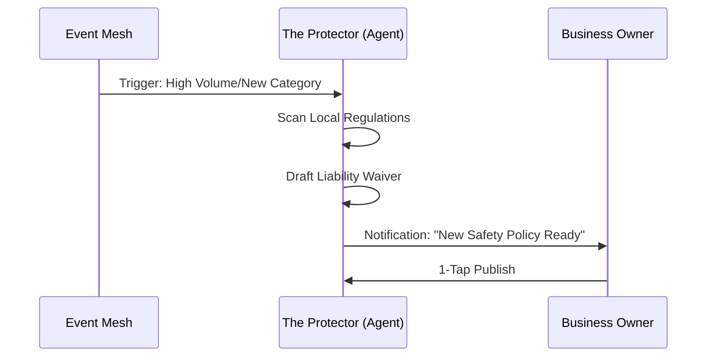

# Issue Brief: Proactive Tax & Legal Guardrails

## Problem Statement
Small business owners like Carlos (handyman) and Maya (baker) live in constant fear of "getting in trouble" with taxes, licenses, or contracts, but they cannot afford legal counsel.

## Research Report
- **Competitor State:** Most platforms offer generic "Terms of Service" templates that users must manually edit.
- **SMB Pain Point:** "Regulatory Paralysis" — 45% of solopreneurs delay expansion because they aren't sure about the legal requirements (Source: SME 2025 Trend Audit).
- **The OHC Advantage:** "The Protector" department can proactively monitor business activity and generate necessary legal artifacts.

### Comparative Table: Legal Guardrails
| Feature | OHC | Shopify | Wix |
| :--- | :--- | :--- | :--- |
| **Compliance** | Proactive Monitoring | Generic Templates | None |
| **Contract Gen** | Auto-Generated (Category-Specific) | App-Store Addons | Manual |
| **Risk Detection** | Trigger-Based (e.g. Vol. Spikes) | None | None |

## Design Doc
### High-Level Architecture
- **Guardrail Agent (The Protector):** Monitors transaction volume and location.
- **Artifact Generator:** Automatically drafts Liability Waivers (for Carlos), Food Safety Disclaimers (for Maya), and Tax-Ready Summaries.
- **Regulatory Heartbeat:** Periodically checks for expiration of business licenses based on the owner's profile.

## Implementation Prompt
Enhance "The Protector" (Legal & Compliance) department to proactively generate "Smart Disclaimers" based on the business category. For a Handyman, it should generate a "Work Completion & Liability Waiver." For a Baker, a "Nut Allergen & Freshness Policy." These should be auto-published to the storefront's footer.

## Priority
P0

## Estimated Scope
Large
