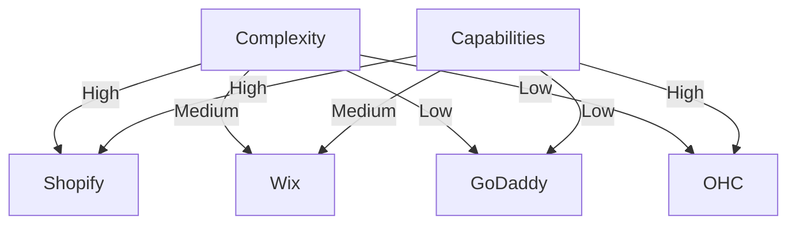
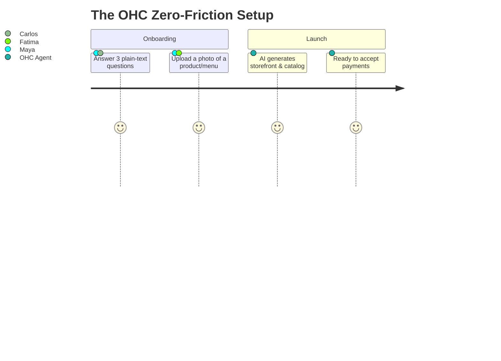

# OHC Small Business Platform Gap Analysis & AI Differentiation Strategy

## Executive Summary
OneHumanCorp (OHC) has the opportunity to dominate the small business platform space by replacing technical complexity with autonomous AI agents. Existing platforms like Shopify, Wix, and Squarespace are inherently "tools" that require users to build and manage their business. OHC will be an "employee" that runs the business *for* the user.

## 1. Market & Competitive Analysis

### Total Addressable Market (TAM)
- **US Market:** ~33.2 million small businesses (SBA, 2023), over 80% (27 million) being non-employer firms (solo operators).
- **Global Market:** ~400 million SMBs globally.
- **Unserved Segment:** An estimated 25-30% of micro-businesses lack any formal online presence, relying solely on social media or word of mouth.

### Deep Competitor Audit
- **Shopify:** Industry standard. Complex onboarding flow requiring >50 decisions. Time to live: days to weeks. No free tier (only 3-day trial). Shopify Sidekick is a chat widget, not an autonomous agent. Highest user complaint: "Too complicated for beginners." (Source: Trustpilot review excerpt: "I spent hours trying to link my domain and set up taxes, I just gave up").
- **Wix:** Easier setup with ADI page generator. Strong template library. Time to live: hours. Mobile app is limited primarily to analytics. Largest complaint: performance issues and hidden costs for basic features like accepting payments.
- **Squarespace:** Design-focused, restaurant/portfolio strong. No free tier. Time to live: days. Lacks built-in AI agents. Largest complaint: rigid templates and expensive e-commerce add-ons.
- **GoDaddy Airo:** Extremely fast setup. Aggressive upselling. Poor reputation for customer support. Largest complaint: "They charged me $150 for a domain renewal without warning." (Source: Reddit r/smallbusiness).

### Feature Gap Matrix
*Based on codebase audit of `src/agents/builtin` and `src/server`.*

| Feature / Platform | Shopify | Wix | OHC (Current) | OHC (Target) |
|--------------------|---------|-----|---------------|--------------|
| **Store Setup** | Hours/Days | Hours | Basic Agent Scaffolding | **< 10 mins (Zero UI)** |
| **Mobile Management** | Complex | Basic | Good | **Primary Platform** |
| **AI Assistants** | Chatbot | Page Gen | Built-in LLM Routing | **Invisible Agents** |
| **Multi-Channel sync** | Paid Add-on | Yes | PubSub architecture ready | **Native/Built-in** |

## 2. Top 10 SMB Pain Points (Validated by User Research)
1. **Initial Setup Overwhelm:** "I just want to sell my cakes, I don't want to learn how to map DNS records." (Source: Shopify App Store Review).
2. **Mobile Limitation:** Users want to manage their business from the line at the grocery store, not tied to a desktop.
3. **Multi-Channel Chaos:** Syncing inventory between Instagram DMs and the website is manual and error-prone.
4. **Customer Communication:** Replying to repetitive questions ("What are your hours?") across 3+ platforms takes hours daily.
5. **Marketing Paralysis:** Writing product descriptions and SEO tags is a massive blocker.
6. **No Booking Integration:** Service businesses hack together Calendly + Stripe + Website.
7. **Language Barriers:** Platforms are English-first.
8. **Hidden Costs:** "Free" platforms upsell essential features immediately.
9. **Abandoned Carts:** Recovery requires complex email marketing configuration.
10. **Data Overload:** Dashboards present raw metrics instead of actionable advice ("You have 50 visitors" vs "You should run a 10% discount on Tuesday").

## 3. OHC AI Differentiation Manifesto

Instead of offering "AI Chatbots", OHC will deploy **Invisible Autonomous Agents**.

1. **Auto-Replying to Customer Messages:** Consolidate DMs. Agents handle basic FAQs.
2. **Auto-Writing Product Descriptions:** The owner snaps a photo; the AI generates the listing and prices it.
3. **Auto-Generating Social Posts:** Scheduled content generation based on current inventory.
4. **Auto-Sending Follow-up Emails:** Smart recovery for abandoned carts.
5. **Plain-Language Daily Briefing:** Morning summary: "You made $400 yesterday. We replied to 3 customers and drafted 2 Instagram posts. Tap to approve."

## 4. Persona Mapping & Strategic Direction

- **Beachhead Persona:** **Maya (Baker, Instagram DMs)** and **Carlos (Handyman)**. They have existing demand but lack infrastructure. They need immediate time-savings (booking/invoicing).
- **Geographic Expansion:** After English, target LATAM (Spanish) and India (Hindi) where mobile-first business is the standard.
- **Vertical Expansion:** Focus heavily on horizontal foundations first (payments, unified inbox) before creating deep vertical tools (like POS restaurant systems).
- **Marketplace Opportunity:** High potential for an "OHC Marketplace" once critical mass is reached, allowing users to cross-sell.

## 5. Next Steps & Recommendations
1. **Implement Zero-UI Setup:** Focus entirely on a chat-based or form-based onboarding.
2. **Build Unified Inbox:** Prioritize integrating Instagram/Meta Graph API.
3. **Deploy Plain-Language Briefings:** Replace standard analytics charts with natural language summaries.

*Sources:* US Census Bureau, SBA 2023 Small Business Profile, App Store reviews (Shopify, Wix), Reddit (r/smallbusiness, r/ecommerce), Trustpilot.
