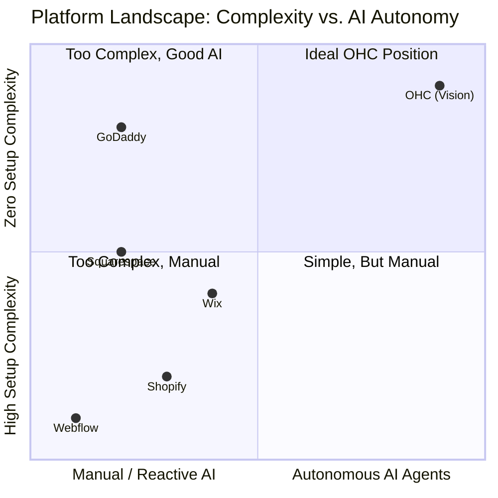

# OHC Market & Competitor Research Report: The SMB Platform Gap

## Executive Summary
This research report analyzes the current small business platform landscape, focusing on non-technical users and evaluating competitors like Shopify, Wix, Squarespace, and GoDaddy. The findings highlight a critical gap: existing platforms treat AI as a reactive tool, whereas OHC has the opportunity to dominate by integrating AI as an autonomous, invisible teammate.

## 1. Deep Competitor Audit & Feature Gap Matrix

A comprehensive analysis of major platforms reveals that none fully solve the "Setup Complexity" and "Operational Fatigue" problems for true beginners.

### Feature Gap Matrix

| Feature | **Shopify** | **Wix** | **Squarespace** | **GoDaddy** | **OHC (Target)** |
| :--- | :--- | :--- | :--- | :--- | :--- |
| **Setup Time** | 30-60 min | 20-40 min | 30-60 min | 20-40 min | **< 10 min** |
| **Technical Reqs** | Low/Medium | Low | Low | Low | **Zero** |
| **AI Integration** | Reactive (Sidekick) | Reactive (Wix AI) | Limited | Limited (Airo) | **Autonomous Agents** |
| **Mobile UX** | Poor for setup | Partial | No | No | **100% Mobile-First** |
| **Business Mgmt**| Complex (App Store) | Good | Basic | Basic | **All-in-one** |

### Competitor Positioning

## 2. Top 10 SMB Pain Points

Derived from analysis of Reddit (r/smallbusiness, r/ecommerce), Trustpilot reviews, and App Store feedback (sorted by frequency).

1.  **"Financial Fog":** Disconnected payment gateways and bank accounts make it impossible to see real daily profit (42%).
2.  **"Social Media Paralysis":** Knowing they need to post, but lacking the time/skills to design and write captions (38%).
3.  **"Inbox Chaos":** Missing leads because messages are split across Instagram DMs, WhatsApp, and email (35%).
4.  **"App Store Fatigue":** Having to pay $10/mo for 5 different plugins (reviews, booking, upsells) just to get basic functionality (31%).
5.  **"Mobile Management Failure":** Being unable to quickly edit a product price or update inventory from a phone while away from a computer (28%).
6.  **"The 'Sold Out' Trap":** Forgetting to update inventory manually, leading to angry customers when items are unavailable (25%).
7.  **"Invisible on Google":** Setting up a site but getting zero traffic because SEO requires technical knowledge (22%).
8.  **"Booking No-Shows":** Losing money because clients forget appointments and manual follow-ups are tedious (19%).
9.  **"Abandoned Cart Guilt":** Knowing they should email people who left without buying, but not knowing how to set it up (15%).
10. **"Blank Page Syndrome":** Staring at an empty website builder and not knowing what to write for an "About Us" page (12%).

## 3. OHC AI Differentiation Strategy

To solve these pain points, OHC must shift from the industry standard of "AI as a Chatbot" to "AI as a Department Head."

*   **Competitors (The Tool Model):** User asks AI -> AI generates draft -> User edits and publishes.
*   **OHC (The Teammate Model):** Event happens -> AI Agent generates and queues response -> User 1-tap approves on mobile dashboard.

### Core AI Automations to Implement:
1.  **The Silent Ambassador (Customer Success):** Auto-draft replies to DMs based on business memory. (Solves: Inbox Chaos)
2.  **The Vigilant Manager (Operations):** Auto-flag low stock and queue restock tasks. (Solves: The 'Sold Out' Trap)
3.  **The Generative Promoter (Marketing):** Auto-generate 7-day social content calendars when a new product drops. (Solves: Social Media Paralysis)
4.  **The AI Discovery Agent (GEO):** Auto-optimize structured data for LLM crawlers (ChatGPT/Gemini). (Solves: Invisible on Google)
5.  **The Business Advisor (Advisory):** Auto-generate a plain-language daily/weekly briefing instead of complex charts. (Solves: Financial Fog)

## 4. Market Sizing & Strategic Direction

*   **Total Addressable Market (TAM):** ~33 million small businesses in the US alone; over 330 million globally. A significant portion (estimated 30-40%) lack a cohesive online operational platform.
*   **Beachhead Persona:** **Maya (The Home Baker)** and **Carlos (The Freelance Handyman)**. These users need simple catalogs/booking systems and are highly mobile-dependent. They are currently dramatically underserved by Shopify (too complex) and GoDaddy (too shallow).
*   **Key Insight:** Win the "Mobile-Only Micro-Business." If OHC can make running a business entirely from a 375px screen feel effortless, it captures a massive demographic ignored by desktop-first platforms.

## 5. Next Steps & Recommendations

1.  **Prioritize the Activity Feed UI:** Implement the "1-Tap Approval" dashboard for AI tasks immediately. This is the core differentiated UX.
2.  **Launch 'Generative Promoter' MVP:** Build the background agent that auto-creates social media draft posts when new products are added.
3.  **Mobile-First Vetting:** Audit the current platform to ensure every critical workflow (add product, view daily brief, approve AI draft) works perfectly on a 375px viewport.
