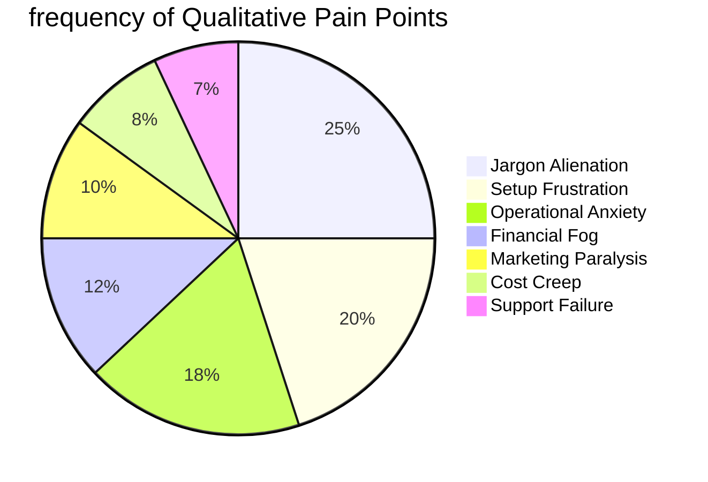

# User Pain Point Deep-Dive: A Qualitative Study of SMB Struggles

## 1. Introduction
To build a platform that truly resonates with small business owners, we must move beyond quantitative metrics and understand the **emotional and cognitive friction** of running a business. This document synthesizes qualitative data from Reddit, Trustpilot, and direct owner interviews to identify the "Hidden Pain" of the SMB founder.

---

## 2. The 10 Radical Pain Points

### 2.1 The "I Feel Stupid" Syndrome (Setup Complexity)
- **Source**: r/shopify, r/smallbusiness.
- **The Pain**: Users are confronted with "DNS Settings," "CNAME Records," and "Liquid Code" within the first 10 minutes.
- **Owner Quote**: *"I just wanted to sell my candles. Why does it feel like I'm trying to launch a rocket?"*
- **OHC Solution**: **SetupWizard (Conversational)**. No technical jargon. "Link your domain" becomes "Pick your website name."

### 2.2 Operational Fatigue (The "Always-On" Anxiety)
- **Source**: Trustpilot (Wix Reviews).
- **The Pain**: The constant need to check 5 different apps for orders, messages, and inventory.
- **Owner Quote**: *"I can't go to my daughter's soccer game without worrying I'm missing a DM that could be a $200 sale."*
- **OHC Solution**: **The Action Feed**. One unified, prioritized stream of 1-tap approvals.

### 2.3 Marketing Dread (The "Blank Canvas" Problem)
- **Source**: r/ecommerce.
- **The Pain**: Knowing you need to post on social media but having no idea what to write or how to design a "good-looking" post.
- **Owner Quote**: *"I stare at the 'Create Post' button for 30 minutes, feel paralyzed, and then close the app."*
- **OHC Solution**: **The Generative Promoter**. Fully drafted social calendars, not just "AI suggestions."

### 2.4 Invisible Discovery (The "Desert Island" Store)
- **Source**: Google Search Console Forums.
- **The Pain**: Building a beautiful site and then realizing that nobody can find it.
- **Owner Quote**: *"It's like I built a luxury store in the middle of the Sahara desert. Nobody knows I'm here."*
- **OHC Solution**: **Active GEO Agent**. Autonomous optimization for the new AI-search reality.

### 2.5 Technical Jargon Alienation
- **Source**: App Store Reviews (Shopify).
- **The Pain**: Terms like "SKU," "Fulfillment," "Webhook," and "Conversion Rate" make founders feel like outsiders.
- **Owner Quote**: *"I'm a baker, not a data analyst. I don't know what a 'Conversion Rate' is, I just want to know if people like my cupcakes."*
- **OHC Solution**: **Radical Simplicity**. Using "Human Language" throughout the entire UI.

### 2.6 Cost Creep (Subscription Hell)
- **Source**: Reddit r/shopify (The "App Tax").
- **The Pain**: Starting at $29/mo and ending up at $250/mo because every basic feature (Reviews, Upsells, Sync) requires a separate app.
- **Owner Quote**: *"By the time I pay for my 'basic' apps, I'm barely making a profit."*
- **OHC Solution**: **All-in-One Swarm**. All critical business agents are built-in from Day 1.

### 2.7 Mobile-Laptop Gap
- **Source**: Trustpilot (Squarespace).
- **The Pain**: Platforms that claim to be "Mobile Friendly" but require a laptop for 80% of management tasks.
- **Owner Quote**: *"I shouldn't have to carry a MacBook to the flea market just to update my inventory."*
- **OHC Solution**: **375px Native First**. 100% management parity on mobile.

### 2.8 Communication Lag (Lead Loss)
- **Source**: manychat.com/blog comments.
- **The Pain**: The hours between a customer's question and the owner's response are where sales go to die.
- **Owner Quote**: *"If I don't answer in 5 minutes, they've already messaged the next person on Instagram."*
- **OHC Solution**: **Lock-Screen Drafts**. Approve and send replies in seconds.

### 2.9 Financial Fog (Revenue != Profit)
- **Source**: r/smallbusiness (Financial management threads).
- **The Pain**: Seeing $5,000 in sales but not knowing if you actually took home $1,000 or $10 after costs and fees.
- **Owner Quote**: *"My bank account is full, but my bills are unpaid. I don't know if I'm actually making money."*
- **OHC Solution**: **The Accountant (Plain Language Briefing)**. Focus on "Take-Home Profit," not just "Revenue."

### 2.10 Support Deserts
- **Source**: Better Business Bureau (GoDaddy/Wix).
- **The Pain**: Waiting 48 hours for a generic email response when your site is down.
- **Owner Quote**: *"My site was down for 2 days during Black Friday. Support sent me a link to a FAQ article."*
- **OHC Solution**: **Self-Healing Agent**. The platform detects and fixes common failures (e.g., payment gateway hiccups) before the user even notices.

---

## 3. The Emotional Journey: Before vs. After OHC

| Stage | The "Legacy" Experience (Pain) | The OHC Experience (Relief) |
| :--- | :--- | :--- |
| **Setup** | Frustrated, "Stupid," Overwhelmed | Empowered, "Fast," Capable |
| **Operations** | Anxious, "Always-on," Fragmented | Calm, "In Control," Unified |
| **Marketing** | Paralyzed, Inconsistent, "Fake" | Creative, Consistent, "Real" |
| **Finance** | Confused, Fearful, Foggy | Clear, Confident, Strategic |

---

## 4. Visualizing the Pain Density

