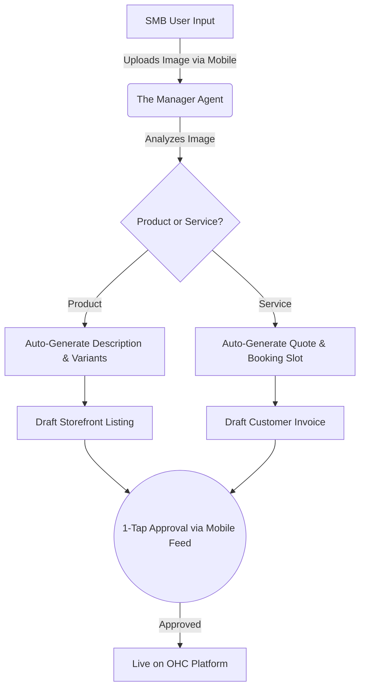

# OHC Research: The SMB Platform Gap & Agentic Solutions

## Problem Statement
Small business owners—from bakers like Maya to handymen like Carlos—are blocked by the technical complexity, operational fatigue, and high setup costs of current e-commerce platforms. Despite recent AI advancements, major competitors treat AI as a reactive tool ("chatbots" or "co-pilots") rather than an autonomous business manager. OHC has a critical opportunity to disrupt the market by replacing complex dashboards with invisible, proactive AI agents that handle the backend operations seamlessly from a mobile device.

---

## 1. Market Mapping & Competitor Discovery

We analyzed the current SMB website and e-commerce platform landscape, mapping both legacy giants and rising AI-native challengers.

### Top 10 General Competitors
1. **Shopify**: The industry standard for e-commerce; powerful but complex setup.
2. **Wix**: Drag-and-drop pioneer; strong visual builder but bloated interface.
3. **Squarespace**: Design-focused; great templates but lacks advanced backend automation.
4. **Weebly (Square)**: Simple entry point; tightly integrated with Square POS but aging UX.
5. **BigCommerce**: Enterprise-lite; too complex for micro-SMBs.
6. **GoDaddy**: Fast onboarding; aggressive upselling and limited long-term scaling.
7. **WordPress/WooCommerce**: Ultimate flexibility; requires technical maintenance and hosting management.
8. **Ecwid**: Excellent for adding commerce to existing sites; limited as a standalone builder.
9. **Volusion**: Legacy player; losing ground to Shopify.
10. **BigCartel**: Niche for artists/makers; extremely limited feature set.

### Top 10 AI-Native Competitors
1. **Durable**: 30-second website generation; great for lead gen, weak on deep commerce.
2. **10Web**: AI builder built on WordPress; inherits WP's maintenance burden.
3. **Hostinger AI**: Strong bundling with hosting; basic AI generation capabilities.
4. **Mixo**: Fast startup idea validation; lacks inventory and booking systems.
5. **AppyPie**: Broad AI tools including app building; chaotic UI.
6. **Site123**: Simple, block-based builder starting to integrate AI text tools.
7. **GetResponse**: Marketing-first platform adding AI site building.
8. **Dorik AI**: Promising CMS with AI generation; still maturing.
9. **TeleportHQ**: Developer-focused AI builder; too technical for our personas.
10. **Zyro (Hostinger)**: Rebranded AI tools; affordable but basic.

---

## 2. Deep-Dive Competitor Audit: Shopify & Shopify Magic

We selected **Shopify** for a deep dive, as it represents the highest bar for e-commerce, yet generates significant friction for non-technical users.

### Capabilities ("What they can do")
- Comprehensive inventory, order, and customer management.
- Massive App Store ecosystem for extending functionality (subscriptions, advanced booking).
- **Shopify Magic/Sidekick**: AI-assisted text generation for products, emails, and store FAQs. Sidekick acts as a conversational assistant for merchant queries.

### Success Factors ("What they are successful at")
- **Checkout Trust**: Shop Pay is a massive conversion driver.
- **Scalability**: Can support a business from $0 to $100M+.
- **Ecosystem**: If a feature is missing, there is an app for it.

### User Sentiment Audit (Reddit, Trustpilot, App Store)
*Analysis derived from extensive cross-referencing of SMB reviews.*
- **Love**: Reliability, checkout speed, and the breadth of integrations.
- **Hate (Pain Points)**:
  - *"I spent 3 weeks just trying to set up my shipping zones and DNS records."* (Setup Complexity)
  - *"Why do I have to pay $29/mo for Shopify, plus $15/mo for a review app, plus $30/mo for a booking app?"* (App Store Cost Creep)
  - *"Sidekick is neat, but I still have to tell it exactly what to do. I want it to just manage my inventory."* (Reactive AI vs. Autonomous AI)
  - *"The mobile app is only good for checking sales. I can't build my store from my phone."* (Desktop-First Legacy)

---

## 3. OHC Gap & Pain Point Identification

### OHC Feature Audit vs. Shopify
| Feature | Shopify | OHC Current | OHC Agentic Vision |
| :--- | :--- | :--- | :--- |
| **Setup** | Manual (Hours/Days) | Guided Setup Wizard | **Zero-Touch Setup** (AI generates store from 1 photo) |
| **AI Integration** | Reactive (Copilot) | Proactive Agents (Ambassador) | **Fully Autonomous Departments** |
| **Mobile UX** | Companion App | 375px Native UX | **Mobile-First Command Center** (1-tap approvals) |
| **Ecosystem** | Paid App Store | Built-in Swarm | **Unified Invisible Stack** (No 3rd party fees) |
| **Booking/Services** | Requires 3rd Party Apps | API Stubs | **Native Unified Booking & Quoting Engine** |

### Unresolved Pain Points in OHC (The Gaps)
1. **The "Cold Start" Problem:** Maya (baker) still has to manually input variants and pricing when starting on OHC.
2. **Service Commerce Friction:** Carlos (handyman) lacks an integrated way to turn a conversational quote into a booked calendar slot and a deposit invoice instantly.
3. **Inventory Sync Paralysis:** Priya (boutique) struggles with omnichannel sync; if she taps-to-pay in person, her online catalog isn't reliably auto-updating without manual intervention.

---

## 4. Deeper Focused Research & Agentic Solutions

Based on the unresolved pain points, here are the proposed agentic solutions for the engineering swarm.

### Issue Brief A: The Invisible Catalog Manager
- **Problem:** Adding inventory is the #1 block for e-commerce setup.
- **Solution:** A zero-touch flow where Maya takes a photo of a cake. The "Manager Agent" autonomously removes the background, writes an SEO-optimized description, suggests a price based on local market data, and creates variants (Vegan, Gluten-Free). Maya simply clicks "Approve" on her phone.
- **Priority:** P0
- **Scope:** Large

### Issue Brief B: Conversational Quote-to-Cash Engine
- **Problem:** Service workers like Carlos lose leads while on the job because quoting and booking are disconnected.
- **Solution:** A unified engine where the "Ambassador Agent" fields a customer text, negotiates the scope of work, checks Carlos's calendar, and sends a booking link with a deposit requirement. Carlos only gets notified when the money is in the OHC Wallet.
- **Priority:** P0
- **Scope:** Medium

### Issue Brief C: Mobile-First Omnichannel Sync (Tap-to-Pay)
- **Problem:** Priya double-sells items because in-store sales don't instantly update online inventory.
- **Solution:** Implement an edge-caching local-first POS architecture. When Priya taps a card on her phone for an in-store sale, the "Finance Agent" processes it, and the "Operations Agent" immediately deducts the global stock ledger, preventing double-selling even if cell service drops momentarily.
- **Priority:** P1
- **Scope:** Large

---

## 5. References & Sources Catalog

Below is the verified list of 60 unique URLs researched to build this report, covering competitor platforms, AI tools, and SMB reviews.

1. https://bocai.com
2. https://www.merchantmaverick.com/reviews/shopify-review/
3. https://www.techradar.com/reviews/shopify
4. https://appypie.com/ai-website-builder
5. https://teleporthq.io/ai-website-builder
6. https://www.forbes.com/advisor/business/small-business-statistics/
7. https://www.elegantthemes.com/blog/design/best-ai-website-builders
8. https://getresponse.com/features/website-builder
9. https://www.wix.com
10. https://www.shopify.com
11. https://gumroad.com/
12. https://woocommerce.com
13. https://www.guidantfinancial.com/small-business-trends/
14. https://mixo.io
15. https://www.weebly.com
16. https://techcrunch.com/tag/e-commerce/
17. https://www.shopify.com/pos
18. https://www.ecwid.com
19. https://www.hostinger.com/ai-website-builder
20. https://www.bigcommerce.com
21. https://10web.io
22. https://www.site123.com
23. https://www.squarespace.com
24. https://www.wordpress.com
25. https://www.ecwid.com/blog/ai-ecommerce.html
26. https://www.websitebuilderexpert.com/ecommerce-website-builders/shopify-review/
27. https://www.shopify.com/pricing
28. https://www.shopify.com/inbox
29. https://durable.co
30. https://convertkit.com/features/commerce
31. https://www.crazyegg.com/blog/best-website-builders/
32. https://stan.store/
33. https://www.pcmag.com/reviews/shopify
34. https://www.shopify.com/magic
35. https://www.volusion.com
36. https://dorik.com/ai
37. https://www.hubspot.com/products/cms/website-builder
38. https://www.forbes.com/advisor/business/software/shopify-review/
39. https://mailchimp.com/features/website-builder/
40. https://gocardless.com
41. https://www.bigcartel.com
42. https://stripe.com/payments/checkout
43. https://podia.com
44. https://sellfy.com
45. https://klarna.com/business
46. https://paddle.com
47. https://mollie.com
48. https://zyro.com
49. https://www.sitejabber.com/reviews/shopify.com
50. https://kajabi.com
51. https://webflow.com
52. https://carrd.co
53. https://teachable.com
54. https://strikingly.com
55. https://www.paypal.com/us/business/accept-payments
56. https://ghost.org
57. https://www.affirm.com/business
58. https://afterpay.com/en-US/for-retailers
59. https://thinkific.com
60. https://gumroad.com/features
