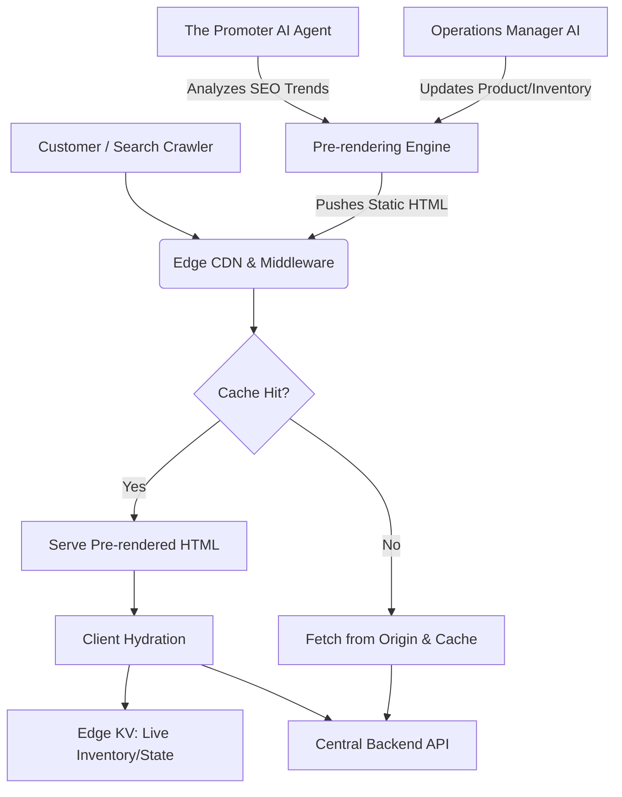

# Research Report: Universal Edge-Cached Dynamic Storefront & Agentic SEO Pre-rendering Architecture

## Problem Statement
Small business owners, such as Maya (a baker) and Carlos (a freelance handyman), need their online storefronts and service listings to load instantly and rank highly on search engines like Google. Traditional Single Page Applications (SPAs) or heavily client-side rendered (CSR) storefronts often struggle with initial load latency on mobile networks and present poor SEO out-of-the-box because web crawlers cannot reliably execute complex JavaScript to index content. Conversely, fully server-side rendered (SSR) pages can introduce latency due to backend processing on every request. There is a critical need for an architecture that combines the instant loading and SEO benefits of static HTML with the real-time, dynamic capabilities required for personalized inventory, localized pricing, and agent-driven content updates.

## Research Report
### Competitive Analysis
*   **Shopify:** Employs a robust edge delivery network but requires merchants to understand and configure SEO settings. The storefronts are generally fast, but deep personalization often relies on client-side fetching that can delay the "time to interactive".
*   **Wix & Squarespace:** Offer decent SEO defaults and edge caching, but heavily dynamic storefronts can experience performance degradation. Their built-in AI tools are typically constrained to content generation rather than autonomous SEO optimization and edge caching logic.
*   **Next.js / Vercel (General Architecture):** Showcases the power of Incremental Static Regeneration (ISR) and Edge middleware, blending static speeds with dynamic updates.
*   **OHC Opportunity:** By introducing a "Universal Edge-Cached Dynamic Storefront & Agentic SEO Pre-rendering Architecture," OHC can proactively and autonomously generate highly optimized, static HTML for all product and service pages, push them to the edge, and use lightweight edge functions to hydrate dynamic states (like inventory or personalized pricing). An AI Agent ("The Promoter") can continuously monitor search trends and autonomously trigger re-rendering of specific pages to target emerging, localized keywords without any merchant intervention.

### Findings
1.  **SEO is Make-or-Break:** For small businesses without large marketing budgets, organic search traffic is vital. Pre-rendered HTML is universally understood by all search engine crawlers, ensuring maximum visibility.
2.  **Latency Impacts Conversion:** Instant page loads (sub-100ms) drastically reduce bounce rates. Edge caching of pre-rendered HTML achieves this globally.
3.  **Dynamic Hydration is the Sweet Spot:** Serving static HTML for the initial paint (and crawlers) and hydrating dynamic elements (cart status, live inventory) via Edge KV or lightweight APIs provides the best of both worlds.
4.  **Agentic SEO is Untapped:** Current platforms require merchants to act on SEO recommendations. An autonomous agent that pre-renders pages based on real-time search intent is a significant differentiator.

## Design Doc
### Architecture
1.  **Agentic SEO Engine (The Promoter):** Continuously analyzes search trends, competitor keywords, and business data to generate optimized metadata, product descriptions, and localized content.
2.  **Pre-rendering Pipeline:** When a product is updated or "The Promoter" identifies a new SEO opportunity, a background worker triggers the pre-rendering of the storefront page into static HTML and JSON data.
3.  **Edge Distribution:** The pre-rendered HTML and assets are pushed to a globally distributed Edge CDN.
4.  **Edge Middleware/Functions:** Intercept requests to serve the cached HTML. They also execute lightweight logic for A/B testing or applying geographic-specific configurations.
5.  **Dynamic Hydration:** Once the static HTML is loaded, the client-side application (e.g., Flutter Web or lightweight JS) hydrates dynamic components like live inventory, cart state, or user-specific pricing by fetching from an Edge KV store or the central API.

### Mobile UX Flow (375px)
*   **Instant First Paint:** The customer sees the full product page instantly, rendered from the edge-cached HTML.
*   **Crawler Visibility:** Search engines receive perfectly structured, keyword-optimized HTML without executing JavaScript.
*   **Seamless Interactivity:** Critical interactions (e.g., "Add to Cart") are immediately responsive, while secondary dynamic data (e.g., "Only 2 left in stock!") hydrates without layout shifts.

### AI Agent Integration
*   **The Promoter (Marketing & Advertising):** Drives the Agentic SEO process. It autonomously generates localized landing pages (e.g., "Vegan Cakes in Austin") and triggers pre-rendering to capture niche search traffic.
*   **The Operations Manager:** Triggers partial re-rendering of product pages when significant inventory changes occur (e.g., item goes out of stock) to ensure cached HTML remains relatively fresh.

## Implementation Prompt
**Goal:** Implement the Universal Edge-Cached Dynamic Storefront & Agentic SEO Pre-rendering Architecture to guarantee sub-100ms load times and automated, top-tier SEO for all OHC storefronts.

**Acceptance Criteria:**
1.  Implement a Pre-rendering Engine that generates static HTML for all public storefront routes (products, services, profiles).
2.  Integrate the Pre-rendering Engine with the CDN to automatically push and invalidate cached HTML upon content updates.
3.  Develop the "Agentic SEO" workflow where "The Promoter" can autonomously request the generation and edge-caching of new, SEO-targeted landing pages.
4.  Implement Edge Middleware to route requests to the appropriate pre-rendered HTML or trigger fallback rendering.
5.  Ensure client-side hydration smoothly attaches to the pre-rendered HTML without layout shifts, specifically handling live inventory and cart states via Edge KV.
6.  Validate that search engine crawlers receive fully populated HTML containing appropriate meta tags and schema markup.
7.  Add OpenTelemetry tracing to monitor pre-rendering times, edge cache hit rates, and agent-driven SEO updates.
8.  Provide Playwright E2E tests simulating search engine crawlers and normal user hydration on simulated slow connections.
