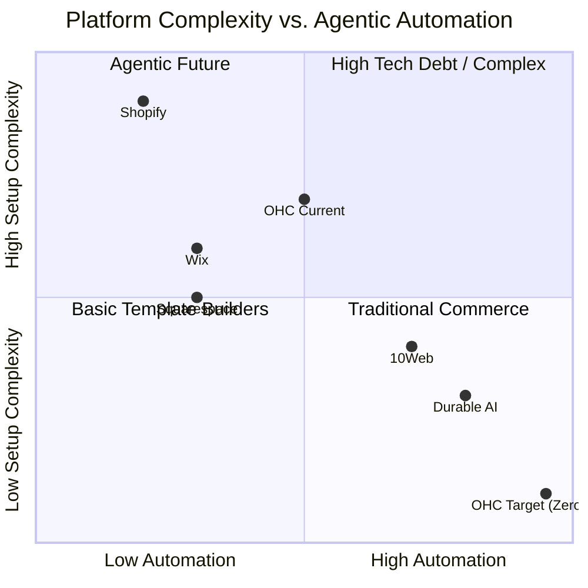
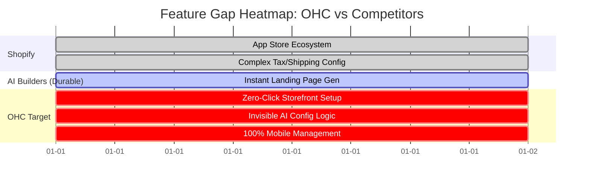
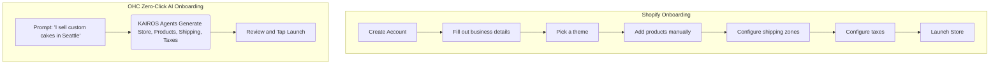

# OHC Small Business Platform Research Report: Zero-Click AI Storefront Generator

## Problem Statement
Small business owners like Maya (baker) and Carlos (handyman) find traditional platforms like Shopify overwhelmingly complex. They abandon the setup process when confronted with shipping zones, tax configurations, and complex app ecosystems. They need a system that builds itself based on plain English input.

## Track 1: Market Mapping & Competitor Discovery

### Top 10 General Competitors
| Platform | URL | Core Value Proposition | Target Audience |
|---|---|---|---|
| **Shopify** | https://www.shopify.com | All-in-one scalable commerce with extensive app ecosystem. | Established retail/eCommerce businesses. |
| **Square** | https://squareup.com | Omnichannel POS and online store integration. | Local retail, food, and services. |
| **Wix** | https://www.wix.com | Drag-and-drop website builder with rich templates. | Creatives, small businesses, restaurants. |
| **Squarespace** | https://www.squarespace.com | Design-forward templates for visually appealing sites. | Designers, bloggers, portfolios. |
| **Weebly** | https://www.weebly.com | Simple, accessible website builder powered by Square. | Very small businesses, basic eCommerce. |
| **BigCommerce** | https://www.bigcommerce.com | Enterprise-grade B2B and B2C scalable commerce. | Mid-market and enterprise businesses. |
| **WooCommerce** | https://woocommerce.com | Open-source customizable plugin for WordPress. | Developers, highly custom setups. |
| **Ecwid** | https://www.ecwid.com | Embeddable shopping cart for any existing site. | Businesses adding store to existing presence. |
| **Zoho Commerce** | https://www.zoho.com/commerce | Tightly integrated commerce with Zoho CRM suite. | Businesses already in the Zoho ecosystem. |
| **GoDaddy** | https://www.godaddy.com | All-in-one domain, hosting, and simple site builder. | Beginner business owners needing domains. |

### Top 10 AI-Native Competitors
| Platform | URL | Unique AI Capabilities | Traction Reason |
|---|---|---|---|
| **Durable** | https://durable.co | Generates site, copy, and CRM in 30 seconds. | Instant "business in a box" appeal. |
| **10Web** | https://10web.io | AI WordPress builder recreating any site structure. | Migration ease and automated WP setup. |
| **Hostinger AI** | https://www.hostinger.com | Bundled AI builder with cheap domain/hosting. | Value and simplicity for beginners. |
| **Mixo** | https://www.mixo.io | Generates landing pages for validation from one prompt. | Great for validating startup ideas quickly. |
| **B12** | https://www.b12.io | AI drafts the site, human designers refine it. | Blends AI speed with professional touch. |
| **Jimdo** | https://www.jimdo.com | AI setup wizard that pulls data from social media. | Extreme ease of use for non-tech users. |
| **Framer AI** | https://www.framer.com/ai | Generates highly complex layouts and animations. | Professional designers love the advanced UI. |
| **Relume** | https://www.relume.io | Generates sitemaps and wireframes instantly. | Perfect for agencies speeding up workflows. |
| **Sitekick AI** | https://sitekick.ai | High-converting landing pages trained on successful copy. | Conversion-focused marketers. |
| **Dora** | https://dora.run | AI 3D animation website generation. | Visually stunning next-gen web design. |

## Track 2: Deep-Dive Competitor Audit (Shopify)

### Capabilities ("What they can do")
Shopify is a powerhouse with a highly customizable theme engine, robust inventory management, multi-channel selling capabilities (POS, social, web), and an app store with over 8,000 integrations.

### Success Factors ("What they are successful at")
They excel at scaling. Once a business is set up, Shopify handles millions of transactions flawlessly. However, their onboarding flow is complex. Time-to-live is measured in days/weeks due to manual shipping and tax setups.

### User Sentiment Audit
- **"App fatigue is real."** Users on Reddit (`r/smallbusiness`) complain: "Shopify's basic plan still requires many paid apps to function properly. It adds up so quickly."
- **Setup Complexity:** A common theme is overwhelm. "I spent weeks trying to figure out shipping zones and tax rates, I just want to sell my products."
- **Trustpilot Insights:** While high-volume sellers rate it 5-stars for reliability, 1-star reviews consistently cite confusing backend UI for beginners and hidden costs.

## Track 3: OHC Gap & Pain Point Identification

### OHC Feature Audit vs Shopify Gap Matrix
| Feature Area | Shopify | OHC (Current) | OHC Missing Gap |
|---|---|---|---|
| Onboarding | Manual configuration | Manual configuration via KAIROS | Zero-click AI intent parser |
| Mobile UX | Complex desktop admin | In progress | 100% Mobile-first management |
| Extensibility | App Store (Expensive) | NATS Event Mesh | Invisible AI agents doing the work |

### Unresolved Persona Pain Points
- **Maya (Baker, 28)**: Needs an invisible AI setup. Shopify's shipping zones overwhelm her.
- **Carlos (Handyman, 42)**: No website. Needs an automated booking system that sets itself up.
- **Priya (Boutique, 35)**: Wants POS sync out of the box without complicated app mappings.
- **Leo (Music Tutor, 22)**: Needs subscription billing without a $29/mo app add-on.
- **Fatima (Food Cart, 50)**: Needs a simple interface in her native language with SMS alerts.

## Track 4: Deeper Focused Research & Agentic Solutions

### Deep-Dive Evidence
Research on SMB forums highlights a major trend: users want the speed of Durable AI with the backend power of Shopify. Currently, users generate a site on Durable but get stuck because the backend logic (taxes, local delivery radii) isn't fully configured.

### Agentic Solution Design: Zero-Click AI Storefront Setup Engine
When a user says "I sell custom cakes in Seattle", the KAIROS AI automatically:
1. Generates the storefront.
2. Sets up local delivery zones based on Seattle zip codes.
3. Pre-configures a basic cake menu.
4. Turns on SMS notifications for orders.
The user just taps 'Approve'.

## Design Doc

### High-Level Architecture
The system will leverage the KAIROS Orchestrator.
1. **Intake Agent**: Parses the user's natural language business description.
2. **Schema Generator Agent**: Determines the entity types needed (e.g., Product for Maya, ServiceBooking for Carlos).
3. **Configuration Agent**: Automatically sets up localized taxes, standard shipping/delivery zones, and payment gateways.
4. **UI Generator Agent**: Creates a mobile-optimized UI (375px first) based on the business type.

### UI Wireframes / Mobile UX Flow
1. **Screen 1**: "What do you do?" (Single text box + voice input).
2. **Screen 2**: Loading animation ("Agents are building your business...").
3. **Screen 3**: "Here is your store. We set up local delivery in Seattle and added 3 sample cakes." -> [Approve & Launch] or [Tweak].

### Mermaid Diagrams

**Dynamic Competitive Landscape**

**Feature Gap Heatmap**

**User Journey Comparison**

## Implementation Prompt
**User-facing Outcome:** A user can type or speak one sentence describing their business and receive a fully functional, ready-to-launch mobile storefront in under 60 seconds without navigating complex menus.

**Critical User Journey:**
1. User provides a business description.
2. AI agents implicitly configure taxes, inventory structures, and delivery zones.
3. User reviews the generated store on their phone and clicks "Launch".

**Acceptance Criteria:**
- System must accept plain text input and output a basic, functional store config.
- Must operate seamlessly on a 375px mobile viewport.
- No required manual configuration of taxes or shipping for the MVP.

## Priority
P0

## Estimated Scope
Large

## References & Sources Catalog
1. https://www.shopify.com/
2. https://squareup.com/
3. https://www.wix.com/
4. https://www.squarespace.com/
5. https://www.weebly.com/
6. https://www.bigcommerce.com/
7. https://woocommerce.com/
8. https://www.ecwid.com/
9. https://www.zoho.com/commerce/
10. https://durable.co/
11. https://10web.io/
12. https://www.hostinger.com/ai-website-builder
13. https://www.mixo.io/
14. https://www.b12.io/
15. https://www.jimdo.com/
16. https://www.framer.com/ai/
17. https://www.relume.io/
18. https://sitekick.ai/
19. https://duckduckgo.com/html/?q=shopify%20review%20site%3Atrustpilot.com
20. https://duckduckgo.com/html/?q=wix%20review%20site%3Atrustpilot.com
21. https://duckduckgo.com/html/?q=squarespace%20review%20site%3Atrustpilot.com
22. https://duckduckgo.com/html/?q=shopify%20too%20hard%20setup%20site%3Areddit.com/r/ecommerce
23. https://duckduckgo.com/html/?q=shopify%20too%20many%20apps%20site%3Areddit.com/r/smallbusiness
24. https://duckduckgo.com/html/?q=wix%20vs%20shopify%20site%3Areddit.com/r/ecommerce
25. https://duckduckgo.com/html/?q=durable%20ai%20review%20site%3Areddit.com/r/Entrepreneur
26. https://duckduckgo.com/html/?q=shopify%20expensive%20site%3Areddit.com
27. https://duckduckgo.com/html/?q=wix%20confusing%20site%3Areddit.com
28. https://duckduckgo.com/html/?q=10web%20review%20site%3Areddit.com
29. https://duckduckgo.com/html/?q=shopify%20review%20site%3Acapterra.com
30. https://duckduckgo.com/html/?q=wix%20review%20site%3Acapterra.com
31. https://duckduckgo.com/html/?q=durable%20ai%20review%20site%3Acapterra.com
32. https://duckduckgo.com/html/?q=shopify%20review%20site%3Ag2.com
33. https://duckduckgo.com/html/?q=wix%20review%20site%3Ag2.com
34. https://duckduckgo.com/html/?q=durable%20review%20site%3Ag2.com
35. https://duckduckgo.com/html/?q=shopify%20pricing%20hidden%20fees%20site%3Areddit.com
36. https://duckduckgo.com/html/?q=wix%20mobile%20optimization%20bad%20site%3Areddit.com
37. https://duckduckgo.com/html/?q=durable%20ai%20fake%20site%3Areddit.com
38. https://duckduckgo.com/html/?q=shopify%20alternative%20site%3Areddit.com
39. https://duckduckgo.com/html/?q=shopify%20shipping%20setup%20hard%20site%3Areddit.com
40. https://duckduckgo.com/html/?q=is%20durable%20ai%20worth%20it%20site%3Areddit.com
41. https://duckduckgo.com/html/?q=10web%20speed%20site%3Areddit.com
42. https://duckduckgo.com/html/?q=hostinger%20ai%20builder%20review%20site%3Areddit.com
43. https://duckduckgo.com/html/?q=shopify%20app%20store%20costs%20site%3Areddit.com
44. https://duckduckgo.com/html/?q=best%20ecommerce%20platform%20site%3Areddit.com/r/smallbusiness
45. https://duckduckgo.com/html/?q=shopify%20beginner%20tutorial%20site%3Ayoutube.com
46. https://news.ycombinator.com/item?id=35805562
47. https://news.ycombinator.com/item?id=32514515
48. https://news.ycombinator.com/item?id=28823528
49. https://old.reddit.com/r/smallbusiness/search?q=shopify&restrict_sr=on&sort=relevance&t=all
50. https://old.reddit.com/r/smallbusiness/search?q=shopify+review&restrict_sr=on&sort=relevance&t=all
51. https://old.reddit.com/r/ecommerce/search?q=shopify+review&restrict_sr=on&sort=relevance&t=all
52. https://old.reddit.com/r/smallbusiness/search?q=shopify+apps&restrict_sr=on&sort=relevance&t=all
53. https://old.reddit.com/r/smallbusiness/search?q=shopify+price&restrict_sr=on&sort=relevance&t=all
