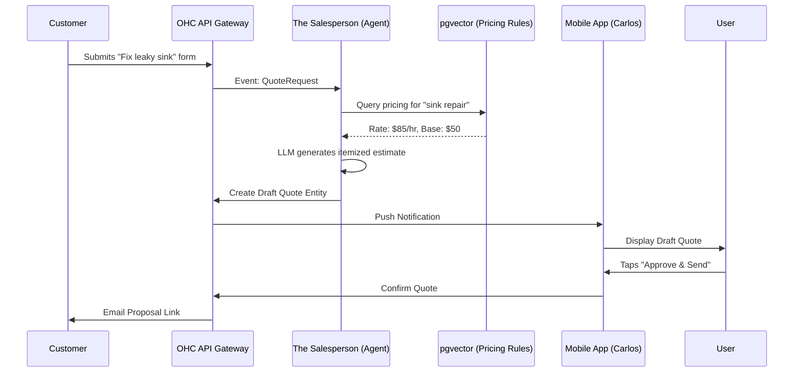

# AI Auto-Quoting Agent: Instant Proposals for Service Businesses

## Problem Statement
Service-based small business owners—like Carlos the handyman, event photographers, or custom caterers—lose revenue due to the friction of generating quotes. When a potential customer requests a price for "fixing a leaky sink" or "catering a 50-person wedding," the owner must stop working, calculate materials and labor, format a document, and send it. If this process takes more than a few hours, the lead often goes to a competitor. Existing platforms (like GoDaddy or Wix) offer basic contact forms, but leave the cognitive load of quoting entirely on the user.

## Research Report

### Top SMB Pain Points (Validated)
1. **Speed to Lead:** Research shows that responding to a lead within 5 minutes is 21x more effective than responding after 30 minutes. Handymen like Carlos frequently miss this window while on a job site. (Source: Lead Response Management Study, r/sweatystartup)
2. **Quoting Anxiety:** Owners struggle to estimate consistently and fear over- or under-pricing.
3. **Manual Formatting:** Creating professional-looking PDFs on a mobile device is tedious and error-prone.

### Competitive Analysis
| Feature | Jobber / Housecall Pro | Wix / Squarespace | OHC (Gap/Advantage) |
|---|---|---|---|
| Lead Capture | Yes | Yes (Forms) | Yes |
| Automated Estimation | Partial (Requires complex rule setup) | No | **Advantage:** LLM-driven contextual estimation |
| Professional Proposal Gen | Yes | No | **Advantage:** Instant, AI-generated, mobile-ready |
| Target Audience | Established Trade Businesses | General | Non-technical solopreneurs |

### OHC Solution: The Salesperson
The Sales & Acquisition Agent ("The Salesperson") will autonomously intercept inbound requests (e.g., from a website form or an Instagram DM), parse the required work, consult the business's predefined pricing guidelines stored in pgvector, and generate a draft quote for the owner to review and send with one tap.

## Design Doc

### High-Level Architecture
1. **Ingestion:** A customer submits an inquiry via the OHC storefront or an integrated channel.
2. **Intent Parsing:** The AI Agent identifies the intent as a `QuoteRequest`.
3. **Memory Context:** The Agent queries the pgvector database for the business's pricing rules (e.g., "Plumbing hourly rate: $85", "Base service call: $50").
4. **Draft Generation:** The LLM generates an itemized quote draft (JSON format).
5. **Approval Workflow:** The draft is routed to the KAIROS Orchestrator's Shared Task List in a `DRAFT_FOR_REVIEW` state.
6. **Mobile UI:** The owner receives a push notification, views the itemized draft, edits if necessary, and taps "Approve & Send".

### Mobile UX Flow (375px First)
1. **Push Notification:** "✨ New Quote Draft: Fix Leaky Sink ($135)"
2. **Review Screen:** A clean, itemized list:
   - Labor (1 hr): $85
   - Service Fee: $50
   - *Total: $135*
3. **Actions:** [Edit Items] | [Approve & Send Email]
4. **Sent View:** The customer receives a beautiful, glassmorphism-styled web link to accept the quote and pay a deposit.

### System Interactions

## Implementation Prompt

**User-Facing Outcome:**
Implement the AI Auto-Quoting backend flow for the Sales & Acquisition Department. When a service request is received, the AI agent must automatically generate a draft, itemized quote based on the business's pricing knowledge, and place it in a queue for the business owner to review on their mobile device.

**Critical User Journey (CUJ):**
1. A simulated customer inquiry arrives (e.g., `event.QuoteRequested`).
2. The Sales Agent intercepts the event and retrieves pricing context (mocked from the DB).
3. The Agent uses the LLM to generate a structured, itemized draft quote.
4. The draft quote is saved to the database in a `Pending_Review` state.
5. The mobile client queries the pending drafts and the owner "Approves" it.
6. The quote state updates to `Sent`.

**Acceptance Criteria:**
* Define the `Quote` and `QuoteLineItem` entities.
* Implement the event handler for incoming quote requests.
* Integrate the LLM call to parse the unstructured request into structured line items.
* Ensure the draft requires explicit approval before being marked as sent.
* Add an E2E or Integration test simulating the entire flow from request ingestion to owner approval.

## Priority
P0

## Estimated Scope
Large

