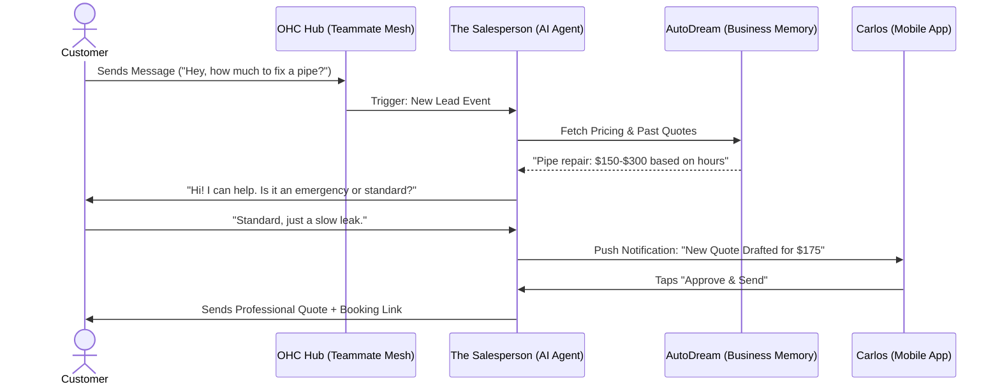

# Issue Brief: [Sales] Autonomous Lead-to-Quote Engine

## Title
The Salesperson: Autonomous 1-Tap Lead Conversion & Quote Generation

## Problem Statement
Small business owners like Carlos (Handyman) and Leo (Music Tutor) are often in the middle of a job or lesson when a new lead arrives via their website, Instagram DM, or SMS. By the time they can respond (often hours later), the lead has already contacted a competitor. They need a "Salesperson" who can instantly engage the lead, gather requirements, and draft a professional, accurate quote that they can approve with a single tap from their phone.

## Research Report
- **Competitive Analysis**:
  - **Shopify/Wix**: Rely on manual forms. The user must manually check their dashboard and reply via email.
  - **HoneyBook/Dubsado**: Powerful but have steep learning curves (weeks to master).
  - **OHC Advantage**: Zero-setup engagement. The AI "Salesperson" acts as a 24/7 concierge that understands the owner's pricing logic and service availability.
- **Data Insights**: Small businesses that respond to a lead within 5 minutes are 9x more likely to convert. Most SMB owners take > 6 hours.
- **Pain Points Addressed**:
  - Operational Fatigue (The "never-ending inbox").
  - Communication Lag (Losing sales while sleeping/working).

## Design Doc

### High-Level Architecture (Mermaid.js)

### Mobile UX Flow (375px)
1.  **Lead Notification**: A high-priority notification appears on the owner's phone: "💼 **New Lead from Maya**: Kitchen Sink Leak."
2.  **The Draft View**: Tapping the notification opens a Glassmorphism-styled card showing:
    -   Customer's message summary.
    -   AI-calculated Quote (e.g., "$175.00").
    -   "Why this price?" breakdown (e.g., "Based on standard 1-hour repair fee").
3.  **1-Tap Approval**: A prominent "Send Quote ➔" button at the bottom.
4.  **Success State**: Green shimmer effect + "Quote Sent! Carlos will be notified when Maya books."

### AI Agent Integration
- **Triggers**: Inbound messages from `WhatsApp`, `Instagram`, `SMS`, or `Web Chat`.
- **Memory Access**: Queries `autodream_memories` for "Carlos's standard rates" and "similar past jobs."
- **Approval Logic**: All quotes are `Draft-for-Review` by default to ensure the owner stays in control of their profitability.

## Implementation Prompt
**To Implementer Agent:**
Implement "The Salesperson" agent department. Create a lead-capture engine that hooks into the Teammate Mesh to listen for `inbound.message` events. The agent must use the business owner's service list and pricing history (from `autodream_memories`) to conduct a conversational "requirement gathering" with the customer. Once sufficient info is gathered, the agent must generate a `Quote` entity in a `PENDING_REVIEW` state and trigger a mobile push notification. Implement the mobile-first (375px) "Draft Review" UI with OHC design tokens, allowing the owner to edit or 1-tap approve the quote. Ensure the entire flow is resilient to offline states by leveraging the local SIPDB for draft storage.

## Priority
P0 (Core Growth Driver)

## Estimated Scope
Large
