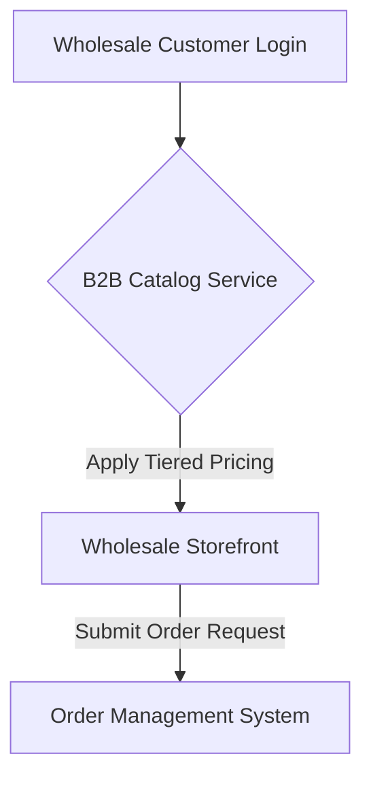

**Title**: B2B Wholesale Portal
**Problem Statement**: Managing wholesale orders through emails and spreadsheets is inefficient for businesses looking to scale B2B operations.
**Research Report**: B2B sales often require different pricing tiers, bulk order minimums, and net payment terms that standard retail storefronts don't support.
**Design Doc**:
*   Architecture: Customer Type Authentication -> B2B Catalog Service -> Custom Checkout Flow.

**Implementation Prompt**: Develop a dedicated B2B portal where approved wholesale customers can view custom pricing tiers, place bulk orders with minimum quantity constraints, and request net-30 payment terms, all managed within the central OHC inventory system.
**Priority**: P1
**Estimated Scope**: Large
