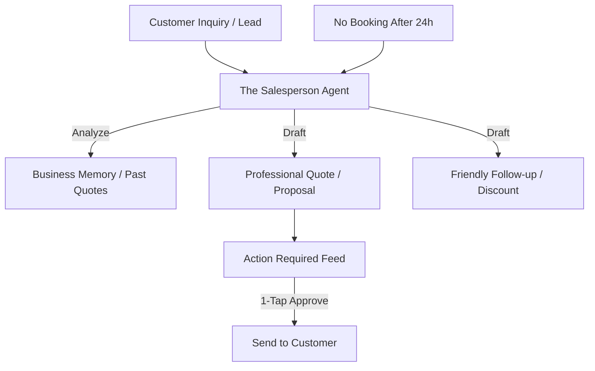

# [Sales] Architecture Brief: "The Salesperson"

## Title
OHC "The Salesperson": Lead Conversion Loops and Automated Follow-ups

## Problem Statement
Carlos (Handyman) loses 40% of his jobs because he can't get a quote back to customers fast enough while he's on a job. Leo (Music Tutor) has students who ask for prices but never book. These "leaks" in the sales funnel happen because solopreneurs can't be available 24/7 to "close the deal."

## Research Report
- **Lead Speed**: Research shows responding to a lead within 5 minutes increases conversion by 9x. Carlos needs an AI that quotes while he's on a ladder.
- **Quote Automation**: By analyzing past jobs and service descriptions, "The Salesperson" can estimate costs and draft a professional proposal instantly.
- **Upsell Loops**: If Priya's customer buys a dress, "The Salesperson" should suggest a matching belt in the checkout flow.

## Design Doc

### High-Level Architecture (Mermaid.js)

### UI Flow (375px First)
- **Quote Preview**: A high-end Glassmorphic card showing the itemized quote. Carlos can adjust the price with a slider and tap "Send Quote."
- **Referral Loop**: After a successful sale, "The Salesperson" drafts a message: "Thanks for the business! Here is a $20 discount code for your friend."

### AI Agent Integration
- **Triggers**: `tenant.lead.created`, `tenant.quote.requested`, `tenant.order.completed`.
- **Memory**: Contextual retrieval of pricing history and customer interaction sentiment.

## Implementation Prompt
**To Implementer Agent:**
Implement "The Salesperson" (Sales) department. This agent must monitor incoming inquiries and autonomously draft quotes based on the business's predefined services and past pricing data. Implement a "24h Follow-up" loop that triggers if a drafted quote is sent but not accepted. The agent should also manage the "Referral Program" logic, generating unique discount codes and drafting referral requests to happy customers.

## Priority
P1

## Estimated Scope
Medium
