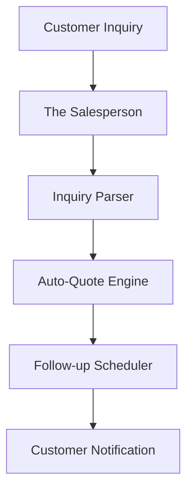

# Architecture Brief: The Salesperson

## Title
OHC AI Department: Sales & Acquisition ("The Salesperson")

## Problem Statement
Every minute of lag in replying to an inquiry is a lost sale. "The Salesperson" automates the lead-to-order flow via context-aware quoting and persistent (yet friendly) follow-ups.

## Research Report
- **Conversion Friction**: Manual follow-ups lead to lost opportunities.
- **Context-Aware Quotes**: Quotes should automatically incorporate details from the customer's inquiry.

## Design Doc

### Key Design Decisions
1.  **Inquiry Parsing**: Automatically extracts relevant details from customer inquiries.
2.  **Auto-Quote Engine**: Generates professional quotes based on extracted details and predefined pricing rules.
3.  **Follow-up Loops**: Triggers polite, automated follow-ups for unanswered quotes.

### Architecture Diagram (Mermaid.js)

## Implementation Prompt
Build "The Salesperson" inquiry parsing and auto-quote engine. Focus on the pipeline that takes an incoming message, identifies intent, extracts entities, and formulates a structured quote response. Include the scheduling mechanism for follow-ups.
