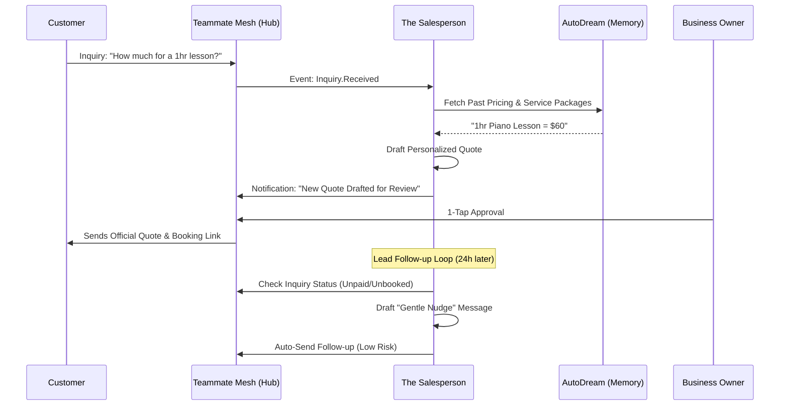

# Architecture Brief: "The Salesperson" (Sales & Acquisition) Department

## Title
The Salesperson: Autonomous Lead Conversion and Proactive Quote Management

## Problem Statement
For SMBs like Carlos (handyman) or Leo (tutor), every inquiry is a potential sale that can be lost due to "Communication Lag." Carlos might be mid-repair when a lead asks for a quote; if he doesn't reply in 15 minutes, they go to a competitor. These owners lack the time to follow up on "ghosted" leads or abandoned carts. They need a proactive agent that greets leads, generates professional quotes based on their past pricing, and follows up until the deal is closed—all while they sleep or work.

## Research Report
- **Market Gap**:
    - **Shopify**: Has "Abandoned Cart" emails, but they are generic and easily ignored.
    - **HoneyBook/Dubsado**: Great for quotes, but requires manual setup for every project.
    - **OHC Opportunity**: "The Salesperson" acts as a 24/7 sales assistant. It doesn't just send an email; it interprets the customer's request (e.g., "My sink is leaking and it's an emergency") and drafts a specific quote based on Carlos' business rules.
- **Conversion Barriers**:
    - **Friction to Quote**: The time it takes for an owner to sit down and type a price.
    - **The "Follow-up" Fear**: Owners feel "pushy" or simply forget to follow up with leads who haven't responded.
    - **Inconsistent Pricing**: Owners often "eyeball" prices differently each time.

## Design Doc

### Architecture Diagram (Mermaid.js)

### Key Design Decisions
- **Rule-Based Quoting**: The agent looks at `PRODUCT` and `BOOKING` data to ensure quotes match the owner's set rates.
- **Tone-of-Voice Matching**: Uses the business's "Visual Vibe" to ensure follow-ups match the brand (e.g., Leo's "friendly/youthful" vs. Priya's "professional/premium").
- **Lead Scoring**: Prioritizes leads based on intent (e.g., "emergency" keywords get immediate owner notification).
- **Draft-for-Review (Quotes)**: New quotes require 1-tap approval; standard follow-ups can be "Auto-Execute" based on user settings.

### Mobile UX Flow (375px)
- **Pending Quotes Feed**: A simple stack of cards showing the lead's name, requested service, and the drafted price.
- **1-Tap Follow-up**: A "Nudge" button next to every open inquiry.
- **Conversion Dashboard**: A single metric: "Sales Win Rate this month."

## Implementation Prompt
**To Implementer Agent:**
Implement the "The Salesperson" AI department. Create the `Inquiry` and `Quote` entities in the OHC-SIP DB. Implement a "Quote Generation Engine" that parses customer messages (via `Teammate Mesh`) and matches them against the tenant's `Products/Services`. Implement the "Lead Follow-up Daemon" that triggers a 24h/48h "nudge" message for unconverted leads. Ensure the agent uses `AutoDream` memory to recall if a customer has received a discount before. Build the "Draft-for-Review" UI for quotes, allowing owners to adjust the price with a slider before sending.

## Priority
P1

## Estimated Scope
Medium
