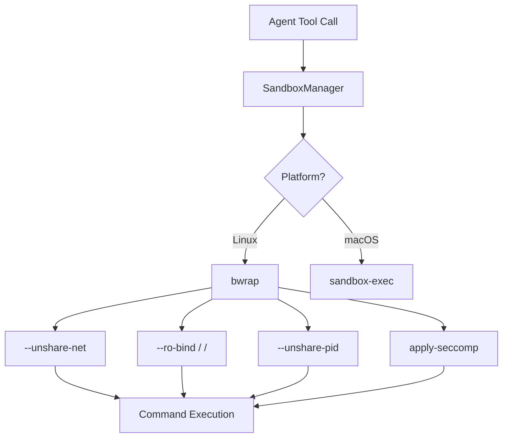

<div markdown="1" style="backdrop-filter: blur(20px); background: rgba(255, 255, 255, 0.03); font-family: 'Outfit', 'Inter'; padding: 2rem; border-radius: 12px; border: 1px solid rgba(255, 255, 255, 0.1);">

# Title: [Security] Implement Zero-Trust Agent Harness via bwrap/sandbox-exec

## Problem Statement
Currently, the OHC Swarm executes agent commands directly on the host or inside standard containers without granular, zero-trust isolation. In contrast, state-of-the-art agent architectures (e.g., Claude Code, OpenClaw) run all Bash/Shell commands inside a heavily restricted Sandbox Harness. Without this, a compromised or hallucinating agent could execute malicious payloads, access unauthorized files, or open unauthorized network connections, compromising the host and tenant data in OHC-HA Cloud Mode.

## Research Report
Based on a deep audit of the Leaked Claude Code (v2.1.88) architecture and Anthropic's `@anthropic-ai/sandbox-runtime`:
- **Isolation Mechanism**: Claude Code utilizes `bwrap` (Bubblewrap) on Linux and `sandbox-exec` on macOS to create a zero-trust wrapper around every executed command.
- **Network Restriction**: Network namespaces (`--unshare-net`) are used by default. Network access is routed exclusively through a local socat proxy/bridge mapped into the sandbox, allowing domain-level allowlisting.
- **Filesystem Restriction**: The root filesystem is mounted read-only (`--ro-bind / /`), and only specific working directories are mounted as read-write.
- **Seccomp Filters**: A BPF filter is injected to block unauthorized Unix socket creation, preventing Docker API escapes or SSH hijacking.
- **PID/Proc**: Process namespaces are unshared (`--unshare-pid`) and a fresh `/proc` is mounted to prevent the agent from seeing host processes.

### Comparative Table: OHC vs Market (Agent Harness)

| Feature | Current OHC Swarm | Claude Code / OpenClaw |
| :--- | :--- | :--- |
| **Command Execution** | Native shell (sh/bash) | Sandboxed (`bwrap` / `sandbox-exec`) |
| **Network Access** | Unrestricted host network | Proxy-only (socat bridge) with domain whitelist |
| **Filesystem Access** | Full R/W access (host/container) | Read-only root (`--ro-bind`), whitelist R/W directories |
| **Unix Socket Creation** | Allowed by default | Blocked via Seccomp BPF filter |
| **Process Visibility** | Full host process view | Isolated (`--unshare-pid`), fresh `/proc` |



## Design Doc
**Architecture Changes**:
1.  Introduce a new `pkg/sandbox` package in the Go backend.
2.  Implement `LinuxSandboxManager` wrapping `bwrap` and `MacOSSandboxManager` wrapping `sandbox-exec`.
3.  Modify the Agent Tool Execution layer (e.g., the `run_bash_command` or equivalent tool) to conditionally route all executions through `pkg/sandbox`.
4.  Implement a local network proxy (socat/HTTP) to whitelist domain access.

**API Contracts**:
```go
type SandboxConfig struct {
    AllowedPaths []string
    AllowedDomains []string
    NetworkEnabled bool
}
func WrapCommand(cmd []string, config SandboxConfig) ([]string, error)
```

## Implementation Prompt
"You are an Implementer agent. Your task is to implement a zero-trust Agent Harness in the OHC Backend.
1. Create a new Go package at `srcs/backend/pkg/sandbox`.
2. Implement `WrapCommand(cmd []string, config SandboxConfig)` that prepends the necessary `bwrap` arguments on Linux (`--unshare-net`, `--unshare-pid`, `--ro-bind / /`, `--bind <allowed> <allowed>`).
3. Modify the existing Bash Tool implementation in `srcs/backend/tools/bash.go` to use this new `WrapCommand` function.
4. Add comprehensive unit tests in `srcs/backend/pkg/sandbox_test.go` ensuring that commands correctly error out when trying to write to `/` or access the network without permission.
5. Achieve 100% test coverage."

## Priority
P1

## Estimated Scope
Large

</div>
