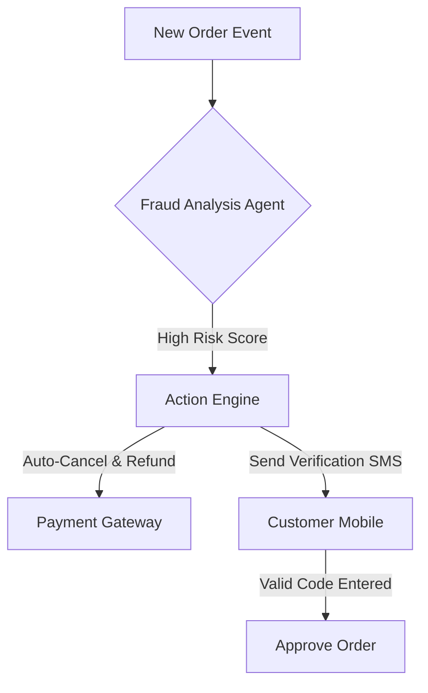

**Title**: Autonomous Fraud Prevention and Monitoring
**Problem Statement**: Fraudulent orders cost small businesses heavily in both lost merchandise and chargeback fees. SMBs do not have the time to manually review every order flag.
**Research Report**: Friendly fraud and stolen credit cards represent a significant margin drain. Existing solutions (like Stripe Radar) are effective but often require manual review of "suspicious" flags, which owners ignore or misunderstand.
**Design Doc**:
*   Architecture: Payment Gateway Webhook -> Fraud Analysis Agent -> Automated Action Engine.

**Implementation Prompt**: Build an autonomous fraud prevention layer that intercepts high-risk orders. If an order exceeds a certain threshold, the system should automatically cancel and refund it, or optionally, trigger an automated SMS verification flow requiring the purchaser to enter a code before the order is released to fulfillment.
**Priority**: P1
**Estimated Scope**: Large
