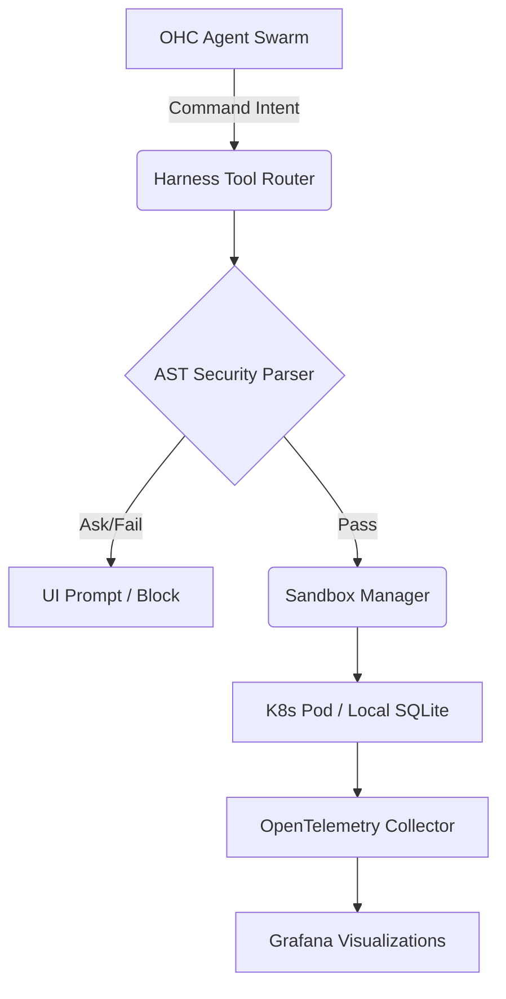

# 🔬 Issue Brief: Implement Client-Side AST Command Validation & Sandboxing

**Author:** Principal Product Researcher & Oracle (L7)
**Target:** Leaked Claude Code (v2.1.88)
**Focus:** Agent Harness, Sandbox Manager, and Execution Telemetry

---

## Title
[Security] Implement Client-Side AST Command Validation & Sandboxing

## Problem Statement
OHC's Standalone Desktop Mode relies on a local executor (`BashTool`) that currently lacks advanced static command validation and granular filesystem isolation. While Cloud-Native mode uses robust K8s network/pod isolation, local mode is vulnerable to agent hallucination executing destructive commands (e.g. `rm -rf`, unexpected process substitution) or accessing unintended areas of the host file system. We need "Defense in Depth" before a shell command even reaches execution.

## Priority
P1

## Estimated Scope
Large

## Research Report

This report dissects the **Agent Harness Architecture** implemented in the "Claude Code" leaked repository. We extracted the codebase and deeply analyzed its implementation for safe bash execution (`BashTool`), command parsing (`bashSecurity.ts`, `bashPermissions.ts`), and its environment isolation abstraction (`SandboxManager`).

Claude Code's architecture heavily emphasizes "Defense in Depth" through aggressive static AST parsing *before* command execution, paired with an optional but comprehensive native sandbox (`sandbox-adapter.ts`). It differs from OHC's approach by prioritizing client-side native sandboxing over distributed cloud isolation.

### Competitive Architectural Analysis

#### 1. The Agent Harness Structure

The harness operates in layers:

1.  **Tool Layer (`Tool.ts` / `BashTool.tsx`)**: Abstract base classes providing a unified schema, parameter validation, and rendering lifecycle (e.g., `renderToolUseMessage`, `renderToolResultMessage`).
2.  **Semantic AST Parser (`bashSecurity.ts` / `ast.ts`)**: Commands aren't just checked with Regex; they are parsed into an Abstract Syntax Tree using `tree-sitter`.
3.  **Permissions Gate (`bashPermissions.ts`)**: Checks whether the tool/command requires user approval based on predefined dangerous commands (`zmodload`, `emulate`, process substitution, redirection `< / >`).
4.  **Sandbox Adapter (`SandboxManager`)**: A native isolation wrapper managing network restrictions, file system access, and UNIX socket bindings.

#### 2. Claude Code vs. OHC-HA

| Feature | Claude Code (Client-Side) | OHC-HA (Hybrid / Cloud-Native) |
| :--- | :--- | :--- |
| **Execution Environment** | Local OS with Native Sandboxing Wrapper | Multi-tenant K8s Pods / Local Desktop (SQLite) |
| **Command Security** | Deep AST Parsing & Misparsing Validators (`bashSecurity.ts`) | SPIFFE/SPIRE Identity Auth & K8s Network Policies |
| **Agent Tool Definition** | Functional `buildTool` factory over `Tool` interfaces | Centralized OHC Central DB (OHC-SIP) Mesh |
| **Telemetry** | `logEvent` wrapped around specific check IDs | OpenTelemetry + Prometheus & Grafana |

### Deep Dive: `BashTool` & `SandboxManager`

#### Advanced Bash Security (`bashSecurity.ts`)

Claude Code employs a multi-stage validation pipeline (`validateDangerousPatterns`) that looks for:
*   **Process Substitution**: `<()`, `>()`, `=()`
*   **Command Substitution**: `\$()`, backticks (`` ` ``)
*   **Redirections**: `< / >`
*   **Zsh specific attack vectors**: `zmodload`, `sysopen`, `zpty`

It uniquely tracks both `ask` results and `isBashSecurityCheckForMisparsing` flags. This prevents an attacker from hiding a severe misparsing vulnerability behind a generic prompt trigger.

#### The Sandbox Wrapper (`sandbox-adapter.ts`)

The `SandboxManager` restricts:
*   `FsReadRestrictionConfig` / `FsWriteRestrictionConfig`
*   `NetworkRestrictionConfig` (Intercepts and manages domains)
*   Enforces `allowManagedDomainsOnly` policy.

*Note: The CLI maintains a dynamic "Excluded Commands" list (`excludedCommands`), allowing specific commands to bypass the sandbox. This acts as a user-convenience fallback rather than a strict security vulnerability, provided user-prompt gates remain active.*

---

## Design Doc

### Proposed OHC-HA Architecture

### Core Components to Implement
1.  **`srcs/server/bash_sandbox/ast_parser.go`**: Implement a bash command semantic analyzer using `tree-sitter` (or equivalent Go bash parsing library like `mvdan.cc/sh`). It must expose a `ValidateForSecurity(cmd string) error` that blocks process substitution, malformed variables, and unintended redirections.
2.  **`srcs/server/bash_sandbox/permissions.go`**: Implement a rule engine that tracks dangerous patterns and handles the "ask" (user prompt) vs "block" (fail immediately) behavior.
3.  **`srcs/server/bash_sandbox/sandbox_manager.go`**: Build a native wrapper around `os/exec` for the Standalone Desktop Mode that accepts FS read/write restriction configurations.

---

## Implementation Prompt

You are the Principal Security & Systems Implementer (L7). Your mission is to implement Client-Side AST Command Validation and Sandboxing for OHC's Standalone Desktop Mode.

1.  **Create AST Validator**: In `srcs/server/bash_sandbox/ast_parser.go`, implement a bash parser using `mvdan.cc/sh/v3/syntax`. Parse input commands and recursively traverse the AST.
    *   Fail the validation if you detect: Process Substitution (`<()`, `>()`), Command Substitution (`$()`, `` ` ``), or unsafe redirections (especially overwriting system files).
2.  **Create Permission Engine**: In `srcs/server/bash_sandbox/permissions.go`, create a `CheckCommandSecurity(cmd string) PermissionResult` function that orchestrates the AST validation and returns whether the command is allowed, blocked, or requires user approval.
3.  **Implement Local Sandbox Manager**: In `srcs/server/bash_sandbox/sandbox_manager.go`, implement `RunInSandbox(cmd string, fsConfig FSConfig)`. For Standalone Mode, implement basic Chroot or path-prefixing constraints to ensure the command only touches allowed directories.
4.  **Integrate**: Hook the new `CheckCommandSecurity` into the existing executor flow (likely in `srcs/server/bash_sandbox/executor.go` or similar) so all commands are intercepted before execution.
5.  **Testing**: Write comprehensive unit tests for `ast_parser.go` verifying that complex, multi-line, and piped attacks are caught correctly. Unit test coverage MUST be 100%.
