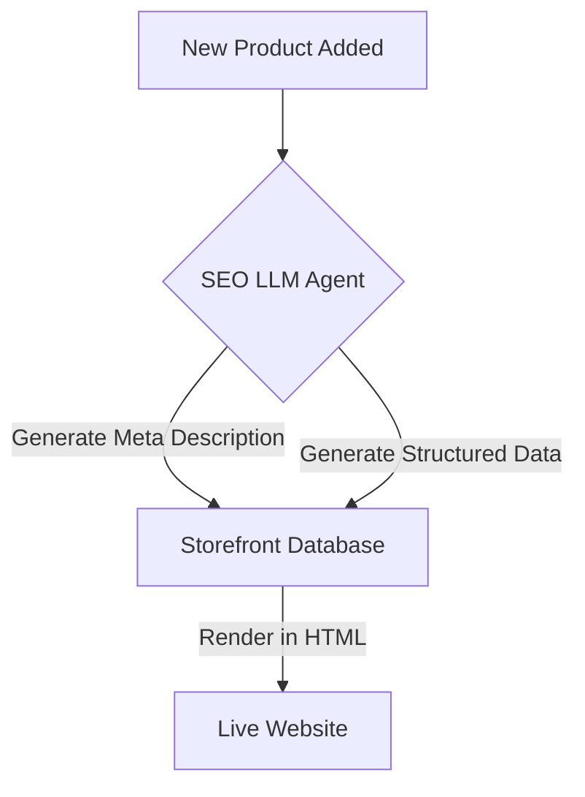

**Title**: Generative SEO Optimizer
**Problem Statement**: Technical SEO (meta tags, sitemaps, structured data) is a black box for non-technical users, resulting in poor organic search visibility.
**Research Report**: SMBs heavily rely on paid acquisition because their organic reach is minimal. Tools that promise "SEO help" usually just provide a list of confusing tasks rather than doing the work.
**Design Doc**:
*   Architecture: Catalog Updates -> SEO LLM Agent -> Storefront Metadata.

**Implementation Prompt**: Create a background agent that automatically generates localized meta descriptions, alt tags for images, and Schema.org structured JSON-LD data for every new product and page added to the platform, ensuring compliance with Google's latest indexing standards without requiring user input.
**Priority**: P2
**Estimated Scope**: Medium
