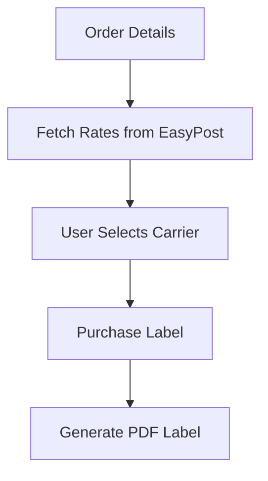

## [Shipping] Issue Brief: EasyPost for Multi-Carrier Shipping

**Title**: Scout 🔍: EasyPost Integration for Label Generation
**Problem Statement**:
Small e-commerce owners spend hours manually copying addresses to carrier websites to buy shipping labels. They need to instantly print labels from OHC.
**Research Report**:
- **Tool**: EasyPost API.
- **Evaluation**: EasyPost aggregates dozens of carriers into one API.
- **Ease of Use**: User connects EasyPost to OHC.
- **Pricing**: EasyPost charges per label.
- **Cloud vs. Standalone**: Fully functional in both modes.
**Design Doc**:
- "Operations" -> "Orders".
- User clicks "Buy Shipping Label".
- OHC fetches rates from EasyPost.
- User selects a rate, and a PDF label is generated.

**Implementation Prompt**:
Implement an EasyPost integration to fetch shipping rates. Allow the user to purchase a label and download the PDF.
**Priority**: P1
**Estimated Scope**: Large
