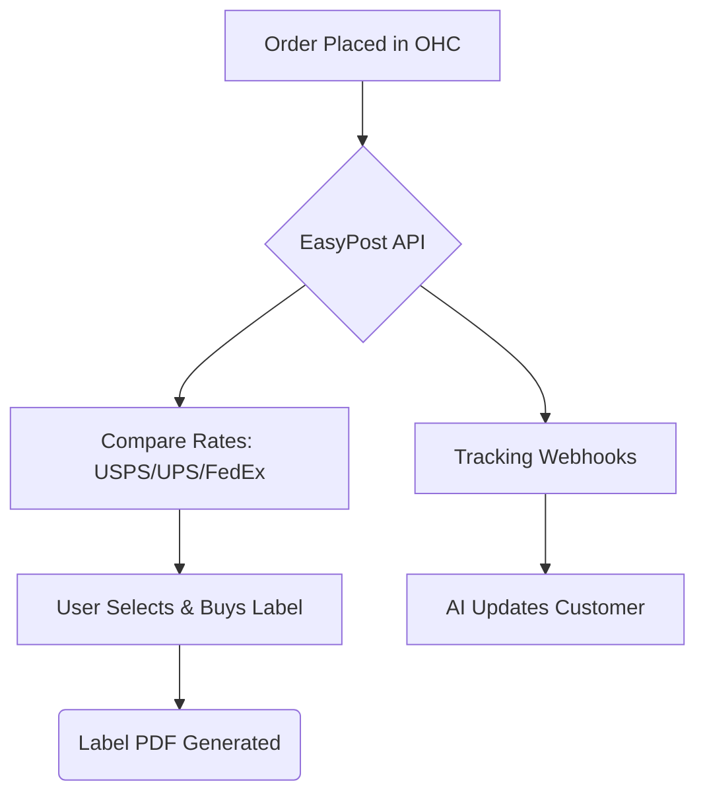

## [Shipping] Issue Brief: EasyPost Integration

**Title**: Scout 🔍: Integrate EasyPost for Multi-Carrier Shipping & Tracking
**Problem Statement**:
Small business owners like Priya (Boutique) spend hours manually weighing packages, visiting different carrier websites (USPS, FedEx, UPS) to compare rates, and manually typing tracking numbers into emails. They need a unified system that automatically calculates the cheapest rate, prints the label, and tracks the package in one place.
**Research Report**:
- **Tool**: EasyPost API
- **Evaluation**: EasyPost provides a single API to integrate with dozens of carriers globally. It handles rate comparison, label generation, address verification, and real-time tracking updates via webhooks.
- **Ease of Use**: Excellent. Users connect their existing carrier accounts or use EasyPost's default accounts.
- **Pricing**: Free tier available (120k shipments/year free), then pennies per label. Very friendly for small businesses.
- **Cloud vs. Standalone**: Highly suitable for Cloud. Usable in Standalone with individual API keys.
**Design Doc**:

- When an order is ready to ship, OHC requests rates via EasyPost.
- The user selects a rate and generates a label (PDF) directly in OHC.
- EasyPost sends webhooks as the package moves.
- The AI Customer Success agent automatically emails the customer with tracking updates.
**Implementation Prompt**:
Integrate the EasyPost API to provide end-to-end shipping management. Build a UI for users to compare rates, purchase shipping labels, and download the PDFs. Implement address verification to prevent shipping errors. Set up tracking webhooks to automatically update order statuses in OHC and trigger AI-generated shipping notification emails to customers.
**Priority**: P1
**Estimated Scope**: Large
