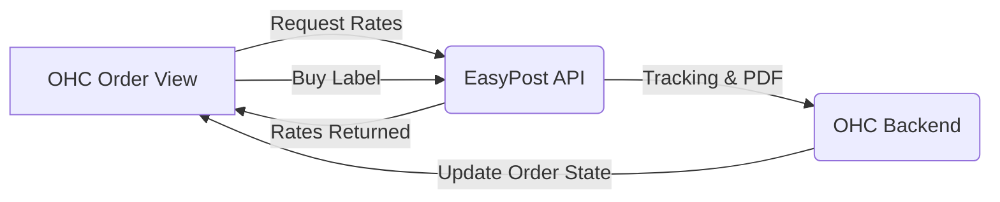

# [Shipping] EasyPost Integration

## Problem Statement
For product-based small businesses, managing shipping is a manual, error-prone nightmare. They often have to copy-paste customer addresses from their CRM into a carrier's website (like USPS or FedEx), manually calculate rates to charge the customer, and then manually copy tracking numbers back to the customer. This process does not scale and leads to incorrect addresses and frustrated customers. A unified solution to generate labels and track packages directly from the order view is required.

## Research Report
### Market Evaluation
- **EasyPost**: An API-first shipping solution that aggregates hundreds of carriers (USPS, FedEx, UPS, DHL, etc.) into a single integration.
- **ShipStation**: Very popular, but acts more as a standalone dashboard. Integrating their API into another platform like OHC can be clunky.
- **Shippo**: Similar to EasyPost, strong competitor, but EasyPost often has an edge in developer experience and raw API performance.

### Findings
EasyPost is the ideal shipping engine for OHC because:
1. **Unified API**: Connecting EasyPost gives OHC users access to almost every major carrier worldwide instantly.
2. **Pricing**: Pay-per-label model (often free for very low volume or specific carriers like USPS), meaning no high monthly SaaS fees for the business owner.
3. **Features**: It handles address verification automatically, which drastically reduces returned packages for small businesses.

### Comparison Table
| Feature | EasyPost | Carrier Direct (e.g. USPS) | Importance for OHC Users |
| :--- | :--- | :--- | :--- |
| **Multi-Carrier Support** | Yes | No | High - Flexibility in shipping |
| **Address Verification** | Yes (Built-in) | Variable | High - Reduces costly mistakes |
| **Developer DX** | Excellent | Poor | Medium - Stable integration |
| **Pricing** | Per-label | N/A | High - Scales with business |

## Design Doc

### Mobile UX Flow
1. **Trigger**: User views a "Paid" order in the OHC mobile app.
2. **Action**: User taps "Generate Shipping Label".
3. **View**: A modal appears showing the customer's verified address, package dimension inputs (or saved presets), and a list of real-time rates from connected carriers.
4. **Action**: User selects the cheapest rate and taps "Buy Label".
5. **Result**: The label is generated and displayed as a PDF for printing (or sharing), tracking information is automatically attached to the order, and the customer receives an automated "Order Shipped" notification.

### Architecture (High-Level)

### Integration Points
- **Order Management**: The core integration lives within the order detail view.
- **Customer CRM**: Tracking links are visible in the customer profile history.
- **Notifications**: Triggering automated updates when package state changes (e.g., "Out for Delivery").

## Implementation Prompt
**Outcome**: A product-based business owner can purchase and generate a shipping label directly from a customer's order screen. Tracking information should automatically sync.
**Acceptance Criteria**:
- Address verification occurs before rate calculation.
- Rate calculation displays at least 2 carrier options (if available).
- Purchasing a label deducts from the user's EasyPost balance and returns a printable PDF.
- Tracking numbers are saved to the OHC database against the specific order.
- The UI must be highly intuitive on a mobile device, avoiding dense spreadsheet-like views, utilizing premium visual tokens (Glassmorphism).

## Priority
`P1` (High) - Essential for product-based users to scale their fulfillment operations.

## Estimated Scope
Medium
