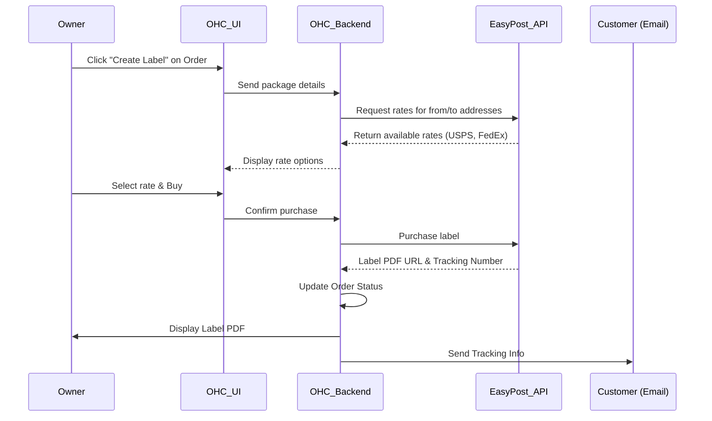

# [Shipping] Automated Fulfillment & Tracking

## Title
Automated Shipping Label Generation and Tracking Integration

## Problem Statement
As a small business owner selling physical products, fulfillment is a nightmare. I have to manually copy customer addresses from my store into a carrier's website (like USPS or FedEx), pay for a label, print it out, and then manually email the tracking number back to the customer. This takes hours every week and I make mistakes typing addresses. I need a way to hit one button to buy and print a shipping label, and automatically tell the customer their package is on the way.

## Research Report
**Tools Evaluated:** Shippo, EasyPost, ShipEngine.

- **Shippo:**
  - *Ease of Use:* Very high. Good dashboard, but more importantly, their API is very clean.
  - *Pricing:* Pay as you go ($0.05 per label) or $10/mo. Very affordable for SMBs. Provides deeply discounted USPS rates.
  - *Cloud vs Standalone:* Works identically in both since it relies purely on outbound API calls.
- **EasyPost:**
  - *Ease of Use:* Developer-focused. Very powerful, but less focus on the end-merchant UI if they need to log into the dashboard.
  - *Pricing:* First 120,000 shipments free per year. Unbeatable price.
  - *Cloud vs Standalone:* Fully functional in both modes via direct outbound API integration.
- **ShipEngine:** Powering ShipStation. Very robust, slightly more complex API.
- **Recommendation:** Use EasyPost due to the generous free tier for developers/platforms, which keeps costs zero for our smaller users. We will build the label generation UI natively within OHC so the user never leaves our app.

## Design Doc
A "Fulfillment" section integrated directly into the "Orders" view in OHC.
- **Trigger:** Business owner views a paid order and clicks "Create Shipping Label".
- **Action:** OHC prompts for package weight/dimensions (or uses saved defaults). OHC fetches live rates from EasyPost.
- **User View:** The owner selects the cheapest or fastest rate, clicks "Buy Label", and a printable PDF of the label appears. Simultaneously, the system emails the tracking number to the customer.

## Implementation Prompt
Integrate with the EasyPost API to allow business owners to generate shipping labels directly from an Order detail page. The UI should allow them to input package weight/dimensions, fetch live carrier rates, and purchase the label. Once purchased, provide a button to print the PDF label and automatically transition the Order status to "Shipped", which should trigger an automated email to the customer containing their tracking link.

## Priority
P2

## Estimated Scope
Medium
