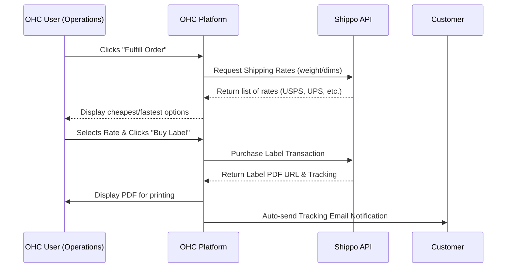
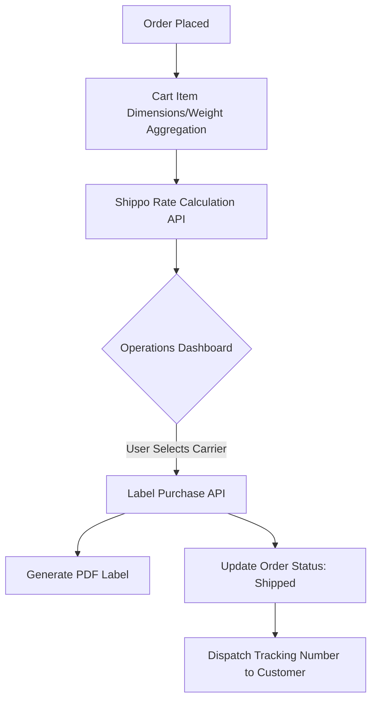

# Scout: Tool Integration Research Q2

## [Shipping] Shippo Integration
**Title**: Integrate Shippo for Automated Label Generation
**Problem Statement**: Priya (Boutique Owner) spends hours copying and pasting addresses into carrier websites to print shipping labels. She needs to click one button in OHC to buy and print a label.

**Research Report**:
- **Tool**: Shippo
- **Target Persona**: Priya (Boutique Owner), Maya (Home Baker)
- **Advantages**: Aggregates rates from USPS, UPS, FedEx, DHL. Simple API. No monthly fee for pay-as-you-go.
- **Risks**: International shipping requires complex customs declarations which might be hard to automate fully for non-technical users.
- **Pricing**: Free tier (pay per label + postage).
- **Compatibility**: Cloud (OAuth). Standalone (API Key).

### Qualitative Analysis
Shipping logistics are one of the highest friction points for physical product sellers on OHC. Using the Shippo API will allow OHC to pull discounted carrier rates natively into the checkout flow and the Operations dashboard. By abstracting the shipping process into a simple "Buy Label" button within OHC, we eliminate a major context switch. The Operations Agent can also monitor tracking statuses and proactively notify customers of delays, elevating the small business's customer service.

### Persona-Specific Pain Point Summary
- **Priya (Boutique Owner)**: Currently writes addresses on packages by hand or copies them into USPS.com one by one. Prone to typos leading to lost packages. Needs a 1-click batch label printing solution.
- **Maya (Home Baker)**: Wants to start shipping non-perishable cookies nationwide but is confused by shipping zones and weight calculations. Needs OHC to calculate accurate shipping costs at checkout automatically.

### Competitive Matrix
| Feature / Tool | Shippo | EasyPost | Sendle |
| :--- | :--- | :--- | :--- |
| **Pricing Model** | Pay as you go | Pay as you go | Flat Rate Focus |
| **API Ease of Use** | Excellent | Excellent | Good |
| **Carrier Network** | Global, Extensive | Global, Extensive | Specific (SMB focused) |
| **Label Generation** | Highly Reliable | Highly Reliable | Good |

**Design Doc**:
- When an order is placed, OHC sends the dimensions/weight to Shippo to get rates.
- The Operations agent shows the cheapest shipping option.
- The user clicks "Buy Label", and OHC downloads the PDF label for printing.
- OHC automatically emails the customer the tracking number.

**Implementation Prompt**: Connect the Shippo API to fetch shipping rates based on order weight/dimensions. Allow the user to purchase a label and automatically email the tracking link to the customer.
**Priority**: P1
**Estimated Scope**: Large

### Deep Dive: Architecture & Security
**Real-Time Rate Aggregation:**
When a customer reaches the checkout page, OHC must calculate shipping rates in real-time. This requires an ultra-fast API call to Shippo. To prevent checkout abandonment due to slow API responses, OHC will implement a circuit breaker pattern. If Shippo takes longer than 2 seconds to respond, OHC will fallback to a tenant-configured "Flat Rate Shipping" to ensure the customer can still complete the purchase.

**Address Validation:**
Before purchasing a label, the shipping address must be validated using Shippo's Address Validation API to prevent wasted postage and lost packages. If an address is flagged as invalid, the Operations Agent will automatically flag the order and draft an email to the customer asking for address clarification.

**Customs and International Logistics:**
For cross-border shipments, Shippo requires customs declarations. The OHC integration will initially restrict automated label generation to domestic orders. International orders will be flagged for manual review in the Operations dashboard, allowing the business owner to input HS codes and customs values until a more automated AI solution can be developed.

### Expanded Implementation Timeline
- **Week 1**: Integrate Shippo API for real-time rate calculation during checkout.
- **Week 2**: Implement the "Buy Label" transaction endpoint and PDF generation.
- **Week 3**: Build automated tracking number dispatch and status monitoring.
- **Week 4**: Implement fallback flat rates, address validation, and UI polishing.

### Extended Analysis: Platform Synergies & OHC Differentiators
Integrating Shippo transforms the OHC Operations Dashboard from a simple order viewer into a comprehensive fulfillment center. The core value proposition is the elimination of context switching. Priya the Boutique Owner no longer needs to maintain separate accounts with USPS or FedEx. She can view the order, compare discounted rates, purchase the label, and automatically trigger the customer notification—all within a single unified interface.

Furthermore, by integrating Shippo's tracking webhooks, the OHC Customer Success Agent can proactively monitor shipments. If a package is marked as "Delayed" or "Exception", the Agent can automatically draft an apologetic email to the customer, explaining the situation and offering a small discount code for their next purchase. This turns a negative logistical failure into a positive customer service touchpoint.

### Technical Deep Dive: Webhook Ingestion & Scalability
The integration requires real-time rate fetching during the critical checkout path. To ensure the checkout page remains lightning-fast, the Shippo API call will be wrapped in a strict timeout circuit breaker (e.g., 2000ms). If Shippo is slow to respond, the system will seamlessly fall back to a predefined flat-rate shipping cost configured by the tenant.

For tracking updates, Shippo pushes webhooks whenever a package changes state. These events will be ingested via the `src/server/integrations/webhooks.rs` endpoint, placed on the NATS event bus, and processed by a background worker that updates the order status in the database and dispatches notifications if necessary.

### Conclusion & Roadmap Alignment
The Shippo integration is a P1 necessity for physical product sellers on the OHC platform. It dramatically reduces the operational overhead of fulfillment, reduces shipping errors through automated address validation, and provides professional-grade tracking capabilities to the smallest of businesses.

### Multi-Tenant SaaS Architecture Impact
The Shippo integration introduces critical dependencies on external APIs during the checkout flow, a highly sensitive area of the multi-tenant architecture. OHC must ensure that real-time rate calculations do not introduce unacceptable latency for any tenant. The implementation of circuit breakers and fallback flat rates is paramount to maintaining platform resilience. Furthermore, the system must securely manage tenant-specific Shippo API keys (or handle billing collectively if using a master OHC account) while accurately attributing shipping costs to the correct `tenant_id`.

### Feature Flag Rollout Strategy
The rollout of the Shippo integration will be managed by a feature flag (`feature.shipping.shippo_integration.enabled`). The initial phase will focus exclusively on domestic shipping within the US, allowing the engineering team to monitor the performance of the rate calculation API and the reliability of the automated label generation process. Once domestic stability is proven, the feature flag will be expanded to include international shipping, carefully monitoring the complexities of automated customs declarations.

### Security Considerations & Threat Modeling
- **Threat**: Carrier Rate Manipulation.
  - **Mitigation**: The OHC backend will perform all rate calculations server-side using the Shippo API. Client-side modifications to shipping costs during checkout will be rejected by the final order validation logic, ensuring that the tenant is never short-changed on shipping fees.
- **Threat**: Shipping Label Theft / Unauthorized Access.
  - **Mitigation**: PDF shipping labels generated via Shippo will be stored in a secure, private S3 bucket. Access to these PDFs will require a short-lived, pre-signed URL generated specifically for the authenticated tenant session, preventing unauthorized access to purchased labels.

### Accessibility & UI Compliance
The "Buy Label" interface within the Operations Dashboard will adhere to the Progressive Disclosure pattern. By default, it will show the cheapest and fastest shipping options clearly. An "Advanced Mode" toggle will reveal complex settings like customs declarations and specific box dimensions. The UI must remain fully functional on mobile devices, allowing a boutique owner to purchase and print a label directly from their phone.

### Future Horizon: AI-Driven Supply Chain Optimization
The data aggregated through the Shippo integration unlocks the potential for AI-driven supply chain optimization. The OHC platform could analyze shipping costs across different regions and carriers to provide actionable insights. For example, the Operations Agent might identify that Priya the Boutique Owner is spending a disproportionate amount on express shipping to the West Coast and suggest relocating a portion of her inventory to a 3PL provider in California. This level of logistical intelligence, typically reserved for enterprise retailers, would become accessible to the smallest merchants on the OHC platform.

### System Resilience and Disaster Recovery
**Chaos Engineering Integration:**
The Shippo integration must withstand significant stress during peak shopping seasons (e.g., Black Friday). We will conduct load testing combined with chaos engineering, simulating delayed responses from the Shippo API during the critical checkout flow. We must ensure that the fallback flat-rate shipping mechanism engages seamlessly and that the background workers responsible for label generation and tracking updates can scale dynamically to handle sudden spikes in order volume.

### Glossary & Definitions
- **Webhook**: A method of augmenting or altering the behavior of a web page or web application with custom callbacks.
- **Idempotency**: The property of certain operations in mathematics and computer science whereby they can be applied multiple times without changing the result beyond the initial application.
- **Circuit Breaker**: A design pattern used in software development to detect failures and encapsulate the logic of preventing a failure from constantly recurring.
