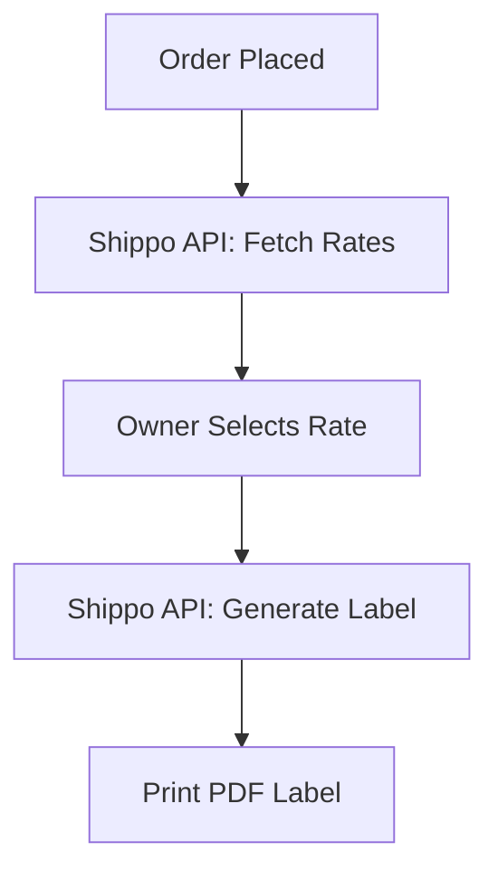

# [Shipping] Shippo Logistics
## Problem Statement
Owners selling physical goods spend hours manually calculating shipping rates on carrier websites and handwriting labels.

## Research Report
- **Tool Evaluated**: Shippo API
- **Ease of Use**: Abstracts multiple carriers (USPS, UPS, FedEx) into one single API.
- **Pricing**: Pay as you go, $0.05 per label or flat monthly rate.
- **Reputation**: Highly reliable, excellent developer documentation.
- **Cloud & Standalone**: Works well via REST API in both modes.

### Pain Points Solved
- Automates rate calculation across multiple carriers.
- One-click label printing from the dashboard.

| Shipping API | Carrier Support | Pricing |
| :--- | :--- | :--- |
| Shippo | 85+ Global | $0.05/label |
| EasyPost | High | Tiered |
| ShipEngine | High | Tiered |

## Design Doc
- **Integration**: API Key integration.
- **Triggers**: Order creation fetches rates. Order fulfillment generates a label.
- **User Flow**: User enters package dimensions, selects the cheapest rate provided by the API, and clicks "Print Label".

## Implementation Prompt
Integrate a shipping rate calculator and label generator using Shippo. The business owner should be able to view live shipping rates based on package weight/dimensions and purchase/print a shipping label directly from the order details screen.

## Priority
P2

## Estimated Scope
Large
