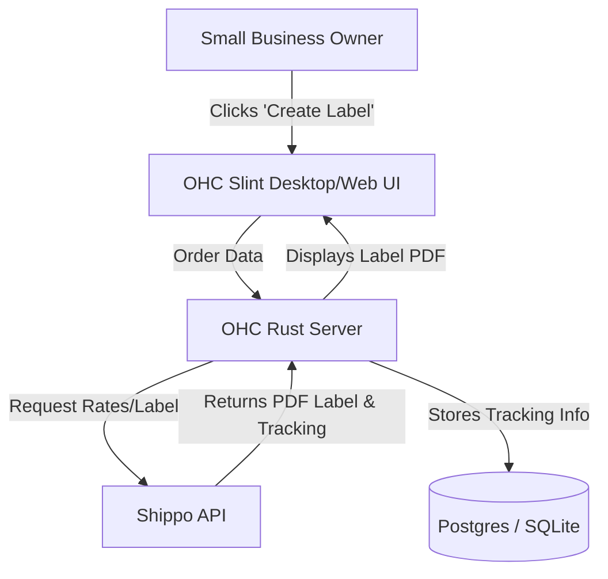

**Title**: Shipping & Logistics Integration: Shippo

## Problem Statement
Small e-commerce businesses waste massive amounts of time manually calculating shipping rates, copying addresses between systems, and printing labels. They need an integrated solution that automatically fetches the cheapest rates across multiple carriers, generates printable shipping labels directly from their order dashboard, and sends tracking info to customers.

## Research Report
**Tool Evaluated:** Shippo
**Category:** Shipping & Logistics
**Overview:** Shippo is a multi-carrier shipping API and web app that connects businesses to carriers like USPS, UPS, FedEx, and DHL.

**Key Features for Small Businesses:**
*   **Multi-Carrier Rates:** Compare rates instantly to find the cheapest option.
*   **Label Printing:** Generate and print shipping labels directly.
*   **Tracking:** Automated tracking updates and return label generation.
*   **Ease of Use:** Abstract away the complexity of dealing with individual carrier APIs.

**Environment Compatibility:**
*   **Cloud Mode:** Fully supported via Shippo REST API.
*   **Standalone Mode:** Fully supported via Shippo REST API.

**Pros:**
*   Excellent developer API and documentation.
*   Provides deeply discounted rates (e.g., USPS Commercial Plus).
*   Pay-as-you-go pricing model with no monthly fees for basic usage.

**Cons:**
*   International shipping can be complex regarding customs forms, though Shippo handles most of it.

## Design Doc

The integration embeds shipping label generation directly into the OHC order fulfillment workflow.

### High-Level UX Flow:
1.  **Integration Hub:** The user connects their Shippo account via API key in the OHC settings.
2.  **Order Fulfillment:** On an order details page, the user clicks "Fulfill Order".
3.  **Rate Selection:** OHC presents 2-3 shipping options (e.g., "Cheapest", "Fastest") fetched via Shippo.
4.  **Label Generation:** The user selects an option and clicks "Buy Label". OHC deducts the cost, generates a printable PDF label, and automatically emails the tracking link to the customer.

## Implementation Prompt
**Objective:** Integrate Shippo to provide in-app shipping rate calculation and label printing for physical goods.
**Acceptance Criteria:**
- Create a UI component in Slint to configure the Shippo API connection.
- Implement an order fulfillment UI flow that fetches rates and allows label purchase.
- Implement backend integration with Shippo API to create shipments, fetch rates, and buy labels.
- Ensure the user interface passes the "Grandmother Test" (e.g., "Print Shipping Label").

## Priority
P2

## Estimated Scope
Large
