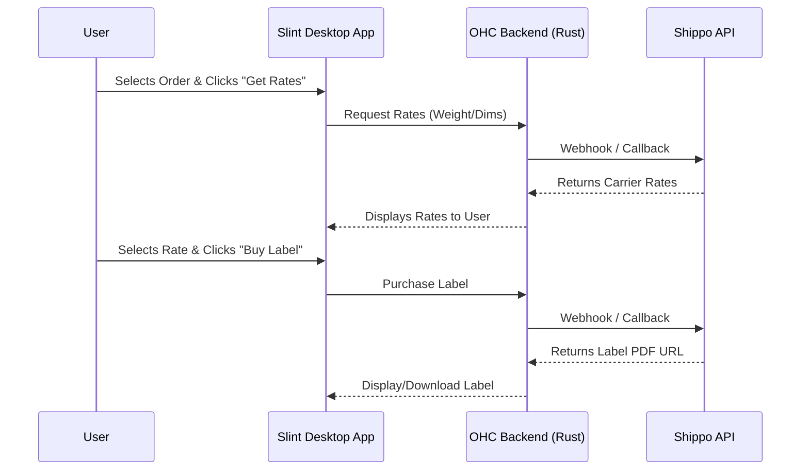

# Shippo Integration

## Problem Statement
Calculating shipping rates and generating labels manually for e-commerce orders is time-consuming and prone to errors for small business owners.

## Research Report
Shippo offers a multi-carrier shipping API that simplifies rate calculation and label generation.
* **Problem Addressed**: Automates the logistics of shipping physical products.
* **User Benefit**: "Automated shipping rate calculation across multiple carriers and easy label generation directly from your OHC dashboard."
* **Ease of Use (for non-technical users)**: The OHC UI will hide the API complexity. Users just need to input package weight/dimensions and click "Generate Label."
* **Risks & Trade-offs**: Requires accurate package dimensions and weights to avoid carrier adjustments. Reliant on carrier API uptimes.
* **Pricing Estimate**: Free tier available (pay per label); $10/month for advanced features.
* **Compatibility**: Cloud & Standalone.

## Design Doc
The integration will use the Shippo REST API to query rates and generate PDF labels for orders within OHC.

## Implementation Prompt
**Outcome**: Implement the Shippo integration to allow users to calculate shipping rates and generate labels for e-commerce orders managed within OHC.
**Acceptance Criteria**:
1. Users must be able to input their Shippo API key.
2. The UI must allow users to input package dimensions/weight for an order.
3. The system must query and display available shipping rates from Shippo.
4. The user must be able to purchase a label and download the resulting PDF directly from the OHC UI.

## Priority
P2 (Medium)

## Estimated Scope
Large
