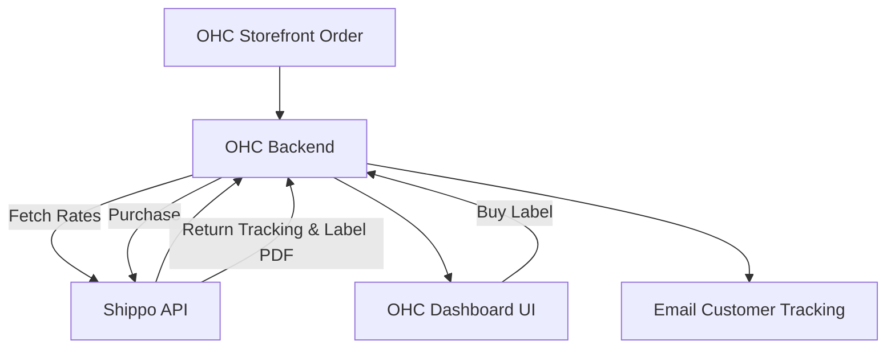

# Research: Shipping & Logistics Integration with Shippo

## Title
Integrate Shippo for Multi-Carrier Shipping and Label Generation

## Problem Statement
E-commerce small business owners spend too much time calculating shipping rates, buying postage, and manually copying tracking numbers to customers. They need a centralized system that compares carrier rates, generates shipping labels easily, and automates tracking updates, saving time and reducing shipping costs.

## Research Report
Shippo is a multi-carrier shipping software that connects businesses to over 40 global carriers (USPS, UPS, FedEx, DHL, etc.) through a single platform.
- **Ease of Use**: Shippo is highly user-friendly. It allows users to quickly compare rates, print labels in bulk, and manage returns from a clean dashboard.
- **Pricing**: Shippo offers a "Starter" plan that is free to use (no monthly fee) and provides access to heavily discounted carrier rates; you only pay postage plus a small per-label fee if using your own carrier accounts. Pro plans start at $17/mo for removing branding and advanced features.
- **Reputation**: It is widely trusted by over 100,000 businesses. It is known for its robust API, reliability, and the significant discounts it offers on USPS and UPS rates.
- **Environment Support**: Shippo is an API-first cloud service. It requires internet connectivity to fetch live rates and generate labels, making it suitable for Cloud and online Standalone modes.

## Design Doc
The integration will allow OHC users to manage fulfillments without leaving the platform.
1.  **Carrier Connection**: The user connects their Shippo account (or OHC provisions a white-labeled one).
2.  **Order Sync**: When a product is sold, the order details (weight, dimensions, destination) are sent to the Shippo API.
3.  **Rate Fetching & Label Creation**: OHC displays available rates. The user selects a rate, and OHC triggers the Shippo API to purchase the label.
4.  **Tracking**: Shippo returns a tracking URL, which OHC automatically emails to the customer and displays in the order dashboard.

## Implementation Prompt
Integrate Shippo to provide shipping rate calculation and label generation. The OHC dashboard should allow users to view pending orders, input package dimensions, fetch live rates from Shippo, and purchase a label. The generated label PDF must be easily printable from the browser. Furthermore, automate the process of updating the order status to "Shipped" and sending the tracking information provided by Shippo to the customer.

## Priority
P1

## Estimated Scope
Medium
