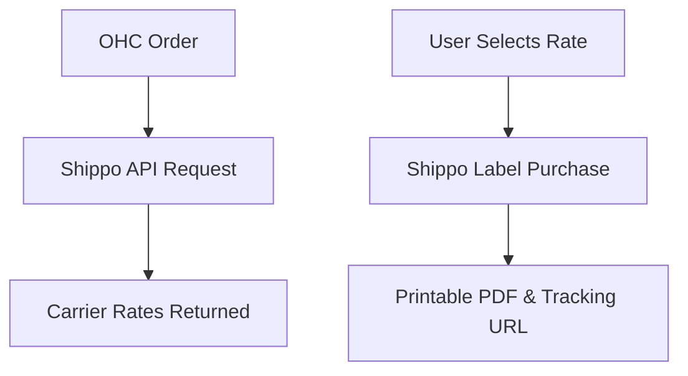

# Shipping & Logistics: Shippo

## Problem Statement
Product-based small businesses spend hours manually calculating shipping rates, buying stamps, or writing labels at the post office. They need a quick way to generate a printable shipping label and get a tracking number right from their order dashboard.

### Persona-Specific Pain Point Summary
- **E-commerce (Alex):** "I spend 2 hours a day manually copying addresses into USPS to buy labels."
- **Craft Maker (Emma):** "I never know the exact shipping cost until I'm at the post office, which eats into my profits."

## Research Report
**Tool:** Shippo
**Ease of Use:** Very user-friendly API and dashboard. Connects to numerous carriers globally. (Source: G2 reviews)
**Pricing:** Pay-as-you-go per label (e.g., 5 cents per label) + carrier costs.
**Reputation:** Reliable, good customer support for SMBs.
**Cloud/Standalone:** Standard REST API, works well in both environments.

### Comparative Table
| Feature | Shippo | EasyPost | OHC Fit |
|---|---|---|---|
| Pricing | Pay as you go | Tiered/Volume | Essential |
| Global Carriers | High | High | Good |
| UI for non-tech | Excellent | Good | Essential |

## Design Doc
### Architecture

### UX Flow
1. User views an "Unfulfilled Order" in OHC.
2. User clicks "Generate Shipping Label".
3. OHC fetches rates via Shippo. User selects the cheapest option.
4. OHC downloads the PDF label for printing and emails the tracking link to the customer.

## Implementation Prompt
Integrate Shippo into the Orders module. Add a "Create Label" button on the order details page. This should prompt a modal showing shipping rates based on the customer's address. Upon selection, purchase the label via the Shippo API, save the tracking number to the order, and provide a direct link to download the PDF label.

## Priority
P2

## Scope
Large
