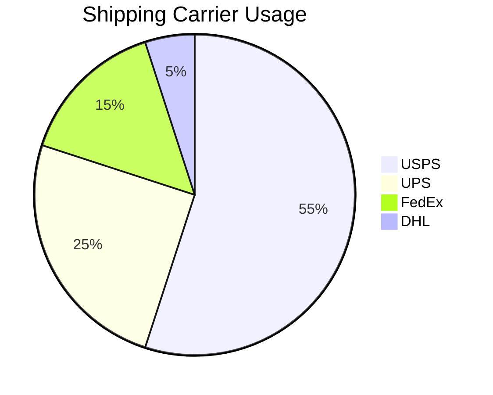
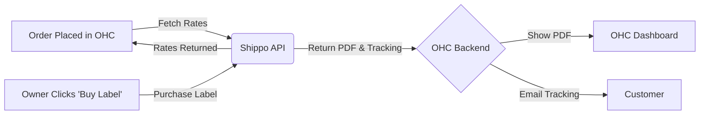

# Shipping & Logistics: Shippo

## Problem Statement
Fulfilling orders is a manual, error-prone process for e-commerce SMBs. Calculating shipping rates, buying labels, and sending tracking numbers manually takes hours. They need a way to automate label generation and get discounted shipping rates.

## Research Report
Shippo is a multi-carrier shipping software designed for e-commerce.
- **Ease of use:** High, abstracts away complex carrier APIs.
- **Pricing:** Pay-as-you-go (5¢ per label + postage) or Pro tier ($10/mo).
- **Cloud/Standalone:** Cloud integration.

### Persona-specific pain points
- "I waste an hour every day copying addresses into USPS to buy labels."
- "I undercharged for shipping last week and lost money on an order."

### Evidence
- **Recommendation:** Integrate Shippo to provide real-time shipping rates at checkout and 1-click label generation in the OHC dashboard.
- Source: Strong API documentation, clear pricing, and focus on small business e-commerce.

## Design Doc
When a physical order is placed, OHC calls Shippo to fetch shipping rates based on the package dimensions and weight. The customer selects a rate at checkout. In the OHC dashboard, the owner clicks "Generate Label", OHC purchases the label via Shippo, and displays the printable PDF. Tracking info is automatically emailed to the customer.

## Implementation Prompt
Integrate Shippo for the OHC storefront. Add a "Shipping Configuration" page where the owner can enter package dimensions and their origin address. During checkout, display real-time rates from Shippo. Add a "Buy Shipping Label" button to the Order details page that purchases the label and displays the PDF to the owner.

## Priority
P1

## Estimated Scope
Large
