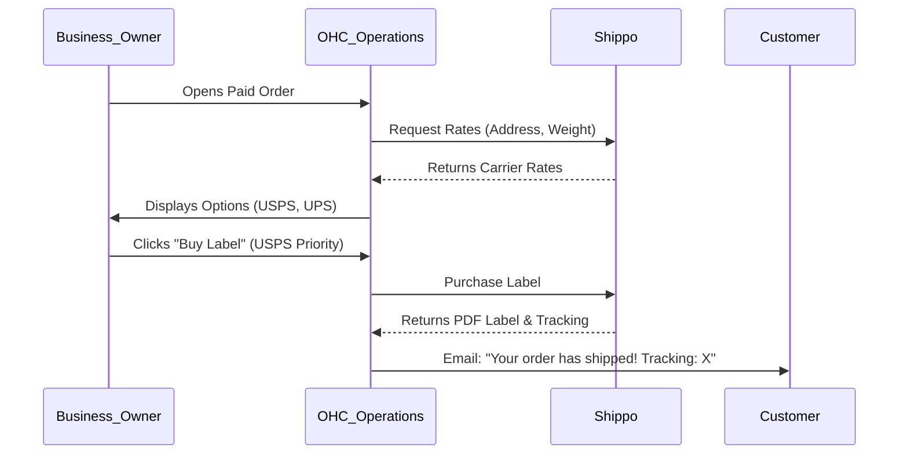

# Native Shipping Rates & Labels via Shippo

## Problem Statement
Priya (Boutique Owner) and Maya (Home Baker) spend hours manually copying customer addresses into carrier websites to generate shipping labels. They need a simple, one-click solution within OHC to buy and print labels instantly without using complex third-party logistics aggregators.

## Research Report
- **Strategy**: Build a native fulfillment interface powered by the Shippo API.
- **Target Persona**: Retailers and makers shipping physical goods.
- **Advantages**: Incredibly high value proposition. Saves hours of manual work weekly. Keeps the fulfillment workflow entirely within OHC.
- **Risks**: Handling complex edge cases like international customs declarations or multi-box shipments can be difficult to simplify.
- **Pricing**: Free tier available; nominal fee per label printed thereafter.
- **Compatibility**:
  - Cloud: Centralized OAuth integration.
  - Standalone: User provides API key.

## Design Doc
- **User Experience Flow**:
  1. Business owner configures product weights/dimensions in their catalog.
  2. During checkout, OHC queries Shippo for real-time rates and displays them to the customer.
  3. After payment, the business owner views the order in OHC.
  4. The Operations Agent suggests the cheapest shipping option.
  5. User clicks "Buy Label & Print". OHC purchases the label via Shippo.
  6. OHC automatically emails the tracking number to the customer.
- **AI Integration**: The Customer Success Agent monitors the tracking status via Shippo webhooks and proactively notifies the customer if a delivery is delayed.

### Mobile UX Flow
| Screen | Description |
|---|---|
| Order Fulfillment | Order details view. Prominent "Fulfill Order" button. |
| Shipping Options | List of carrier options with prices. "Purchase Label" button. |
| Print Label | Displays the generated PDF label with a "Print" or "Share" action. |

## Implementation Prompt
Implement a native shipping module powered by Shippo. Enable real-time shipping rate calculations at checkout. Create a merchant dashboard interface to purchase, generate, and print shipping labels. Automatically attach the generated tracking number to the order and notify the customer.

- **Acceptance Criteria**: Live shipping rates appear at checkout. Merchant can click "Print Label" to generate a valid PDF label. Tracking number is saved and sent to the customer automatically.
- **Priority**: P1
- **Estimated Scope**: Large
