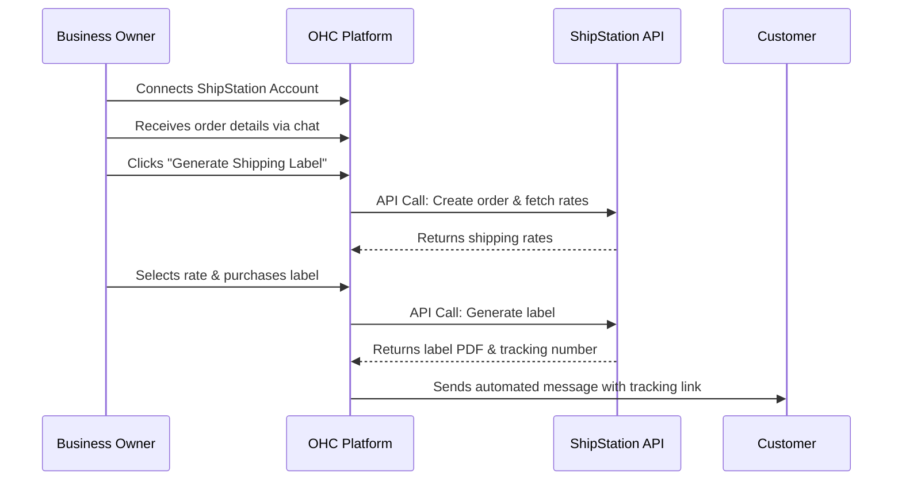

## Shipping & Logistics: ShipStation

**Title**: Implement ShipStation Integration for Streamlined Order Fulfillment

**Problem Statement**: E-commerce small business owners spend a significant amount of time manually entering customer addresses and generating shipping labels. This manual process is prone to errors, which leads to misdeliveries, unhappy customers, and wasted time.

**Research Report**: ShipStation is a highly regarded shipping software solution tailored for e-commerce, supporting a vast array of carriers (USPS, UPS, FedEx, DHL, etc.) and storefronts.
* *Ease of Use*: High. Its dashboard aggregates orders and makes printing labels a one-click process.
* *Pricing*: Offers a Starter plan (up to 50 shipments/mo) for around $9.99/mo, scaling up based on volume. It provides deep discounts on USPS rates, offsetting the monthly fee.
* *Reputation*: An industry standard for small-to-medium e-commerce, praised for its integrations and reliability.
* *Mode Compatibility*: Requires API keys and webhooks, functioning effectively in both Cloud and Standalone environments.

**Design Doc**:

**Implementation Prompt**: Create a ShipStation integration to simplify fulfillment. In the chat interface, when an owner receives an order, provide a "Create Shipping Label" button. OHC should pull the customer's shipping address (if known) or prompt the owner for it, then call the ShipStation API to get rates. Once a rate is chosen, OHC should generate the label and automatically send the customer a tracking link in the chat thread. The setup should use plain language like "Connect my Shipping Provider."

**Priority**: P1

**Estimated Scope**: Large
