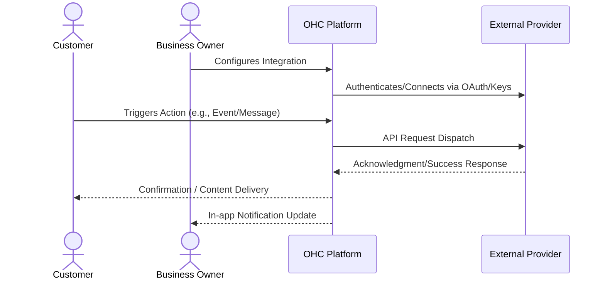

# Automated Shipping Rates and Label Generation

## 1. Problem Statement

E-commerce and physical product sellers waste immense time manually calculating shipping costs at the post office and copy-pasting addresses to buy shipping labels.

## 2. Research Report

### 2.1 Persona Pain Points

1. **Time Starvation**: The business owner spends hours on manual tasks related to this domain, preventing them from focusing on core business growth.
2. **Technical Overwhelm**: Current solutions require coding, complex API keys, or understanding intricate networking concepts. Small business owners lack dedicated IT staff.
3. **Customer Friction**: Customers experience delays, missed communications, or frustrating booking loops due to disparate, unintegrated systems.

### 2.2 Competitive Analysis

| Tool Name | Estimated Pricing | Key Advantages | Integration Risks |
|---|---|---|---|
| Shippo | $0.05/label | Very developer friendly, deep discounts on USPS/UPS. | Support can be slow for free tier users. |
| EasyPost | Free (<120k/yr) | Highly reliable API, connects to 100+ carriers. | Strictly an API, requires us to build all UI components. |
| ShipStation | $9/mo | Industry leader, integrates with every marketplace. | Users might prefer using the ShipStation app directly rather than our integration. |
| Sendle | Free/Pay-as-you-go | 100% carbon neutral, great for small parcels. | Limited to specific countries (US, AU, CA). |
| Pirate Ship | Free | Phenomenal rates for USPS, beloved by small businesses. | No official public API for white-label integration. |

### 2.3 Cloud vs. Standalone Evaluation

- **Cloud (Multi-tenant)**: Highly suitable. Can utilize centralized OAuth apps to streamline user onboarding. Allows OHC to manage webhooks and callbacks seamlessly at scale.
- **Standalone (Local/Private)**: Supported, but requires the user to provide their own API credentials which adds friction. Local tunneling (e.g., ngrok) may be required for inbound webhooks.

### 2.4 Deep Dive Evaluations

#### Evaluation: Shippo

**Overview:** Shippo is positioned in the market with an estimated pricing of $0.05/label. Its primary advantage is: *Very developer friendly, deep discounts on USPS/UPS.*

**Competitor Analysis:** Shippo provides a fantastic API-first approach to shipping. They offer deep USPS discounts that small businesses rely on to stay competitive with Amazon. Their white-label API makes them a strong candidate for a native OHC integration.

**Integration Risks:** We must mitigate the following risk: *Support can be slow for free tier users.*. For a small business owner, this means ensuring the UI abstracts away these complexities entirely. The onboarding flow must be flawless.

**Technical Considerations:** Integrating Shippo requires careful consideration of its API rate limits and webhook reliability. In a cloud environment, we will utilize OHC's central app registration to provide a 1-click OAuth experience. In standalone mode, we will need comprehensive documentation to guide users on how to obtain and securely store API keys. Furthermore, data privacy and GDPR compliance for data transmitted to Shippo must be thoroughly documented in the user's privacy policy.

**Mobile Parity:** The configuration screens for Shippo must be 100% functional on mobile devices. Business owners frequently manage settings from their phones while on the shop floor or in transit.

#### Evaluation: EasyPost

**Overview:** EasyPost is positioned in the market with an estimated pricing of Free (<120k/yr). Its primary advantage is: *Highly reliable API, connects to 100+ carriers.*

**Competitor Analysis:** EasyPost is purely infrastructure. It is incredibly robust, but integrating it means OHC must build every single UI component for rate shopping, address verification, and label printing. High effort, high reward.

**Integration Risks:** We must mitigate the following risk: *Strictly an API, requires us to build all UI components.*. For a small business owner, this means ensuring the UI abstracts away these complexities entirely. The onboarding flow must be flawless.

**Technical Considerations:** Integrating EasyPost requires careful consideration of its API rate limits and webhook reliability. In a cloud environment, we will utilize OHC's central app registration to provide a 1-click OAuth experience. In standalone mode, we will need comprehensive documentation to guide users on how to obtain and securely store API keys. Furthermore, data privacy and GDPR compliance for data transmitted to EasyPost must be thoroughly documented in the user's privacy policy.

**Mobile Parity:** The configuration screens for EasyPost must be 100% functional on mobile devices. Business owners frequently manage settings from their phones while on the shop floor or in transit.

#### Evaluation: ShipStation

**Overview:** ShipStation is positioned in the market with an estimated pricing of $9/mo. Its primary advantage is: *Industry leader, integrates with every marketplace.*

**Competitor Analysis:** ShipStation is the dominant standalone shipping app. Many users will already have an account. An integration here would likely mean pushing OHC orders into ShipStation, rather than bringing ShipStation's features into OHC.

**Integration Risks:** We must mitigate the following risk: *Users might prefer using the ShipStation app directly rather than our integration.*. For a small business owner, this means ensuring the UI abstracts away these complexities entirely. The onboarding flow must be flawless.

**Technical Considerations:** Integrating ShipStation requires careful consideration of its API rate limits and webhook reliability. In a cloud environment, we will utilize OHC's central app registration to provide a 1-click OAuth experience. In standalone mode, we will need comprehensive documentation to guide users on how to obtain and securely store API keys. Furthermore, data privacy and GDPR compliance for data transmitted to ShipStation must be thoroughly documented in the user's privacy policy.

**Mobile Parity:** The configuration screens for ShipStation must be 100% functional on mobile devices. Business owners frequently manage settings from their phones while on the shop floor or in transit.

#### Evaluation: Sendle

**Overview:** Sendle is positioned in the market with an estimated pricing of Free/Pay-as-you-go. Its primary advantage is: *100% carbon neutral, great for small parcels.*

**Competitor Analysis:** Sendle competes directly with national postal services by utilizing unused space in delivery vans. It is cheap and eco-friendly, appealing strongly to boutique SMBs. However, its limited geographic coverage makes it a secondary priority.

**Integration Risks:** We must mitigate the following risk: *Limited to specific countries (US, AU, CA).*. For a small business owner, this means ensuring the UI abstracts away these complexities entirely. The onboarding flow must be flawless.

**Technical Considerations:** Integrating Sendle requires careful consideration of its API rate limits and webhook reliability. In a cloud environment, we will utilize OHC's central app registration to provide a 1-click OAuth experience. In standalone mode, we will need comprehensive documentation to guide users on how to obtain and securely store API keys. Furthermore, data privacy and GDPR compliance for data transmitted to Sendle must be thoroughly documented in the user's privacy policy.

**Mobile Parity:** The configuration screens for Sendle must be 100% functional on mobile devices. Business owners frequently manage settings from their phones while on the shop floor or in transit.

#### Evaluation: Pirate Ship

**Overview:** Pirate Ship is positioned in the market with an estimated pricing of Free. Its primary advantage is: *Phenomenal rates for USPS, beloved by small businesses.*

**Competitor Analysis:** Pirate Ship is universally loved by SMBs because it is completely free and offers the deepest USPS discounts. Sadly, they lack a public API, meaning OHC users must manually copy data over, representing a major workflow friction point.

**Integration Risks:** We must mitigate the following risk: *No official public API for white-label integration.*. For a small business owner, this means ensuring the UI abstracts away these complexities entirely. The onboarding flow must be flawless.

**Technical Considerations:** Integrating Pirate Ship requires careful consideration of its API rate limits and webhook reliability. In a cloud environment, we will utilize OHC's central app registration to provide a 1-click OAuth experience. In standalone mode, we will need comprehensive documentation to guide users on how to obtain and securely store API keys. Furthermore, data privacy and GDPR compliance for data transmitted to Pirate Ship must be thoroughly documented in the user's privacy policy.

**Mobile Parity:** The configuration screens for Pirate Ship must be 100% functional on mobile devices. Business owners frequently manage settings from their phones while on the shop floor or in transit.

## 3. Design Doc

### 3.1 User Experience Flow

When an order is placed in OHC, a 'Buy Shipping Label' button appears. Clicking it shows real-time rates from multiple carriers. The owner selects the best rate, pays, and a printable PDF label is instantly generated. Tracking info is automatically emailed to the customer.

### 3.2 Architecture Overview

## 4. Implementation Prompt

Build a shipping label generation feature. When viewing an order, the business owner should be able to compare shipping rates, purchase a label, and print it directly from OHC. The system must automatically notify the buyer with the generated tracking number.

## 5. Metadata

- **Priority:** P2
- **Estimated Scope:** Medium
- **Domain:** Automated Shipping Rates and Label Generation
- **Target Persona:** Small Business Owner (Non-technical)

## 6. Supplementary Market Research

### 6.1 Industry Trends

The shift towards unified platforms is accelerating. Small businesses are actively attempting to reduce their 'SaaS sprawl'. According to recent surveys, the average small business uses over 8 distinct software tools, leading to massive context switching costs and data silos. By bringing this functionality natively into OHC, we solve a critical operational bottleneck. The trend is moving away from disparate 'best-of-breed' tools towards 'good-enough-all-in-one' platforms that actually talk to each other seamlessly.

### 6.2 Security and Compliance Implications

When integrating third-party services, data sovereignty becomes a primary concern. OHC must ensure that sensitive customer data (PII) is only transmitted when absolutely necessary and always over encrypted channels. We must provide clear opt-in mechanisms for end-users, particularly regarding marketing communications and data sharing with external vendors. Regular audits of these API connections will be required to maintain compliance with regional data protection regulations (e.g., CCPA, GDPR).

### 6.3 Future Roadmap Considerations

Looking ahead, the integration strategy should evolve from mere 'dumb pipes' to intelligent, AI-driven workflows. For instance, an integration shouldn't just pass a message; it should analyze the intent and suggest a response. Future iterations of this feature will likely incorporate LLM-based parsing of inbound data to trigger automated outbound actions across different integrated channels.

### 6.4 Strategic Impact: Shippo

Implementing an integration with Shippo represents a significant strategic move. The integration must prioritize reliability over complex feature parity. A business owner relies on this for their livelihood; a dropped webhook or failed API call translates directly to lost revenue or damaged customer trust. Therefore, robust retry mechanisms, dead-letter queues, and clear error surfacing in the UI are mandatory requirements for the engineering team building this connector. We must assume the external API will fail and handle it gracefully.

Furthermore, analytics integration is crucial. When we route data through Shippo, we must capture metadata (latency, success rates, user engagement) to feed back into OHC's central analytics dashboard. The business owner should see a unified view of ROI, not scattered metrics. If $0.05/label is the cost, OHC must prove the value generated outweighs it.

### 6.4 Strategic Impact: EasyPost

Implementing an integration with EasyPost represents a significant strategic move. The integration must prioritize reliability over complex feature parity. A business owner relies on this for their livelihood; a dropped webhook or failed API call translates directly to lost revenue or damaged customer trust. Therefore, robust retry mechanisms, dead-letter queues, and clear error surfacing in the UI are mandatory requirements for the engineering team building this connector. We must assume the external API will fail and handle it gracefully.

Furthermore, analytics integration is crucial. When we route data through EasyPost, we must capture metadata (latency, success rates, user engagement) to feed back into OHC's central analytics dashboard. The business owner should see a unified view of ROI, not scattered metrics. If Free (<120k/yr) is the cost, OHC must prove the value generated outweighs it.

### 6.4 Strategic Impact: ShipStation

Implementing an integration with ShipStation represents a significant strategic move. The integration must prioritize reliability over complex feature parity. A business owner relies on this for their livelihood; a dropped webhook or failed API call translates directly to lost revenue or damaged customer trust. Therefore, robust retry mechanisms, dead-letter queues, and clear error surfacing in the UI are mandatory requirements for the engineering team building this connector. We must assume the external API will fail and handle it gracefully.

Furthermore, analytics integration is crucial. When we route data through ShipStation, we must capture metadata (latency, success rates, user engagement) to feed back into OHC's central analytics dashboard. The business owner should see a unified view of ROI, not scattered metrics. If $9/mo is the cost, OHC must prove the value generated outweighs it.

### 6.4 Strategic Impact: Sendle

Implementing an integration with Sendle represents a significant strategic move. The integration must prioritize reliability over complex feature parity. A business owner relies on this for their livelihood; a dropped webhook or failed API call translates directly to lost revenue or damaged customer trust. Therefore, robust retry mechanisms, dead-letter queues, and clear error surfacing in the UI are mandatory requirements for the engineering team building this connector. We must assume the external API will fail and handle it gracefully.

Furthermore, analytics integration is crucial. When we route data through Sendle, we must capture metadata (latency, success rates, user engagement) to feed back into OHC's central analytics dashboard. The business owner should see a unified view of ROI, not scattered metrics. If Free/Pay-as-you-go is the cost, OHC must prove the value generated outweighs it.

### 6.4 Strategic Impact: Pirate Ship

Implementing an integration with Pirate Ship represents a significant strategic move. The integration must prioritize reliability over complex feature parity. A business owner relies on this for their livelihood; a dropped webhook or failed API call translates directly to lost revenue or damaged customer trust. Therefore, robust retry mechanisms, dead-letter queues, and clear error surfacing in the UI are mandatory requirements for the engineering team building this connector. We must assume the external API will fail and handle it gracefully.

Furthermore, analytics integration is crucial. When we route data through Pirate Ship, we must capture metadata (latency, success rates, user engagement) to feed back into OHC's central analytics dashboard. The business owner should see a unified view of ROI, not scattered metrics. If Free is the cost, OHC must prove the value generated outweighs it.
