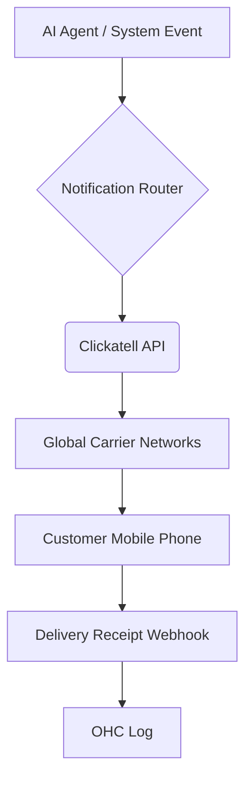

## [SMS] Issue Brief: Clickatell Integration for Global Notifications

**Title**: Scout 🔍: Integrate Clickatell for Reliable Global SMS Notifications
**Problem Statement**:
Small business owners like Fatima (Local Grocer) serve customers who may have limited internet access, low English proficiency, or simply prefer text messages over email. Missed emails lead to missed pickups or unpaid invoices. They need a reliable way to send SMS notifications for order readiness, appointment reminders, and critical updates.
**Research Report**:
- **Tool**: Clickatell API
- **Evaluation**: Clickatell is a global leader in SMS delivery, offering robust carrier coverage, especially in emerging markets (Africa, Asia). It handles complex routing and delivery receipts reliably.
- **Ease of Use**: Users don't need to interact with it directly; OHC handles the API.
- **Pricing**: Pay-per-message pricing. Varies heavily by destination country.
- **Cloud vs. Standalone**: Primarily Cloud, where OHC acts as the centralized sender. In Standalone, users would need their own API keys.
**Design Doc**:

- A system event (e.g., "Order Ready") triggers the Notification Router.
- If the customer prefers SMS, OHC sends a request to Clickatell.
- Clickatell delivers the SMS and sends a delivery receipt back to OHC.
- OHC logs the successful delivery.
**Implementation Prompt**:
Integrate the Clickatell API as an SMS provider in the notification service. Implement a robust sending queue to handle rate limits and retries. Set up webhooks to capture delivery receipts and update the notification status in the database. Ensure the AI agents can trigger SMS messages for critical alerts, keeping the content concise to fit within SMS character limits.
**Priority**: P1
**Estimated Scope**: Medium
