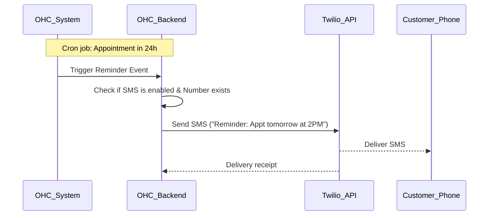

# [SMS] Direct Customer Notifications

## Title
SMS Order Updates and Appointment Reminders

## Problem Statement
As a small business owner, I know that my customers often don't check their email. When they book an appointment, they forget to show up. When I ship an order, they call me asking where it is because they missed the email. I need a simple way to automatically text my customers when an appointment is coming up or when their order ships, so I don't have to deal with no-shows and "where is my order" questions.

## Research Report
**Tools Evaluated:** Twilio, MessageBird, Vonage.

- **Twilio:** The industry standard.
  - *Ease of Use:* High developer effort, but invisible to the user.
  - *Pricing:* Very cheap per SMS ($0.0079 in US), but compliance (A2P 10DLC) is a massive headache for small businesses in the US.
  - *Cloud vs Standalone:* Best in Cloud via a master brand. Standalone users must bring their own Twilio credentials and handle their own A2P 10DLC compliance, which is a major hurdle.
- **MessageBird:** Strong international coverage.
  - *Pricing:* Good, but also requires strict compliance in various regions.
  - *Cloud vs Standalone:* Similar to Twilio, Standalone users face high friction to set up their own compliant account.
- **Recommendation:** Use Twilio for the backend delivery. To shield the non-technical small business owner from A2P 10DLC registration nightmares, OHC should ideally register a master brand and send messages on behalf of the users (e.g., "From OHC: Your order with [Business Name] has shipped"). If they want a dedicated number, they must go through the compliance flow.

## Design Doc
A new toggle in the "Settings -> Notifications" area.
- **Trigger:** System events (Order Shipped, Appointment in 24 hours).
- **Action:** If the business owner has enabled SMS notifications and the customer provided a phone number, OHC sends a brief text.
- **User View:** The business owner just flips a switch: "Send SMS Reminders to Customers". The customer receives a standard text message with the update.

## Implementation Prompt
Implement automated SMS notifications for critical customer events (Order Shipped, Appointment Reminders). Add a simple toggle in the user settings to enable/disable this feature. Use Twilio as the SMS provider. The implementation must handle automatic formatting of phone numbers (E.164 format) and gracefully handle failures (e.g., invalid numbers) without crashing the primary business logic. Ensure all messages include standard "Reply STOP to opt out" compliance footers.

## Priority
P1

## Estimated Scope
Small
