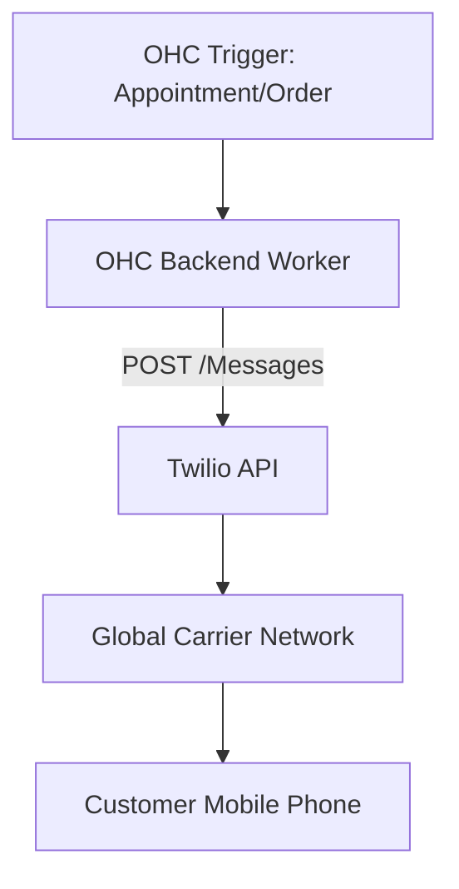

# Research: SMS & Notifications Integration with Twilio

## Title
Integrate Twilio for Global SMS Notifications and Alerts

## Problem Statement
Small businesses, especially those serving non-technical demographics or operating internationally, need to reach customers reliably. Emails are often ignored, while SMS has a near-100% open rate. Business owners need a way to send automated appointment reminders, order updates, and critical alerts directly to customers' phones to reduce no-shows and improve service.

## Research Report
Twilio is the industry leader in cloud communications platforms, providing APIs for SMS, voice, WhatsApp, and more.
- **Ease of Use**: Twilio is an API-first product designed for developers, meaning the end-user (the business owner) will never see Twilio directly. They will interact entirely through the OHC interface, making it completely frictionless for them.
- **Pricing**: Twilio uses a pay-as-you-go model. Prices vary by country, but sending an SMS in the US costs around $0.0079 per message. It is highly cost-effective and scales perfectly with business usage.
- **Reputation**: Twilio is the gold standard for CPaaS (Communications Platform as a Service). It offers unmatched global carrier connectivity, high deliverability, and strict compliance handling (like A2P 10DLC in the US).
- **Environment Support**: Twilio's REST APIs are perfect for Cloud environments. Standalone instances simply require outbound internet access to make HTTP POST requests to Twilio's servers to dispatch messages.

## Design Doc
The integration will utilize Twilio to dispatch outgoing SMS notifications triggered by OHC events.
1.  **Configuration**: The OHC Cloud environment maintains a master Twilio account, or Standalone users enter their own Twilio Account SID and Auth Token.
2.  **Triggers**: Background jobs in OHC (e.g., "Appointment starts in 24 hours") trigger a notification event.
3.  **Dispatch**: The OHC backend formats the message and sends a request to the Twilio SMS API.
4.  **Delivery**: Twilio routes the message to the global telecom network.

## Implementation Prompt
Integrate the Twilio SMS API to handle system-generated text messages. Implement an event listener in the OHC backend that triggers an SMS dispatch when specific conditions are met (e.g., an order status changes to "Ready for Pickup", or a calendar appointment is 24 hours away). Provide a settings interface for business owners to customize the text templates for these notifications. Ensure the integration gracefully handles delivery failures and respects opt-out (STOP) requests automatically.

## Priority
P0

## Estimated Scope
Small
