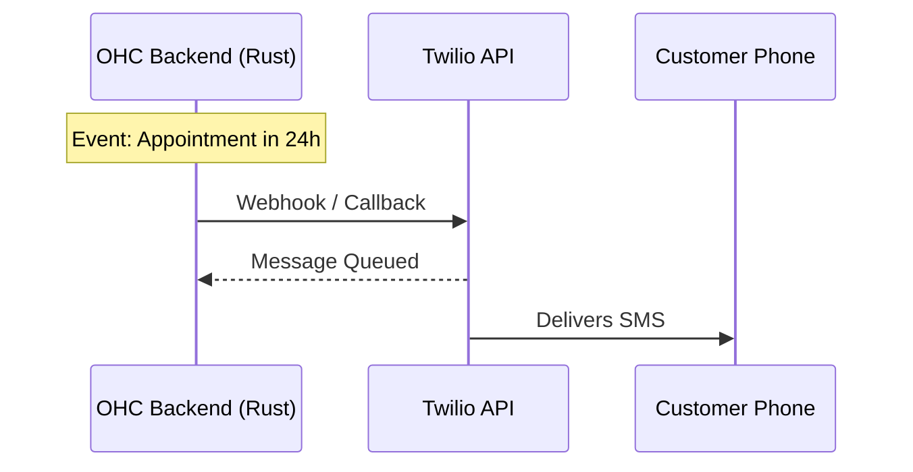

# Twilio Integration

## Problem Statement
Customers often miss email notifications. SMS is critical for urgent updates, especially for customers with low English proficiency or those who don't frequently check email.

## Research Report
Twilio provides a robust, globally available Programmable SMS API.
* **Problem Addressed**: Ensures critical messages (appointment reminders, order updates) reach customers instantly.
* **User Benefit**: "Automated SMS notifications for appointment reminders, order updates, and urgent alerts directly to your customers' phones."
* **Ease of Use (for non-technical users)**: The complexity of registering for A2P 10DLC (in the US) is very high for non-technical users. OHC will need to provide extreme hand-holding or abstract this registration process.
* **Risks & Trade-offs**: Strict A2P 10DLC compliance rules in the US; high costs for international SMS.
* **Pricing Estimate**: Pay-as-you-go (approx $0.0079 per message in the US).
* **Compatibility**: Cloud & Standalone.

## Design Doc
The integration will use the Twilio Programmable SMS API to dispatch text messages triggered by OHC system events (e.g., an upcoming Meeting).

## Implementation Prompt
**Outcome**: Implement the Twilio integration to allow automated SMS notifications for key CRM events (like appointment reminders).
**Acceptance Criteria**:
1. Users must be able to securely store their Twilio Account SID and Auth Token.
2. The system must be able to trigger SMS messages based on internal events (e.g., a Meeting entity nearing its start time).
3. The UI must provide a clear, guided setup wizard explaining A2P 10DLC registration requirements for US users.
4. Ensure the system handles and logs Twilio delivery failures gracefully.

## Priority
P1 (High)

## Estimated Scope
Medium
